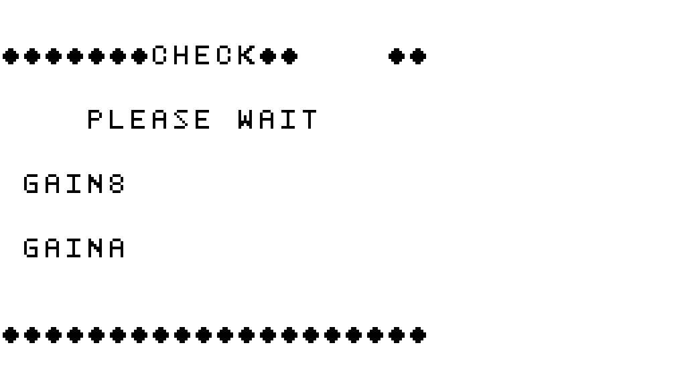
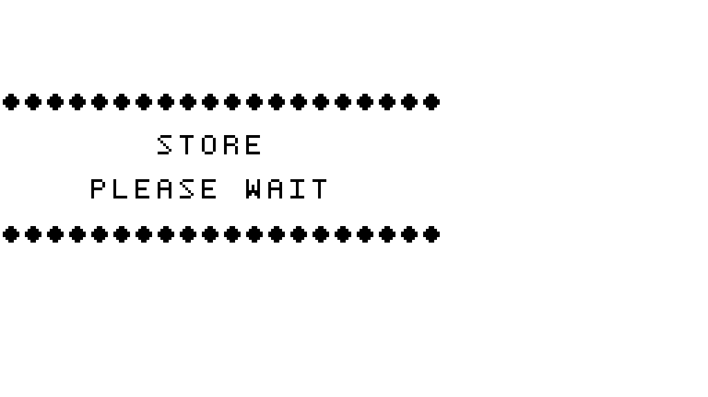
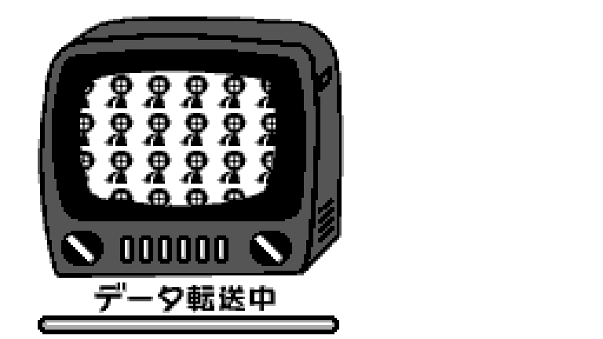
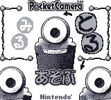
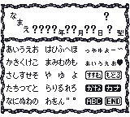
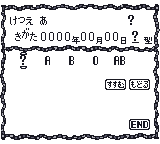
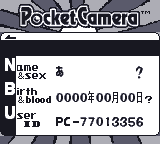
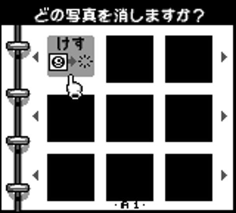
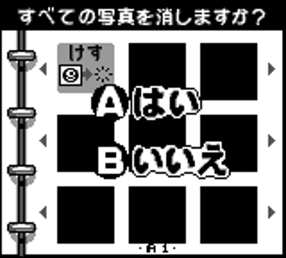
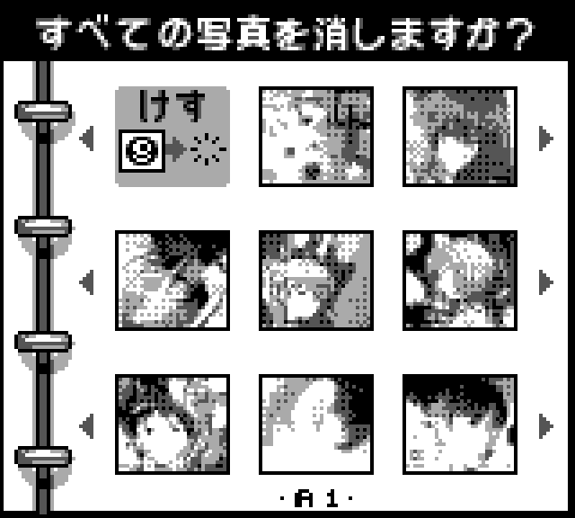

# AI slop, do not trust until human validation
# (not performed yet, work in progress)

# Pocket Camera (Japan) — Disassembly Findings

Primary target: **Pocket Camera (Japan) (Rev A)**, MD5 `fdcfe686cf4df461e870b6e53b2b5a8b`.
International and Zelda-edition ROMs are treated as derivatives (confirmed: bank $0A, the
sensor driver, differs from the international ROM by only **61 bytes** out of 16384 — the
exposure/dithering algorithm itself is effectively region-independent; menu logic in banks
$003–$009 is likewise byte-for-byte structurally identical, same state counts ±1).

## Contents

| § | Topic |
|---|---|
| 1 | Toolchain, reassembly procedure, **disassembly status and what is lacking** (1.2) |
| 2 | **WRAM / HRAM map** — overview, boot / DMA / soft reset, the 34 modes, seven region maps, SRAM mirrors, corrections, open points |
| 3 | **SRAM structure** (128 KB), byte-level map, self-repair rules, atypical saves |
| 4 | Asset catalog |
| 5 | The lookup table at `$02B300` / bank `$0A:$7300` |
| 6 | Calibration procedure (`$04FF2` / `$11FF2`) |
| 7 | Dithering pattern selection |
| 8 | Boot procedure, hidden factory test, hidden key combinations |
| 9 | Masked pixel lines |
| 10 | Auto-exposure |
| 11 | SRAM evidence from the 33 real saves |
| 12 | Open questions |
| Appendix | Tools |

## Screen captures

Pixel-accurate renders, produced directly from ROM tile + tilemap data (not photos of an emulator
— reconstructed the same way the hardware would draw them), plus a few frames captured live via
BGB. All in `/captures/`.

**The hidden factory diagnostic screens** (§8 below) — hold everything except B at power-on:

| | |
|---|---|
|  | Screen 1: live calibration readout. "GAIN8"/"GAINA" are followed on real hardware by the actual SRAM bytes being tested (not shown here since the renderer doesn't execute code — see §6 for the exact values' meaning) |
|  | Screen 2: the same "STORE... PLEASE WAIT" a normal player sees on a cold boot needing SRAM repair — confirms the hidden test is a superset of ordinary boot calibration, not a separate code path |
|   | The pass/fail result tiles (`$ff91==0` → OK, else → NG), after which the screen hangs forever by design |

**The link-cable data-transfer screen**, found while answering an earlier question about an
unidentified tile set — reconstructed from its real tilemap:



**Live menu flow** (captured via BGB, Japan ROM, from last session's exploration):

| | | |
|---|---|---|
|  Boot logo |  Main menu |  Owner registration intro |
|  Name-entry keyboard |  Sex selection |  Birthdate entry |
|  Blood type entry |  Main capture (SHOOT) menu | |

---

Everything below is graded by confidence:
- **Confirmed** — read directly from disassembled code and/or verified against raw ROM bytes.
- **Strong hypothesis** — code traced and consistent with the idea, but not independently cross-checked.
- **Open** — genuinely unresolved; flagged for your input.

---

## 1. Toolchain, reassembly procedure and disassembly status

### 1.1 Toolchain and reassembly procedure

```
rgbds v1.0.4  (rgbasm/rgblink/rgbfix)  — installed, matches what mgbdis's Makefile expects
mgbdis v3.0   — github.com/mattcurrie/mgbdis, used for the static disassembly pass
```

Procedure (byte-exact, verified working):

```bash
python3 mgbdis.py --output-dir disasm_labeled --sym pocketcamera_jp.sym pocketcamera_jp.gb
cd disasm_labeled
make            # runs rgbasm -> rgblink -> rgbfix -> md5sum
# md5sum must print fdcfe686cf4df461e870b6e53b2b5a8b
```

`pocketcamera_jp.sym` (included) currently annotates:
- All 7 menu-bank state-dispatch tables (banks $003–$009) as `.data`, with every state entry labeled — this alone fixed most of the code/data misalignment in those banks.
- ~28 hand-traced entry points inside bank $0A (sensor/calibration/factory-test) and its 5 lookup tables, also marked `.data` so mgbdis stops misreading them as instructions.

This is a **living file** — every further routine we label goes here and the disassembly regenerates clean. This is the recommended workflow for the rest of the project: never hand-edit the generated `.asm`, only ever add to the `.sym` file and regenerate.

Remaining known-dirty regions: the classification of the data banks and of the typeless data inside the code banks, measured in §1.2.

### 1.2 Disassembly status: what is proven, and what is lacking for a confident disassembly

**Byte identity is not the problem.** `mgbdis` + `rgbasm` already reassemble the whole ROM to the exact md5 above, because every byte it cannot type is emitted as `db`.
The open work is *confidence in the classification*: which bytes are code, which are tables / strings / tiles / song streams, and what to call them. That is measured with a
recursive-descent tracer, `tools/rom_trace.py` (v2: `--roots tools/extra_roots.json`; without `--roots` it reproduces the first version bit for bit). A byte is *proven code* only if it lies on a decoded path.

| Trace | Proven instructions | Proven code bytes (banks 00, 02-0A, 1F) | Unresolved indirect jumps |
|---|---:|---:|---:|
| first tracer (vectors, `.sym` labels, mode and state tables) | 56,799 | 111,808 | 14 |
| + 89 live roots and four rules (`jp hl` tables, callbacks, cooperative tasks, soft reset, OAM-DMA stub) | 59,866 | 116,613 | 0 |
| + 45 unreferenced "dead-code" roots (all 134 roots) | 60,449 | 117,627 | 0 |

The 11 code banks hold 180,224 bytes: **117,627 proven code (65 %)**, 1,256 inline jump / mode tables, 2,164 padding, 2,400 unreferenced (2,251 of them `0A:6BDD-74A7`: 1,827 zero bytes plus the popcount table `$7300` and the bit-reverse table `$7400`, both verified), and 56,777 bytes of data of unknown type.
The biggest single gain was the bank `$0A` jump table at `0A:541A` (96 entries, reached through `06:781D → 0A:7CFE`, the first tracer capped it at 32): +2,444 instructions of image-effect code. Indirect flow after the work: 31 `jp hl` (8 by table idiom, 23 by hand or rule), 46 inline `rst $18` tables, 276 far calls (72 distinct targets), 0 unresolved.
All consistency checks pass (no overlapping instructions, every callback ends in `ret`/`jp`, no invalid opcode on a proven path). The 45 dead-code roots decode cleanly but nothing calls them: they are *reachable by decoding*, not proven live.

**What is lacking, by importance**

1. **The data banks are unstructured.** Banks `$0B-$3F` except the sound bank `$1F` (52 banks, 851,968 bytes) are not described: the asset catalog (`assets/catalog_jp.csv`, 385 copy sites) accounts for 254,546 bytes (29.9 %). 25 of these banks have no catalogued byte, and **14 banks (`2B 2D 2E 30-35 37 3A-3D`, 229,376 bytes) have no static reference at all** yet hold real content (not padding). They are reached through computed bank numbers and pointer tables that static tracing cannot follow. Until that is solved a source file can only `INCBIN` them, not name sections.
   Bank `$01` is not in these 52: it is the one data bank that is **already fully typed**. It holds the sprite-composition lists drawn by the OAM adders `00:24AF` (pointer table `$4000`, 249 entries) and `00:2496` (pointer table `$5D47`, 246 entries): each pointer leads to 4-byte OAM records (Y, X, tile, attribute) ended by `$80` (3,247 records in all; `A` = list number, `C`/`B` = Y/X offset added to every record, written to the OAM shadow at `$D400 + FF9A`). Parsing both tables covers `$4000-$7888` (14,473 bytes) with no gap; `$7889-$7FFF` (1,911 bytes) is zero padding. Bank `$02` has two more tables of the same kind (`$6E4B` for `00:2464`, `$5272` for `00:247D`), not parsed yet.
2. **About 57 KB of data inside the code banks has no known type or extent** (bank `$02` 11.9 KB, `$1F` sound data 12.3 KB, `$08` 10.0 KB, `$09` 5.3 KB, `$00` 4.1 KB, `$06` 3.4 KB, `$0A` 2.3 KB…): word tables vs strings vs tiles vs song streams. This is an upper bound: `tools/rom_coverage.py` credits a table as referenced when any `ld rr,nn` constant lands near it, and a bank-0 `ld hl,nn` ≥ `$4000` is credited to every bank. The only data of known extent is the 254,344 bytes copied through `call $0450` with a constant length.
3. **Reachable is not live.** 45 roots (1,014 bytes) are unreferenced code (library stubs, an unused sound-effect starter, twin routines `05:7F1C` / `09:721D`…). Only a runtime log can say whether they ever run.
4. **Heuristic completeness.** The cooperative-task entries of bank 3 (program counters stored as split immediates `ld a,lo ; ld [$D6FD],a ; …`) and the 23 hand-resolved callbacks come from pattern scans, not from a proof that none is missing. The tracer also had one real bug, fixed in v2: an `rst $18` table at `05:48C4` was read one word too long and swallowed the first instruction of `Bank005_State12` as table data (bytes unchanged, labelling wrong).
5. **No text / charset table.** Strings other than the ASCII `MAIN PASS` (`00:2E88`) cannot be typed; the Japanese and the international character sets are not extracted.

**What needs the emulator or the hardware** (PyBoy hooks: see `tools/emu_calib_check.py` for a working example): a PC + ROM-bank coverage log over a scripted tour of every mode (any executed PC outside the trace is a tracer gap; the 45 dead roots must never execute); a ROM-read log (address + bank) for the 14 unreferenced banks to find which tables select them; the index ranges of the third block of the `0A` table (indices 64-95, `A | $40`) and of every `rst $18` table; and a diff of the same routines in `gbcam_usa_eu.gb` / `gbcam_gold.gb` (67 % of the newly proven bytes are byte-identical at the same bank:address there), which would settle several dead-code verdicts.

**What the project owner must decide or supply:** the policy for the 45 dead roots (assemble as code tagged `unreferenced`, or leave as `db`); a scripted emulator coverage run (input sequences for every mode — I can write it, it needs the emulator); the character table for text; and a naming convention for the ~130 new code roots. Quirks that a rebuilt source must keep bit-exact are real ROM behaviour, e.g. `0A:4C51` is an unconditional `jr` that skips an `inc b` (it looks like a `jr z` that was meant, but the bytes are what they are).

Full report with the per-bank table, the resolved indirect sites and the verdict on the 15 unreferenced regions: `disasm/code_gaps.md` and `disasm/coverage_jp_v3.csv` in the package.

---

## 2. WRAM / HRAM map (`$C000-$DFFF`, `$FE00-$FFFF`) — the consolidated, byte-level map

*Rebuilt from a recursive-descent trace of the ROM. It replaces the first-round WRAM map, whose corrections are listed in §2.12.*

### 2.0 Conventions, method and legend

* **Source of truth.** Every row comes from the instructions that a **recursive-descent tracer** (`tools/rom_trace.py`) proves reachable
  (56,799 instructions on proven paths, starting from the reset/interrupt vectors, the main loop `00:2E92`, the 34-entry mode table, every
  `rst $18` state table and the hand-labelled entries of the `.sym` file). `tools/wram_db.py` turns them into an access table: every `ld`/`ldh`
  that touches `$C000-$DFFF` or `$FE00-$FFFE` as **R**ead, **W**rite or **P**ointer load (`ld rr,ADDR`, i.e. the address is the base of an array or
  buffer). **1,135 distinct addresses** are touched (1,153 with the extended trace, see the re-check bullet below). A linear sweep of the ROM (what `mgbdis` prints) was *not* used as evidence: data decoded as
  code produced about 100 phantom addresses in the first-round map.
* **Blind spot, stated once.** Accesses made through a register pair that was loaded with the base address (`ld hl,ARRAY … inc [hl]`, `ld a,[hl+]`) show up only as a **P** row
  for the base. For arrays and buffers the extent, stride and role were therefore read from the code around the P rows and are written in the *Meaning* column.
  Targets of **data-driven callbacks** (bank 3 `$5F68`/`$5F91`, bank 7 `$792C`/`$7BF3`/`$7C62`/`$7CD1`, `call $FF80` = OAM-DMA routine in HRAM) are not followed by the tracer; the rows
  that depend on them say so.
* **Overlays.** Mode banks are overlays: only one mode is active at a time, and nothing clears `$D500-$D9FF` when a mode ends, so the same WRAM bytes
  have a different meaning in each mode (the *Banks* column lists every bank whose proven code touches the row). A row therefore describes **one use**; several
  rows may cover the same bytes (notably `$C000-$CFFF`).
* **Status** (same spirit as §3.0 for the SRAM): **C** = code-traced (writer and reader found, role evident from the code), **I** = inferred (consistent use, no instruction states the meaning),
  **U** = unused or dead (only written, only read, or touched only by unreachable code), **?** = inconclusive (the row says what is known and what is not). A name is never taken from a label.
* **Banks column.** Hex ROM banks (`00` = fixed bank, `0A` = bank `$0A`, `1F` = sound driver), `hw` = hardware register, `all` = used by every bank. Bank:address citations (`07:4A24`) are JP Rev A.
* **Re-check with the extended trace (§1.2).** The maps were written against the first trace. The extended trace (60,449 instructions: 134 hand-resolved roots, `tools/extra_roots.json`) adds **18 addresses and 520 live accesses**;
  all 18 addresses fall inside existing rows (`$C070 $C30E $C4F0 $C68E $C6FE $C770 $C7F0 $C90E $CA3E $CAF0 $CD0C $CD8E $CDFE $DA0D $DA0E $DA24 $DA29 $FF46`). The new live accesses are 479 in bank `0A`, 33 in bank 0 and 8 in bank 7.
  The bank-`0A` ones belong to the 96-entry jump table at `0A:541A` (image-effect routines of the SHOOT modes, reached from bank 6 through `06:781D → 0A:7CFE`, index byte from `06:60DB`, OR `$00/$20/$40` from `$D7EB`):
  they load start pointers into the photo area (`$C070 $C0F0 $C30E $C3C0 $C4F0 $C60E $C68E $C6FE $C770 $C7F0 $C90E $CA3E $CAF0 $CD0C $CD0E $CD8E $CDFE`) and use `$FF8A-$FF8D` as scratch (130+ accesses each), which agrees with the rows of those bytes.
  The bank-0 ones are the soft-reset path (`00:0210-028F`, already described in §2.2) and the bank-7 ones are the menu callbacks `07:7AF1-7B43` / `07:7BF4-7D30`, so the five rows `$DA1A $DA1F $DA24 $DA29 $DA2E` moved from I to C. **No row had to be withdrawn.**
  `wram/wram_access.csv` and `wram_summary.csv` are the extended-trace tables; the per-row counts quoted in the region files come from the first trace and are therefore low by those amounts.
* **Where the full evidence is.** The tables below condense each row to about 150 characters. The un-condensed rows (with `bank:pc` of every key instruction), the per-region write-ups and the raw access tables are in
  `wram/` of the package: `wram_<region>.md` / `.csv` (7 regions), `wram_access.csv`, `wram_summary.csv`, `trace_jp.json`.

**Coverage of the accessed addresses** (mechanically checked on the extended table, 1,153 addresses: every address of `wram_summary.csv` lies inside at least one row; rows of a few bytes with a size cover arrays and buffers):

| Region | Section | Objects (rows) | C | I | U | ? |
|---|---|---:|---:|---:|---:|---:|
| `$C000-$D4FF` and the stack `$DE00-$DFFF` | §2.4 | 69 | 65 | 1 | 3 | 0 |
| `$D500-$D5FF` | §2.5 | 80 | 65 | 11 | 3 | 1 |
| `$D600-$D7FF` | §2.6 | 140 | 131 | 4 | 5 | 0 |
| `$D800-$D9FF` | §2.7 | 192 | 149 | 35 | 7 | 1 |
| `$DA00-$DBFF` | §2.8 | 102 | 92 | 2 | 4 | 4 |
| `$DC00-$DDFF` | §2.9 | 95 | 73 | 0 | 22 | 0 |
| HRAM `$FF80-$FFFE`, OAM `$FE00-$FE9F`, I/O registers `$FF00-$FF7F`, IE | §2.10 | 125 | 112 | 3 | 10 | 0 |
| **total** | | **803** | **687** | **56** | **54** | **6** |

### 2.1 Whole-WRAM overview

| Range | What lives there (details and evidence in the section named in the last column) | Banks | § |
|---|---|---|---|
| `$C000-$CFFF` | **4 KB overlay area.** Base use: slot work buffer (photo `C000-CDFF`, thumbnail `CE00-CEFF`, tag `CF00-CF5B`, echo `CF5C-CFB7`) = the 4096-byte **link exchange buffer** = VRAM staging; then tile / text / effect scratch for each mode | all | 2.4 |
| `$D000-$D0BF` | image-reduction accumulators, three 56-byte collision masks of bank 7, a BG-row buffer of bank 5 | 0, 5, 7, 9 | 2.4 |
| `$D200-…` | print-animation packet | 8 | 2.4 |
| `$D300-$D3FF` | **VBlank VRAM write queue** (4-byte entries; indices `$D520` / `$D521`) | 0, 8 (via `ld h,$D3`) | 2.4, 2.5 |
| `$D400-$D49F` | **OAM shadow** (DMA source page `$D4`, write cursor `$FF9A`) | 0, 4 | 2.2, 2.4 |
| `$D500-$D51F` | sprite-animation pairs: frame byte `$D500+n`, tick byte `$D510+n` | 0, 3, 4, 6, 7, 8 | 2.5 |
| `$D520-$D529` | VRAM-queue indices, soft-reset enable `$D523`, palette fade targets `$D524-$D526`, RNG state `$D527-$D529` (**not** a sound sequencer) | all | 2.5 |
| `$D52A-$D560` | 55-byte subtractive RNG table, seeded at boot from SRAM `$02FFF` | 0 | 2.5, 2.11 |
| `$D561-$D582` | photo count, copy of the photo-state vector (`$D563-$D580`), CoroCoro and Game Face flags | 0, 2-9 | 2.5, 2.11 |
| `$D583-$D5CD` | camera / exposure / dither / calibration working set, calibration vector `$D5B5-$D5C0` | 0A, 6 | 2.5 |
| `$D5CE`, `$D5CF` | **mode and state** of the state machine; `$D5D0-$D5FF` = shared UI state, per-screen cursors, album photo index `$D5D8` | all (0, 3-9) | 2.3, 2.5 |
| `$D600-$D642` | bank 4 pen / stamp tools; bank 6 compose flag `$D600` | 4, 6 | 2.6 |
| `$D643-$D7C1` | hotspot block mirror, hotspot editor, slide-show list mirror, slide-show editor / player (bank 3), border number `$D7C1` | 2-8 | 2.6, 2.11 |
| `$D7C2-$D7FF` | bank 7 auto-play viewer; bank 6 SHOOT state (timer, variant, options, burst list) | 4, 6, 7 | 2.6 |
| `$D800-$D816` | print job state | 8, 0 | 2.7 |
| `$D818-$D88F` | mode `$07` game (and its game-selection menu) | 7 | 2.7 |
| `$D890-$D9D6` | **music editor / player** (mode `$1F`) | 0, 2, 5 | 2.7 |
| `$D9D7-$D9FF` | mode `$20` / `$21` mini-games, link-screen sprite animators | 5, 7, 9 | 2.7 |
| `$DA00-$DA48` | link screen, copy screen, main menu, pen / stamp edge detector, owner-registration keyboard, SHOOT effect vector | 4, 6, 7, 9 | 2.8 |
| `$DA49-$DA95` | owner block buffer, tag-head buffer, comment editor | 0, 2, 4, 7, 8, 9 | 2.8, 2.11 |
| `$DA96-$DAAB` | camera statistics and game records (shadow of SRAM `10BB-10D0`) | 0, 2, 4-9 | 2.8, 2.11 |
| `$DAAC-$DB4C` | delete-photo scatter effect | 4 | 2.8 |
| `$DB4D-$DBFE` | print engine tables and state, shared print / result flags, dead printer-link leftovers | 0, 3, 4, 6-9 | 2.8 |
| `$DC00-$DC42` | **GB Printer packet driver** | 0, 5 | 2.9 |
| `$DC43-$DC5E` | **link-cable protocol** (serial IRQ `00:2AE9`) | 0, 7 | 2.9 |
| `$DD00-$DD7F` | **sound-driver state** (bank `$1F`) | 0, 1F | 2.9 |
| `$DE00-$DFFE` | the stack (first push writes `$DFFE`); `$DFFF` is only the `ld sp` immediate | — | 2.2 |
| `$FF80-$FFFE`, `$FE00`, `$FF00-$FF7F` | HRAM variables, OAM, I/O registers | all | 2.10 |

### 2.2 Boot, stack, OAM DMA, soft reset

* **Cold-boot clear** (`00:0181-0187`): `ld hl,$C000 / ld bc,$1FFF / call $043F` (`$043F` = store 0, `inc hl`, `dec bc`, repeat until BC=0) clears `$C000-$DFFE`; **`$DFFF` is not cleared on the cold path**. HRAM `$FF80-$FFFD` is cleared at `00:01A0-01A6` (`bc=$007E`); `$FFFE` and `$FFFF` are not. OAM shadow is initialised by `00:0895` (all `$F0`), BG maps by `00:087F`/`00:088A`, `$D520-$D522` zeroed at `00:01B6-01BC` (queue indices, see section 2).
* **Soft reset** (`00:0210` -> `00:0224-0246`): entered from the VBlank handler at `00:0317` (`push $0210 ; reti`) when `[$D523] != 0`, the held-buttons byte `$FFA1 == $0F` and `$FFA2 & $0F != 0` (`00:02F3-0319`). Joypad byte layout from `00:0A0E-0A33`: high nibble = d-pad, low nibble = A (bit 0), B (bit 1), Select (bit 2), Start (bit 3), active-high, so the condition is "A+B+Select+Start held, no d-pad, and a new press in the low nibble". It clears **all** `$C000-$DFFF` (`bc=$2000`, `00:023D-0243`) but **does not clear HRAM** (only `$FFB0-$FFB2` are zeroed at `00:0214-0218`, the DMA routine is re-copied at `00:0249`, `$FFC5` is zeroed at `00:025F`).
* **Stack**: `ld sp,$FFFE` (`00:0150`, `00:0210`, `00:0224`) is used only while WRAM is being cleared (the return address of `call $043F` then lives in HRAM `$FFFC-$FFFD`); `ld sp,$DFFF` at `00:019D` (cold) and `00:0246` (soft). So the stack is at the **top of WRAM, first push writes `$DFFE/$DFFD`**. There is no other `ld sp,nn`, `ld sp,hl` or `add sp,n` in proven code; SP is only *read* (`ld hl,sp+n` at `00:08D2`, `00:256B`, `03:5C5B`, `06:5424`, `06:54A5`, `06:5526`, `06:55A7`, `06:5624`, `06:566B`) and `ld [nn],sp` does not occur.
* **OAM DMA**: `00:03E2` copies the 10 bytes at ROM `$03F0` (`3E D4 / E0 46 / 3E 28 / 3D / 20 FD / C9` = `ld a,$D4 ; ldh [$FF46],a ; ld a,$28 ; dec a ; jr nz ; ret`) to HRAM `$FF80-$FF89` (called at `00:01A9` cold, `00:0249` soft). The VBlank handler calls it first (`00:02A7 call $FF80`) and then, in this order, `00:0AB9` (VRAM queue), `00:07EC` (HRAM word-copy request), `00:0868` (HRAM zero-fill request), then writes the LCD registers from the HRAM shadows `$FFAB...`.
* **For the HRAM map (§2.10)**: `$FF9A` = byte cursor into the OAM shadow (page `$D4`); `$FF9B` = ROM-bank shadow (every `ld [$2000],a` is paired with `ldh [$FF9B],a`, e.g. `00:1720-1729`, `00:08BB`); `$FFC7` is incremented once per VBlank (`00:031C-0320`), carry into `$FFC8`, and `$FFC9` free-running (`00:0328-032B`); `$FFCB-$FFCF` + `$FFD0` = VRAM word-copy request executed in VBlank by `00:07EC` (HL source = `$FFCB:$FFCC`, DE dest = `$FFCD:$FFCE`, count `$FFCF`, flag `$FFD0` cleared after use); `$FFD1-$FFD3` + `$FFD4` = zero-fill request executed by `00:0868` (address `$FFD1:$FFD2`, count `$FFD3` words, flag `$FFD4`).

### 2.3 The state machine: `$D5CE` (mode), `$D5CF` (state), and the 34-entry mode table

Every screen is a *mode* (`$D5CE`) made of *states* (`$D5CF`). The main loop (`00:2E92-2F37`, entered by the far-jump helper `call $08BB` from `00:020D` / `00:02A0`) runs the self-test far call (bank `0A:$6A52`), sets mode `$19` state 0
(title/logo), clears `$D5E0-$D600`, sets `$D523 := 1` (soft reset enabled) and then loops: `call $2F39` (mode dispatch) / `call $08A4` (OAM tail clear) / `call $0A82` / `rst $08` (wait for VBlank).
`$2F39` reads the 3-byte entry (lo, hi, bank) at ROM `$2F3F + 3·mode`; each mode bank starts with `ld a,[$D5CF] ; rst $18 ; dw state0, state1 …` (`rst $18` = inline jump table indexed by A).
The table has **34 entries (`$00-$21`)**; entry `$22` would decode as bank `$F7`, so the table ends at `$21` (verified on the ROM bytes). The first-round map stopped at `$19` and the tracer's first version at `$1C`.

| Mode | Entry | What it is | St |
|---|---|---|---|
| `$00` | 7:`$71AF` | **Main menu**: upper page items 0-2, lower page items 3-6. A → mode `[07:7804 + item]` = `$01 $02 $07 $04 $06 $03 $05` for items 0..6 (`FF` refused); B → mode `$19` state 2; Start → mode `$08` | C |
| `$01` | 4:`$6F96` | Three-page menu (states 0/2/4); its choices lead to modes `$15`, `$16`, `$09` and back to itself (`04:7084`); what the pages are called on screen is not established | C (flow) / I (role) |
| `$02` | 7:`$51AC` | Two-choice screen over an animated background; next mode `$0A` or `$0B`, B → mode 0 | C |
| `$03` | 7:`$53BE` | Main-menu item 5; role not identified | ? |
| `$04`, `$05`, `$06` | 3:`$7AA8`, 3:`$7BFD`, 3:`$7695` | Main-menu items 3, 6, 4: cursor-choice screens of bank 3 (`$D5EF-$D5F2`, Up/Down or Left/Right, sound `$02` on a move); which screens they are is not identified | ? |
| `$07` | 7:`$54ED` | Vertical shoot-'em-up whose first wave is the menu that starts modes `$1F`, `$20`, `$21` (name "Space Fever II" is an inference from the documentation) | C (behaviour) / I (name) |
| `$08` | 9:`$4883` | Owner registration / statistics (on-screen keyboard `$DA33-$DA43`, statistics `$DA96-$DAAB`, comment editor `$DA91`) | C |
| `$09` | 4:`$683F` | Album photo-option menu: photo-number slider (`$D67B-$D67E`); Left → pen (`$10`) / stamp (`$11`) tool, Right → far calls `8:4DF2` / `9:4281`, Up → mode `$1C` (print), Down → mode `$0F` (erase viewer) | C |
| `$0A` | 4:`$7488` | Same menu with the photo fixed (`$D5ED`) | C |
| `$0B` | 3:`$78E9` | Reached from mode `$02`; role not identified | ? |
| `$0C` | 3:`$6310` | **Hotspot viewer**: tests the pointer against the five hotspots of a photo | C |
| `$0D` | 7:`$6B03` | **Auto-play viewer**: hub with two wandering sprites, then a photo show (interval `$D7D4`, random or sequential, `$D5FC`) | C |
| `$0E` | 7:`$4000` | **Link-cable exchange screen** (states 4/9/13/17 use the whole `$C000-$CFFF` as exchange buffer) | C |
| `$0F` | 4:`$4649` | Album **copy and erase viewer** (delete-photo scatter effect `$DAAC-$DB4C`; the "erase ALL photos?" confirm of §8 is in this mode) | C |
| `$10` | 4:`$604B` | **Pen tool** (8.8 fixed-point cursor with inertia, size / pattern / speed options) | C |
| `$11` | 4:`$56F9` | **Stamp tool** (17 categories, category 3 only if the CoroCoro flag `$D582` = 1; A held 3 s runs a bitmap transposition, inferred rotation) | C |
| `$12` | 3:`$4000` | **Slide-show (animation) editor**, 35 states (it is *not* owner registration, as the first-round map said) | C |
| `$13` | 3:`$5FA0` | Slide-show player | C |
| `$14` | 6:`$5DE6` | SHOOT live view / shot (variant `$D7E3`) | C |
| `$15` | 6:`$4000` | Self-timer and interval parameter screens | C (flow) / I |
| `$16` | 6:`$44D9` | Option screens (4-item menu, 3 sub-screens; writes a selection code 3..`$15` to `$D7E3`, then mode `$14`); meaning of the choices not established | C (flow) / ? |
| `$17` | 6:`$4C9F` | Photo composition (4-photo / 2-photo layout, flag `$D600`) | C |
| `$18` | 6:`$598E` | 4-photo list | C |
| `$19` | 8:`$723E` | **Title / logo scenes** (boot mode, entered by the main-loop prologue; B from the main menu returns here) | C |
| `$1A` | 3:`$69F5` | **Hotspot editor** (five hotspots, block `$D643-$D660`) | C |
| `$1B` | 8:`$4000` | Print menu (state 2 = photo page) | C |
| `$1C` | 8:`$40F8` | Print one photo (14 states, option screen = state 3) | C |
| `$1D` | 0:`$3015` | **Print engine**, a mode that lives in the fixed bank; entered by constant writes in `06:5A9F`, `08:464D`, `08:469A`, `08:4776` | C |
| `$1E` | 8:`$4887` | Print several photos (6 states, 60-bit selection bitmap `$D808`); not entered by a constant write | C |
| `$1F` | 5:`$4000` | **Music ("sound") editor and player** (SOUND I, SOUND II, NOISE pages); entered by `07:56CB`; the documentation's name "DJ" is an inference | C (structure) / I (name) |
| `$20` | 5:`$74CC` | Three-object action mini-game with a two-row menu (entered by `06:48C2`, `07:56E9`) | C (structure) / I (name) |
| `$21` | 9:`$5FE3` | Mini-game with a character pick (`$D9F8`) and a score lock (entered by `07:5707`) | I |

Bank 5 is therefore a **mode bank** (`$1F`, `$20`), not a "grid/cursor mechanism of three parallel cursors" as the first-round map read it.

### 2.4 `$C000-$D4FF` and the stack `$DE00-$DFFF`: work buffers, link buffer, print packet, VRAM queue, OAM shadow

**How to read this region.**
* `$C000-$CFFF` (4096 bytes) is *one big overlay area*. Its base meaning is the **photo-slot work buffer**: a RAM image of the first `$FB8` bytes of one album slot (photo `$C000-$CDFF`, thumbnail `$CE00-$CEFF`, tag `$CF00-$CF5B`, tag echo `$CF5C-$CFB7`). The same 4096 bytes are the **link-cable exchange buffer** (RX and TX base = `$C000`, `$1000` bytes). In nearly every mode it is also the staging copy from which the picture is uploaded to VRAM (or into which it is read back from VRAM); once uploaded, the WRAM copy is free and several banks reuse parts of it as tile/graphics/text scratch (section 3).
* `$D000-$D0BF` is small scratch (image-reduction accumulators, bank-7 collision masks, a bank-5 BG-row buffer). `$D200` is the print-animation packet, `$D300` the VBlank VRAM write queue, `$D400-$D49F` the **OAM shadow** (DMA source page `$D4`). `$DE00-$DFFE` is the stack.
* There is no `$C000-$D4FF` byte that is *never* touched by proven code except those listed as **U**.

**Evidence note (what the access table misses).** `the access table` records only accesses through absolute operands. Accesses made through a base register whose *high byte is a constant* (`ld h,$D3`, `ld h,$D4`, `ld b,$D4`, `ld d,$CE`) do not appear. I scanned every proven `ld h/d/b,imm`: hits are `00:0A8F`, `00:0AC2` (-> `$D3`, VRAM queue), `00:08AB`, `00:24CE`, `00:255B`, `04:530A` (-> `$D4`, OAM shadow), `02:45C3`, `02:47FE` (-> `$CE`, thumbnail). `ld de,$C0C0` at `03:6642` and `04:504B` is a pair of byte constants (D=E=`$C0`, tile-number bases) and **not** an address (false positive).

**Per-overlay summary of `$C000-$CFFF` / `$D000-$D0BF` (which bank puts what there).**

**Bank 0 (fixed code, runs on behalf of any mode).** The image reducers `00:2583` (thumbnail), `00:2656` (64x56), `00:2734` (quadrant to 4x4-tile grid) and `00:27F4` use `$D000-$D011` as scratch (a result pair written by `00:289C` and eight 16-bit accumulators). The software sprite-to-BG blit `00:1EA4` keeps a 5-byte-record patch list at `$C800-` that `00:213D` applies to a tile buffer.

**Bank 3 (slide-show editor and player, hotspot editor / viewer, cursor-choice screens).** `$C000-$C37F` holds a 64x56-px reduced preview made by `00:2656` from the photo; `$C000-$CDFF` is also edited in place by flash/transition effects before upload. A delay counter `[$D72B]` paces the preview reduction.

**Bank 4 (album / VIEW).** Four icon buffers: two tile buffers of 30 tiles at `$C000` and `$C1E0`, the icon source graphics at `$C3C0` and the blit mask at `$C5A0`.

**Bank 5 (modes `$1F`/`$20`, looks like a sound or note-sheet screen, **I**).** `$C000-$C058` is a packed settings preset, `$C000-$C1FF` stages the tiles of a 4-row level display, `$C200-$C47F` is a 160x16-px band (curve plot or text line, `$0280` bytes = one printer band), `$C480-$C493` a 20-tile text/notes source line, and `$D000-$D013` a 20-tile BG-row buffer.

**Bank 6 (SHOOT and related modes, plus the shared reducers).** `$C000-$C0FF` is the output of `00:2734` (4x4-tile grid), `$C000-$C1BF` the output of `00:27F4`, `$C000-$C1FF` is the two-photo blend rows, `$C080-$C0FF` quadrant composite pieces; `$C330`, `$C400`, `$CA00` are 16-byte effect regions and `$C700-$C7FF` is tile row 7 of the photo.

**Bank 7 (menus, frames, stamps, link).** `$CE00-$CEFF` is a motion-path table of (x,y) byte pairs and `$D000/$D040/$D080` are three 56-byte collision masks selected by `[$D866]`; the link transfers in `Bank007_State04/09/13/17` use the whole `$C000-$CFFF` as exchange buffer (section 2).

**Bank 8 (print).** `$C000-$C031` is an animation script (frame, duration) list; `$C000-$CEFF` holds the print page read back from VRAM for the printer packet builder.

**Bank 9 (scroll engine, thumbnail upload).** `$C018-$C3D7` is a tilemap row buffer for the scroller and `$C000-$C017` hold animation scalars; the album thumbnail upload `09:45B0-45E8` reads `$CE00` (section 2).

**Bank 0A (sensor, calibration, Tricks).** Sensor data from SRAM `$A100/$A800` is transformed into `$C000-$CFFF` photo rows, including the vertical mirror effects written through the second cursor `BC=$C60E` / `$CD0E`; `$C700-$C7FF` receives tile row 7.

<details><summary><b>Object table (69 rows; meaning condensed, full evidence in <code>wram/wram_lowwram.md</code>)</b></summary>

| Address | Size | Name | Type / format | Banks | Meaning | St |
|---|---:|---|---|---|---|---|
| `$C000-$CFFF` | 4096 | Link-cable exchange buffer (RX and TX) | [$DC47] pages of 256 bytes, normally $10 = $1000 bytes | 00/07 | The serial interrupt handler 00:2AE9 stores each received byte at [$DC48:$DC49] + index and loads the next byte to send from [$DC4A:$DC4B] + index + … | C (buffer role) / ? ($0800 variant) |
| `$C000-$CEFF` | 3840 | [8] print page read back from VRAM | 240 tiles x 16 B (16 x 15 tiles): $C000-$C7FF = VRAM $9000-$97FF, $C800-$CEFF = VRAM $8800-$8EFF | 08 | After drawing the print layout with far calls to bank 9 (09:461E, 463F, 465F, 4687, 46C6, 4706, 474D, 4775, 45B0 = thumbnail upload) Bank008 … | C (read-back, pointer) / ? (consumer) |
| `$C000-$CDFF` | 3584 | Photo image (slot bytes 000-DFF) | 224 tiles x 16 B, 2bpp tile format; 16 tiles per row, 14 rows (tile row = $100 B) | shared | The 128x112-pixel picture being viewed / shot / edited / printed (or the Game Face). "Album layout" used by banks 2, 4, 6, 7, 8: $C000-$C7FF <-> VRAM … | C |
| `$C000-$CDFF` | 3584 | [3] photo effect/transition sequences on the VRAM copy | whole photo buffer, bank-3 layout | 03 | 03:66DC: reads VRAM $9000/$8800 back into $C000/$C800 ($0586, 03:66E1-66F5), then 4 passes of a bit-plane operation [hl+1] \|= [hl] / [hl] = … | C (copies) / I (effect names) |
| `$C000-$C37F` | 896 | [3] reduced preview image (64x56 px) | 8x7 tiles x 16 B | 03 | [$D72B] is a delay counter (03:5C2D-5C3D): when it equals 5, 03:5C40-5C64 reduces photo [$D717] (bit 7 -> +$1E special photos; pointer from 02:517B) … | C |
| `$C000-$C1FF` | 512 | [6] two-photo blend rows | 2 x $100 B: tile row of photo A at $C000, of photo B at $C100; result left in $C000 | 06 | For each of the 14 tile rows (06:578D, bc=$0E00): 06:57C3 copies row c ($100 B, call $0450) of photo [$D7F7] to $C000 and of [$D7F8] to $C100 (source … | C (copy/upload) / I (blend) |
| `$C000-$C1FF` | 512 | [5] tile staging for a 4-row level display | 4 blocks x $80 B (8 tiles), uploaded to VRAM $9000/$9100/$9200/$9300 | 05 | 05:6F92 (A = value, C = column 0..31) writes bar patterns at $C001 + ((c&$10)<<4) + ((c&$0C)<<4) … | C (copy/upload) / I (meaning) |
| `$C000-$C1DF` | 480 | [4] icon tile buffer 1 (30 tiles) | 30 x 16 B | 04 | Built from the graphics source $C3C0 by 04:5AAD: 16-byte groups copied to $C000 with +$10 gaps (04:5AC7-5AD6); uploaded to $8A00 (bc=$01E0) … | C |
| `$C000-$C1BF` | 448 | [6] 2:1 reduced image rows (output of 00:27F4) | 224 x 2 bytes (plane0,plane1) of one pixel row each, consumed in pairs | 06 | The output is copied byte pair by byte pair into VRAM with the safe writer $0744, skipping 2 bytes in between (every other pixel row): $9700 x64 … | C (copy pattern) / ? (reduction) |
| `$C000-$C0FF` | 256 | [6] 4x4-tile thumbnail grid (output of 00:2734) | 16 tiles x 16 B, row-major (4 tiles per row), 32x28 px: last tile row only 8 bytes per tile valid | 06 | Each routine reduces one 64x56-px quadrant (source = photo pointer from 02:517B for [$D7F9..$D7FC], plus offset 0, $600, $80, ... passed on the … | C |
| `$C000-$C058` | 89 | [5] packed settings preset (staging) | $59 = 89 bytes | 05/02 | 05:627A: a3 indexes the 3-byte (lo,hi,bank) pointer table at 05:62A3, $59 bytes are copied to $C000 (call $0450), then 02:4F27 is far-called with … | C |
| `$C000-$C031` | 50 | [8] animation script (frame, duration) list | pairs (frame number, duration), end marker $FF at $C030, $C031 = 0 | 08 | 08:74F1 copies 12 BG-map entries x 4 rows from VRAM $9814 and $9834 (rows 0,2 into the even bytes of $C000-$C02F, rows 1,3 into the odd bytes … | C |
| `$C000` | 1 | [9] anim phase / frame index | byte | 09 | Zeroed by the init of states 18-20 (09:4D22, 4D9A, 4E45, 4F06) … | C |
| `$C001` | 1 | [9] frame timer (divider) | byte | 09 | Counts frames: State19/20 inc; cp $08; wrap (events every 8th frame); State21 [$C001]+1 < table[$509F+4[C000]] else wrap (09:4FED-4FF5); State23 … | C |
| `$C002` | 1 | [9] sprite phase | byte 0..5 | 09 | State20 (09:4F9D-4FC8): after 16 frames ([$C003] wraps) advances 0..5 (cp $06) and selects a sprite template word from the table at 09:4FC9 (call … | C |
| `$C003` | 1 | [9] sub-divider / loop counter | byte | 09 | State20: inc; and $0F frame divider driving [$C002] (09:4F9D-4FA3). State23: slide loop counter, >= $0A triggers 09:5155 (09:512D-5138). | C |
| `$C004` | 1 | [9] script finished flag | byte | 09 | Set to 1 by the scroll engine sub-state 5 (09:40FB-40FD) when the script ends; State21 leaves the loop when it is non-zero (09:5049-504E). | C |
| `$C005` | 1 | [9] step counter / toggle | byte | 09 | State19 counts steps to $34 (09:4E1F-4E26), State20 to $43 (09:4EDE-4EE8) then switches screen; State21 toggles 0/1 (xor $01, 09:5007-5009) to choose … | C |
| `$C006-$C00D` | 8 | [9] four (dx,dy) jitter pairs | 4 x (dx,dy), signed -1..+1 | 09 | State20 (09:4EC8-4EE5): pair [C000] is refreshed with random(3)-1 twice (call $09D4, 09:4EDB); 09:4F6A-4F84 draws 8 sprites at table positions … | C |
| `$C00E` | 1 | [9] scroll-engine sub-state | byte 0..10 | 09 | Index of the 11-entry rst $18 table at 09:4004 (09:4000-4003): handlers 401A, 4026, 4053, 4084, 40A4, 40C5, 4106, 4137, 4157, 4179, 4105(ret) … | C (variable) / I (purpose) |
| `$C00F` | 1 | [9] scroll: ROM source row | byte | 09 | Row index (x32) into the bank-$29 source at $4000 (09:4031-403B); advanced by the row count returned in B by 00:1720 (09:4041-4045). | C |
| `$C010` | 1 | [9] scroll: buffer write row | byte | 09 | Destination row in the $C018 buffer ($C018+32n, 09:4026-4030); set to the count d at the end of the row-type scan (09:41B6) or 0 (09:414E, 4170). | C |
| `$C011` | 1 | [9] scroll: display row | byte | 09 | Row currently shown from the $C018 buffer ($C018+32n, 09:4056-405D), +1/+2 per step, cap $1E/$10 (09:40D3-40DD, 41B2). | C |
| `$C012` | 1 | [9] scroll: BG row cursor | byte | 09 | BG-map row counter, pre-decremented (09:4202-4203, 4237-4238); the VRAM row is $9800 + 32(([C012]-1)&$1F) (09:4206-420E); compared with [$C014] … | C |
| `$C013` | 1 | [9] scroll: record byte 0 (flag) | byte | 09 | From byte 0 of the 5-byte control record at $C018+32[C011]: non-zero -> sub-state 4/8 (loop), zero -> next (09:4073-4083, 4126-4136). | C |
| `$C014` | 1 | [9] scroll: stop row | byte | 09 | Record byte 2 (or $FC) = the value of [$C012] at which the scroll step ends (09:4232, 4270). | C |
| `$C015` | 1 | [9] scroll: record byte 3 (pause) | byte | 09 | Pause counter in sub-state 5: while joypad $FFA1 is 0 and [$C015] is non-zero it counts [$C011] to $1E then decrements itself (09:40C5-40E0). | C |
| `$C016` | 1 | [9] scroll: record byte 4 (type) | byte 0/1/2 | 09 | Exit selector: 0 -> keep scrolling, 1 -> next sub-state, 2 -> sub-state 9, else [$C004]=1 and sub-state 10 (09:40E5-4105). | C |
| `$C018-$C3D7` | 960 | [9] scroll: tilemap row buffer | rows of 32 bytes (BG-map tile numbers; first 5 bytes of a row also hold the control record) | 09 | At least 30 rows x 32 B ([C011] up to $1E): $C018-$C3D7; each 00:1720 call copies up to 18 rows (b stops at $12, 00:1763-1766) of the bank-$29 source … | C (layout) / ? (extent) |
| `$C080-$C0FF` | 128 | [6] quadrant composite pieces (top-right, etc.) | 8 tiles ($80 B) per tile row x 7 rows, row stride $100 | 06 | 06:5871 builds a 2x2 composite of 4 photos: [$D7F9] -> $C000, [$D7FB] -> $C080, [$D7FA] -> $C700, [$D7FC] -> $C780 (offsets passed in HL … | C |
| `$C1E0-$C3BF` | 480 | [4] icon tile buffer 2 (30 tiles) | 30 x 16 B | 04 | Second icon plane (inverted mask), uploaded to $8520 (bc=$01E0). | C |
| `$C200-$C47F` | 640 | [5] 160x16-px band: curve plot / text line | 20 x 2 tiles (2 tile rows of 20 tiles x 16 B = $280 bytes; row 0 $C200-$C33F, row 1 $C340-$C47F) | 05 | Cleared by 05:5FAE; ruler marks at $C210, $C250, $C291, $C2D0, $C310 (05:5FBC-5FD6, 16 bytes of $01 each, second tile row +$130); horizontal lines at … | C (buffer/format) / I (printer) |
| `$C330-$C33F` | 16 | [6]/[0A] effect region: tile (3,3) | entry address inside the photo | 06/0A | Entry of the block routine 06:76C0 (a=8) in the region-entry list 06:73EF-7477; the 0A twin (0A:5A19-5A1C) copies sensor-buffer data from SRAM $A430 … | C (entry) / I (effect) |
| `$C3C0-$C59F` | 480 | [4] icon source graphics (blit source) | 30 tiles x 16 B | 04 | Sprite graphics for the software blit 00:1EA4 (record bytes 2-4 = {$C0,$C3,$00} = source $C3C0, bank/WRAM 0) and for the icon builders. | C |
| `$C400-$C40F` | 16 | [6]/[0A] effect region: row 4 | entry address inside the photo | 06/0A | Entry 06:746F-7474 (a=$0A, jp $7480); 0A:5A0D-5A18 copies SRAM $A500 -> $C400, 10 tile rows (b=$0A, helper 0A:5100): tile rows 4-13. | C (entry) |
| `$C480-$C493` | 20 | [5] 20-tile text/notes source line | 20 tile codes: 9F x5, 4F, 9F x4, 4F, 9F x4, 4F, 9F x4 template, filled in place | 05 | The 20-byte template at 05:5C7E is copied to $C480 (05:5C0C-5C19), then 4 groups of 5 bytes are filled from 4 values (ld hl,$D9BD ...): value 0 -> … | C (format) / I (note names) |
| `$C5A0-$C68F` | 240 | [4] icon source mask (blit mask) | 15 tiles x 16 B (bc=$00F0 cleared at 04:5A38) | 04 | Mask for the blit (record bytes 5-7 = {$A0,$C5,$00} = $C5A0) and source of buffer 2. | C |
| `$C60E-$C60F` | 2 | [0A] second write cursor (mirror) | pointer in BC | 0A | 0A:5577-55B9: copies 7 tile rows of the SRAM sensor buffer ($A800...) to $C700 … | C (copy pattern) / ? (effect) |
| `$C700-$C7FF` | 256 | [6]/[0A] photo tile row 7 (halves $C700/$C780) | entry addresses inside the photo | 06/0A | Entry points (HL = $C700 or $C780, a=7 tile rows) of the region routines 06:758F/7480; 0A:590C copies SRAM $A800 -> $C700 (7 rows), 0A:5A70 copies … | C (entry) |
| `$C800-$CDA1` | 1442 | [0] software sprite-to-BG blit: patch list | entries of 5 bytes: addr_lo, addr_hi, and_mask, or_byte0, or_byte1; list ended by a zero address word | 00/04 | 00:1EA4 copies an 8-byte sprite record (width px, height px, source ptr/bank, mask ptr/bank) to $FFD5-$FFDC, then builds for every pixel row x tile … | C (format) / I (max size) |
| `$C802` | 1 | [0] blit patch list: first entry AND mask | byte | 00 | Third byte of entry 0 (see $C800). | C |
| `$C803` | 1 | [0] blit patch list: first entry OR bytes (cleared) | byte | 00 | Fourth/fifth byte of entry 0, zeroed by 00:209C before ORing. | C |
| `$CA00-$CA0F` | 16 | [6]/[0A] effect region: row 10 | entry address inside the photo | 06/0A | Entry 06:745F-7464 (a=4, jp $7480); 0A:59F5-5A00 copies SRAM $AB00 -> $CA00, 4 tile rows (10-13). | C (entry) |
| `$CD0E-$CD0F` | 2 | [0A] second write cursor (mirror) | pointer in BC | 0A | Same pattern as $C60E in 0A:55BA-55FC: SRAM $A100... is copied to $C000 … | C (copy pattern) / ? (effect) |
| `$CE00-$CEFF` | 256 | Thumbnail (slot bytes E00-EFF) | 4x4 tiles x 16 B, 2bpp; valid area 32x28 px, 1-px frame | 02/09 (07 reuse) | Cleared (02:471D-4723, 02:47DE-47E4), built from the photo by 00:2583 (02:472C, 02:47ED; HL -> 3-byte record {$00,$C0,$00} at 02:47B3 = source $C000 … | C |
| `$CE00-$CEFF` | 256 | [7] motion-path table (x,y pairs) | byte pairs: x at $CE00+2n, y at $CE01+2n, n = step | 07 | 07:6557 decodes a delta-coded list (run lengths with bit 7 = repeat, running sum in A) into every second byte of $CE00 (ld [de],a ; inc de ; inc de … | C (format) / ? (extent, screens) |
| `$CF00-$CF11` | 18 | Tag: owner copy F00-F11 | ID 4 + name 9 + gender/blood 1 + birth 4 | 02 | On a new shot 02:46F0 copies 18 bytes from the camera-owner buffer $DA49-$DA5A (02:4742-4747) into both tag copies (primary at $CF00, echo at $CF5C … | C |
| `$CF12-$CF14` | 3 | Tag: reception counters F12-F14 | 3 bytes, binary, cap 99 | 02 | 02:462F (store a received picture): +1 on F12 if [$DA56] bit 0, on F13 if bit 1, on F14 always (cap $63, 00:4668-4684), once for each tag copy (de=0 … | C |
| `$CF15-$CF32` | 30 | Tag: F15-F32 (comments + 3 zero bytes) | tile codes | 02 | Not accessed individually in proven code of this range; comments are written to SRAM directly (02:494B, per README) … | I |
| `$CF33` | 1 | Tag: copy flag F33 | byte 0/1 | 02 | Album Copy (02:45A1) sets [$CF33]=1 (02:45CA) and the echo [$CF8F] (02:45CD); the editor save-back 02:47C4 reads $CF33 and, if non-zero, re-stamps … | C |
| `$CF34-$CF35` | 2 | Tag: photo checksum F34-F35 | (sum8, xor8) | 02 | Stored from $DA8F/$DA90 (computed by 02:4005 over the photo bytes at shot time, called from 02:46FA) into both tag copies; not refreshed by the … | C |
| `$CF36-$CF53` | 30 | Tag: hotspot fields F36-F53 | 5 flags, 5 X, 5 Y, 5 sound, 5 effect, 5 jump | 02 | Zeroed in both copies when a received picture is stored (02:462F) and (as part of F12-F54) at a new shot … | C |
| `$CF55-$CF59` | 5 | Tag: Magic | 4D 61 67 69 63 | 02 | 5 bytes copied from ROM 02:4000; the 2 checksum bytes F5A-F5B are then computed over $5A bytes by 02:432F (bc=$005A, 02:46A7, 02:4774). | C |
| `$CF5C-$CFB7` | 92 | Tag echo F5C-FB7 | copy of F00-F5B incl. checksum | 02 | Second tag copy ($CF5C+x = $CF00+x + $5C). $CF8F = echo of F33. $CFB8 is the first byte not stored. | C |
| `$CF8F` | 1 | Tag echo: copy flag | byte | 02 | $CF5C+$33. | C |
| `$CFB8-$CFFE` | 71 | Beyond the slot image | - | - | $CFB8-$CFFE is neither loaded (bc=$0FB8, 02:4CA8) nor stored (bc=$0FB8, 02:46CA); only cleared with the rest (07:43E9-43EF, 07:475D-4763 … | U (as slot data) |
| `$CFFF` | 1 | Link buffer: gender/blood byte of the sender | byte (copy of $DA56) | 07 | Last byte of the $1000-byte exchange area … | C (writer/reader) / I (travels) |
| `$D000-$D037` | 56 | [7] collision mask 0 (silhouette of image A) | 56 bytes = 8 columns x 7 rows of 8x8-px cells; non-zero = cell contains pixels | 00/07 | 00:1668 runs 00:16C4 three times (de=$D000, $D040, $D080; photo pointer via 05:7F69, c=2,0,1, 00:1672-169F): for each of 56 cells (b=$38) the 16 … | C (format, reader) / I (game) |
| `$D000-$D013` | 20 | [5] BG-row buffer (20 tiles) | 20 tile numbers | 05 | 05:51C9 copies 20 bytes from bank $27 $5AB0 (call $0450), then, depending on [$D8B4/$D8B5/$D8B6] and the per-channel arrays [$D945+..], [$D98A+..] … | C (format) / I (meaning) |
| `$D000-$D001` | 2 | [0] image-reducer result pair | 2 bytes | 00 | 00:289C combines two source bytes (each nibble mapped through the 16-entry table at ROM $36F0, 00:289E-28BF) into two result bytes $D000, $D001; the … | C |
| `$D002-$D011` | 16 | [0] image-reducer accumulators | 8 x 2-byte (hi,lo) sums | 00 | 00:25B6-25D4: for each 4-source-byte group the pair at [hl] is zeroed (ld [hl+],a ; ld [hl],a) and then, four times (ld c,4), the high nibble of the … | C |
| `$D040-$D077` | 56 | [7] collision mask 1 | 56 bytes | 00/07 | Second mask ([$D866] = 1). | C |
| `$D080-$D0B7` | 56 | [7] collision mask 2 | 56 bytes | 00/07 | Third mask ([$D866] = 2). | C |
| `$D200-$D213` | 20 | Print-animation packet buffer | VRAM packet: H L ctl + 16 data bytes + 00 | 08 | $D200=$8F, $D201=$E0 (VRAM $8FE0), $D202=$10 (ctl: 16 plain bytes), $D203-$D212 = 16 tile bytes copied (call $0450, 08:4ECF) from bank $21 $7BB0 + … | C |
| `$D300-$D3FF` | 256 | VRAM write queue (ring buffer) | 64 entries x 4 bytes FF, ptr_lo, ptr_hi, bank; page $D3 | 00/08 | Write index $D520, read index $D521 (byte offsets inside page $D3, only L is incremented so they wrap at 256; zeroed at boot 00:01B6-01B9) … | C |
| `$D400-$D49F` | 160 | OAM shadow buffer | 40 x 4 bytes (Y, X, tile, attr) | shared | Source of the VBlank OAM DMA (page $D4, 00:03F0). 00:0895 fills all 160 bytes with $F0 (Y=240, off-screen) and zeroes the cursor $FF9A … | C |
| `$D4A0-$D4FF` | 96 | (after the OAM shadow) free | - | - | No proven access; the DMA reads only $D400-$D49F. A sprite list longer than 40 entries would spill into it unchecked (never DMA'd). | U |
| `$DE00-$DFFE` | 511 | Stack (top of WRAM) | stack, grows down (first push writes $DFFE,$DFFD) | hw | No absolute access in the table … | C (location) / ? (depth) |
| `$DFFF` | 1 | Initial SP value (top of stack) | - | hw | Only used as the immediate of ld sp,$DFFF; the byte itself is never addressed or pushed to (first push writes $DFFE,$DFFD); not cleared by the … | U (the byte itself) / C (SP value) |

</details>

### 2.5 `$D500-$D5FF`: animation pairs, VRAM queue indices, RNG, state vector, camera working set, mode / state, shared cursors

**`$D500-$D51F` sprite-animation pairs.** Slot n has a frame byte at `$D500+n` and a tick byte at `$D510+n`. A per-frame routine draws the sprite group of the current frame, increments the tick, and when the tick equals the duration stored with the frame in a ROM table it advances the frame and zeroes the tick (verified for the `$D50F/$D51F` pair at `04:7832-786E`; the other pairs use the same pattern, e.g. `03:649B`, `03:7117`, `03:7162`, `03:7774`, `07:55BA`, `07:620F`, `04:72E3`). `00:100B` clears the whole 32-byte area (callers `03:6371`, `07:558F`); other screens zero individual slots on entry. Which sprite each slot drives is only inferred (bank 3: cursor blink, sprite loops and two-actor scripts of the registration screens; bank 7: frame/stamp screens; bank 8: print animation, frame 0..4; bank 4: mode-1 cursor and the pointer-arrow `$D50F`). `$D509`, `$D50A`, `$D50E`, `$D516`, `$D51E` do not appear in the access table; `$D506` has no tick partner.

**`$D520-$D529` and the table.** Not a sound sequencer. The sound engine is bank `$1F` with its own state in `$DC00-$DC5E` and `$D9xx` (other regions). `$D520/$D521` are the write/read indices of the VBlank VRAM-transfer queue; the queue has only two writers (`08:4EE9`, `08:5290`), so most screens upload through direct copies (`$0450`, `$05F8`, `$0721`) instead. `$D524-$D526` are loaded with the constants of the next screen and faded in by `00:0D18`.

**Camera chain (bank 0A), partial answer to README §6 'how are the 12 bytes used'.** (1) Factory sweep `Cam_FactoryMeasure1` fills `$D59D-$D5B4` (12 REG4-bit results, 12 O-register results); `Cam_FactoryMeasure2` turns them into the 12-byte vector `$D5B5-$D5C0`, which `Cam_CommitVectorToSRAM` writes to SRAM (`$AFF2` bank 2 and `$BFF2` bank 8). (2) At normal start `Cam_Calib_ValidityCheck` loads the vector from SRAM, or the default `7E 7F 7F 7F 7E 7D 7E 7E 7D 7E 7D 6A`, into `$D5B5-$D5C0`. (3) Unless both SRAM copies are blank (`Cam_Calib_Loader`, see Corrections 11), `Cam_Calib_BootMeasureSeq` (`0a:4724`) first calls `Cam_ExposureBandSelect` (`0a:4859`), which tries gains 0, 1, 2 (`$D587`), stores the winner in `$D588`, sets `$D589` (4 or 5) and copies three vector bytes into `$D5CB-$D5CD`; it then fills the sensor array `$A006-$A035` with each of five reference levels (`$D5CB`, `$D5CC`, `$D5CD`, `$D5BF`, `$D5C0`) in turn, runs the register search `0a:4B6A` and records REG4 & 7 in `$D5C1-$D5C5` and REG5 & $7F in `$D5C6-$D5CA`. (4) `Cam_MainDispatch` (auto-exposure step; A = `$D59A`) reads `$D5C1-$D5CA` and `$D587-$D589` per band, builds the dither matrix with `Cam_BuildDitherMatrix` (`$D583-$D586` from `0a:7C20`/`0a:7C60`) and updates `$D596/$D597` from the shift table `0a:7B00`.

**Photo-index family.** `$D5D8` is the album's current photo index (0..29, `$1E+n` stock pictures when `$D5DB` != 0). Bank-local copies: `$D5ED` (mode `$0A`), `$D5EE` (mode `$09` slider), `$D5F3` (print, bank 8), `$D5F6` (04 State05), `$D5F7`, `$D5F9` (via `$D671`), `$D5F8` (bank 3), `$D5FB` (bank 3), `$D5FC` (bank 7 random/slideshow). They are passed in `$FF9E` to bank-2 routines (`$5110` draw, `$4DD7`, `$4E31`, `$4C80`, `$4E5F`). Modes `$09` and `$0A` on 'A = yes' write `D5D8 := D5ED/D5EE`, `D5DF := 1`, `D5D6 := 2`, `D5D7 := 0`, `D5CE := $0F`, `D5CF := 5` (`04:6D28`, `04:7AC8`): this confirms the README §8 route into the erase viewer. `D5D6`/`D5D7` choose the prompt strip (`$8800`, 40 tiles) and the icon (`$8B00`, 16 tiles) of those pickers.

**`$D5D0` sub-states.** Seven dispatchers read it with `rst $18`: `04:4000` (3 sub-states `$400A` build/draw, `$40CF` browse, `$410D` confirm/exit), `07:4C08` (3), `07:699C` (4), `08:4DF2` (3), `08:5191` (3), `09:4281` (4), `09:7290` (3). Banks 3 and 6 only write 0 to it (`03:51F3`, `03:62F5`, `03:6329`, `03:6A24`, `03:6F9E`, `06:53F6`, `06:726A`).

**Bank 6 mode `$16` (option screens, `06:44D9`).** `D5E3` is the 4-item menu cursor; each item opens one of three sub-screens whose widgets are `D5E4/D5E5`, `D5E6/D5E7`, `D5E8/D5E9/D5EA`, plus a fourth screen with `D5EB`. All use two generic helpers: `06:4ABC` (vertical, HL = cursor byte, C = maximum) and `06:4ADA` (horizontal). The 'row' bytes `D5E4` and `D5E6` are called with maximum 0 so they never leave 0. On exit `06:4935` writes a selection code 3..`$15` to `D7E3` and sets mode `$14`. What the choices mean on the screen is not established (the strips are graphics in bank `$0D`).

**Bank 4 mode 1 (`04:6F96`).** `D5E0` and `D5E1` use the generic menu helper `04:720D` (DE = cursor byte, HL = table of (button mask, new index)); `04:7084` maps the chosen index to `(D5CE, D5CF)` = (`$15`,0), (`$01`,6), (`$16`,0), (`$09`,0), (`$01`,9). Selecting the `$09` entry goes through `04:7059`, which presets `D5EE := D561-1`.

**Cursor/choice bytes of other banks.** Bank 3: `D5EF` (mode 4), `D5F0`, `D5F1` (mode 5), `D5F2` (mode 6): Up/Down or Left/Right via `$FFA3`, bounded by compare constants, sound `$02` on a move. Bank 7: `D5EC` (mode 2, left/right), `D5FE` (mode 7, up/down). Bank 8: `D5FA` (2-way), `D5FF` (6-8 pages). Bank 9: `D5FD` (4-way, mode `$08`).

**Settings block and WRAM.** The 217-byte settings block (SRAM bank 0 `$B000-$B0D8`, flat `$01000`) has **no flat WRAM image**. Bank 2 moves it field by field: `$B000-$B02F` <- `$D681-$D6B0`, `$B030-$B05E` <- `$D6B2-$D6E0` (47 bytes each, `02:4A19-4A3C`), `$B05F/$B060` <- `$D6E2/$D6E3`, `$B061...` <- sound editor shadows `$D93D...` (`02:4A7D-`), `$B0BB-$B0D0` <-> `$DA96-$DAAB` (22 bytes, `02:5043`), owner block `$AFB8...` -> `$DA49-$DA5A` (`02:5054`). The only byte of it in `$D500-$D5FF` is `$D581` (= `$B0D1`, Game Face present). The other pieces are in §2.6-§2.8 and §2.11.

<details><summary><b>Object table (80 rows; meaning condensed, full evidence in <code>wram/wram_d500.md</code>)</b></summary>

| Address | Size | Name | Type / format | Banks | Meaning | St |
|---|---:|---|---|---|---|---|
| `$D500-$D50E` | 15 | sprite_anim_frame[15] | u8[15]; slot n = $D500+n (slots 0-14) | 3,4,7,8 | Frame index of a table-driven sprite animation; the partner byte `$D510+n` is the tick counter (see overlay notes) … | I |
| `$D50F` | 1 | arrow_anim_frame | u8 0,1,2 (2 = finished) | 4,6,7,8 | Frame index of a 2-frame pointer-arrow flash: table `04:7873` = (sprite group, duration) pairs `($BC,$10) ($BD,$0B)`; at frame 2 the routine returns … | I |
| `$D510-$D51E` | 15 | sprite_anim_tick[15] | u8[15]; partner of $D500+n | 3,4,7,8 | Tick counter: incremented once per call, compared with the frame duration read from the animation table; on equality the frame byte advances and the … | I |
| `$D51F` | 1 | arrow_anim_tick | u8 | 4,6,7,8 | Tick partner of `$D50F` (compared with the duration byte of the current frame at 04:7857; written 0 on advance) [used by: same routines as `$D50F`] | I |
| `$D520` | 1 | vq_write_idx | u8 (low byte of $D300+x) | 0 (+8 callers) | Write index of the VBlank VRAM-transfer queue `$D300-$D3FF`: `$0A8A` stores a 4-byte record `[$FF marker, C = descriptor lo, B = descriptor hi, A = … | C |
| `$D521` | 1 | vq_read_idx | u8 (low byte of $D300+x) | 0 | Read index … | C |
| `$D522` | 1 | unused_d522 | u8 | 0 | Only ever written (0) at boot, never read, no pointer load [used by: boot zeroings 00:01BC, 00:025C only] | U |
| `$D523` | 1 | soft_reset_enable | u8 flag | 0 | If non-zero and the held buttons are exactly A+B+Select+Start (`$FFA1 == $0F`) with a newly pressed one (`$FFA2 & $0F`), the VBlank handler blanks … | C |
| `$D524-$D526` | 3 | palette_target[3] | BGP, OBP0, OBP1 (3 x u8) | 0,3-9,0A | Target palettes of the next screen … | C |
| `$D527` | 1 | rng_seed_tmp | u8 | 0 | Temporary of the boot seed generator (the 'mj' of Knuth's subtractive generator) [used by: 00:091A (writes 092C/094D, reads 0944)] | C |
| `$D528` | 1 | rng_modulus | u8 = $FF | 0 | Modulus M of the subtractive generator (255) [used by: boot 00:01F7, 00:0289 (write $FF); 00:091A, 00:09AD (read)] | C |
| `$D529` | 1 | rng_index | u8 0..54 | 0 | Read pointer into the table: `$08F9` returns table[d529], increments, and on reaching `$37` (55) calls `$09AD` and wraps to 0 [used by: 00:08F9] | C |
| `$D52A-$D560` | 55 | rng_table[55] | u8[55] ($D52A-$D560), values 0..254 | 0 | Knuth / Numerical-Recipes 'ran3' subtractive table … | C |
| `$D561` | 1 | photo_count | u8 0..30 | 2,3,4,6,7 | Number of used slots = entries != $FF in `$D563` … | C |
| `$D562` | 1 | stock_picture_count | u8 ($18 or $1E) | 8 (writer); 3,4,6 (readers) | Number of built-in 'stock' pictures that may be browsed after the user's photos: indices `$1E+n` are valid for n < d562 (04:41F6-4202); wrap size of … | C |
| `$D563-$D580` | 30 | photo_vector_ram[30] | u8[30], slot -> rank | 2 (+0:15ED, 3,4) | RAM copy of the SRAM state vector (flat `$011B2-$011CF`, bank 0 `$B1B2`, 30 bytes + Magic + checksum, echo at `$011D7`) renumbered to a dense 0..n-1 … | C |
| `$D581` | 1 | gameface_present | u8 0/1 | 2 (writer); 0,5,6,7 (readers) | Copy of settings byte SRAM `$B0D1` (flat `$010D1`, Game Face present flag; README §3.4), taken before the Game Face image is copied to `$C000` … | C |
| `$D582` | 1 | coro_flag | u8 0/1 | 8 (writer); 4,8 (readers) | 1 when at least 2 of the 3 bytes SRAM bank 0 `$BFFD-$BFFF` equal the ROM constant `56 56 53` (08:7319; the same routine then rewrites the 3 bytes … | C |
| `$D583-$D586` | 4 | dither_params[4] | u8[4] | 0A | 4-byte row copied from table `0a:7C20` (if B == d588, or B == 8, or default) or `0a:7C60` (if B == d589); row = register C - 1 (4 bytes per row; C = … | C |
| `$D587` | 1 | cam_gain_sel | u8 | 6,0A (8,0: consts) | Active REG1 gain selector: 0,1,2 during the coarse search (0a:485F, 48CE), forced to `$08` / `$0A` for the special band captures (0a:417F, 420A … | C |
| `$D588` | 1 | cam_gain_committed | u8 0..3 | 0A | Gain candidate that ended the coarse search (3 = fallback) [used by: writer 0a:48D9 (Cam_ExposureBandSelect); readers Cam_MainDispatch … | C |
| `$D589` | 1 | cam_gain_alt | u8 = 4 or 5 | 0A (+4,5 reads) | `$04` when gain 0 or 1 won, `$05` when gain 2 or the fallback won … | C |
| `$D594` | 1 | cam_a000_shadow | u8 (only value ever stored: $02) | 0A,6 | Shadow of REG0 `$A000` (bit 0, start, is ORed in when the capture is triggered) [used by: 0a:4745, 4864 (writes $02); read by Cam_ThresholdConverge / … | C |
| `$D595` | 1 | cam_a001_shadow | u8 | 0A | Shadow of REG1 `$A001` (gain/edge byte, ORed with `$20`/`$E0` per band) [used by: 38 writes (Cam_FactoryMeasure1/2, Cam_MainDispatch, BootMeasureSeq)] | C |
| `$D596-$D597` | 2 | cam_exposure_shadow | u16 big-endian (d596 hi, d597 lo) | 0A,6 | Shadow of REG2/REG3 `$A002/$A003` = 16-bit exposure time; adjusted by the shift table at `0a:7B00` in Cam_MainDispatch [used by: Cam_MainDispatch … | C |
| `$D598` | 1 | cam_a004_shadow | u8 | 0A | Shadow of REG4 `$A004`; after a measurement `& 7` is stored in `$D5C1+n` (see below) [used by: 59 accesses (FactoryMeasure1/2, BootMeasureSeq … | C |
| `$D599` | 1 | cam_a005_shadow | u8 | 0A | Shadow of REG5 `$A005`; after a measurement `& $7F` is stored in `$D5C6+n` [used by: 46 accesses] | C |
| `$D59A` | 1 | cam_meter_divisor | u8 ($54 seen) | 6,0A | Divisor of the metering loop `0a:4018-402B`: the 16-bit measurement returned by `0a:4FBD` (DE=$A320) is divided by it by repeated subtraction … | C |
| `$D59B` | 1 | cam_dither_row | u8 (1-based row) | 6,0A | Row index (register C) passed to Cam_BuildDitherMatrix; row = C-1 in the 4-byte table [used by: writers 06:5F6C ($08), 06:6183, 0a:50F4; readers … | C |
| `$D59C` | 1 | cam_dither_mode | u8 | 6,0A | 0 = flat fill (jp `0a:440C`), 1 = ramp A (jp `0a:4427`), else ramp B (normal photos) [used by: writers 06:5E47, 06:6753, 0a:50EF ($01); reader … | C |
| `$D59D-$D5B4` | 24 | cam_factory_raw[24] | u8[24] = $D59D-$D5B4 | 0A | 12 + 12 raw results of the factory sweep: first 12 = REG4 low bits, next 12 = O-register results (README §6); consumed once by Cam_FactoryMeasure2 to … | I |
| `$D5B5-$D5C0` | 12 | cam_calib_vector[12] | u8[12] | 0A | Working copy of the 12-byte calibration vector (SRAM flat `$04FF2-$04FFD` and `$11FF2-$11FFD`, README §3.8): bytes 0-3 / 4-7 / 8-9 feed D5CB / D5CC / … | C |
| `$D5C1-$D5C5` | 5 | cam_boot_reg4[5] | u8[5] (values 0..7) | 0A | `$D598 & 7` read back after the 5 boot measurements (REG4 low 3 bits found by the search at `0a:4B6A`); one entry per measurement level (D5CB, D5CC … | C |
| `$D5C6-$D5CA` | 5 | cam_boot_reg5[5] | u8[5] (values 0..$7F) | 0A | `$D599 & $7F` (bit 7 cleared) after the same 5 measurements = REG5 offset found for each level … | C |
| `$D5CB-$D5CD` | 3 | cam_targets[3] | u8[3] | 0A | Active reference targets: copied from the vector by winning gain, `d5cb`/`d5cc`/`d5cd` <- (b0,b4,b8) if gain 0; (b1,b5,b8) gain 1; (b2,b6,b9) gain 2 … | C |
| `$D5CE` | 1 | mode | u8 $00-$21 | shared (3-9; 0) | Current mode (first mode after boot = `$19`, the CoroCoro-tag check, 00:2EA4-2EAD): index into the 34-entry table at `$2F3F` (3-byte entries … | C |
| `$D5CF` | 1 | state | u8 | shared (all mode banks) | State inside the mode; the dispatcher of every mode bank indexes an inline pointer table with it … | C |
| `$D5D0` | 1 | substate | u8 | 3,4,6,7,8,9 | Second-level state used by the multi-phase screens of banks 4, 7, 8, 9 (phase 0 = build screen and fade in, then browse, then confirm/exit) … | C |
| `$D5D1` | 1 | jitter_x | u8 (bit 0 used) | 4,6,7,8 | Random jitter bit: refreshed from the RNG `$08F9` on even frames (`$FFC8` bit 0 = 0), then `(d5d1 & 1)` is added to the X of the two sprite groups … | C |
| `$D5D2` | 1 | jitter_y | u8 (bit 0 used) | 4,6,7,8 | Same, for the Y coordinate (`$6B+j`, `$30+(j^1)`) [used by: same routines as D5D1] | C |
| `$D5D3` | 1 | blink_counter | u8 | 3,4,6,7,8 | Free-running frame counter; bit 4 toggles the four corner sprites `$A2-$A5` at (x,y) = ($50,$78) ($50,$18) ($18,$48) ($88,$48) (04:697D-699A; same … | C |
| `$D5D5` | 1 | page_is_stock | u8 0/1 | 4 | Set to 1 by the thumbnail-page draw routine `04:440B` when the first index of the page (A & $3F) is >= $1E (stock-picture page), else 0; bounds the … | C |
| `$D5D6` | 1 | msg_strip_sel | u8 $00-$0E | 3,4,7,8 (readers 4,7) | Selects the 40-tile (`$280`-byte) message strip loaded to VRAM `$8800` by `04:4474` from the 3-byte (ptr,bank) table at `04:4493` (bank `$0E`, last … | C |
| `$D5D7` | 1 | icon_sel | u8 $00-$06 | 3,4,7,8 (readers 4,7) | Selects the 16-tile (`$100`-byte) icon loaded to VRAM `$8B00` by `04:44BD` from the table at `04:44DC` (bank `$13`, one icon each; 2 = みる, 0 = けす per … | C |
| `$D5D8` | 1 | photo_index | u8 (0..29 own photos, $1E+n stock) | 3,4,7,8 | Index of the photo currently selected/shown in the album screens (cursor on the thumbnail grid and photo viewer); copied to `D5ED`, `D5F3` … | C |
| `$D5D9` | 1 | neighbor_or_page_target | u8 ($FF = none; bit 7 = page flip) | 4,7 | Two uses … | I |
| `$D5DA` | 1 | cursor_sprite_var | u8 ($00,$01,$0F,$10,$11) | 4,7 | Sprite-group id of the selection cursor = D5DA + `$0F` (`$24AF`), drawn at the thumbnail cell given by `D5D8 & 7` (table `04:41BD`, (x,y) in hex … | C |
| `$D5DB` | 1 | stock_nav_allowed | u8 0/1 | 3,4,8 | 1 when the current screen may navigate to stock pictures (`$1E+`): set by 04:74AC (mode $0A) and 08:411A; cleared by the other entries [used by … | C |
| `$D5DC` | 1 | scroll_wobble_phase | u8 0..15 | 4 | Phase of a 16-step table `04:417D` of (SCX, SCY) pairs written to shadows `$FFAE/$FFAD`, advanced every second frame (`$FFC8` bit 1): small screen … | C |
| `$D5DF` | 1 | ab_result | u8: 1 = A, 2 = B (0 = none) | 3,4,6,7,8,9 | Latch of the button that answered a confirm/choice state: newly pressed A -> 1, B -> 2 (A+B -> 1; a few writers store the constant directly: 04:4C6E … | C |
| `$D5E0` | 1 | mode1_cursor_a | u8 0..4 | 4 | (`$D5E0-$D600` are cleared once at start by 00:2EB0-2EB5, so every UI byte below starts at 0.) 5-position cursor of mode 1 (04:6F96): generic cursor … | C |
| `$D5E1` | 1 | mode1_cursor_b | u8 0..? | 4 | Cursor of another menu of mode 1 (same helper, sprite `$DF`) [used by: 04:714F (via 04:720D, table `04:7271`, positions `04:7182`)] | C |
| `$D5E3` | 1 | opt_menu_cursor | u8 0..3 | 6 | Vertical cursor (4 items) of the bank-6 option menu = mode $16 (06:44D9); `06:4659` gives the target state per item (a value >= $22 plays the 'not … | C |
| `$D5E4` | 1 | opt1_row | u8 (always 0) | 6 | Row cursor whose maximum is passed as 0 (`06:466B`), so it can never leave 0; the branches for a non-zero row are unreachable [used by: 06:4665-46B4 … | U |
| `$D5E5` | 1 | opt1_value | u8 0..8 | 6 | Horizontal value of option sub-screen 1 (9 choices); left/right changes it; selects the tile image at VRAM `$9300` from table `06:46EF`; becomes … | C |
| `$D5E6` | 1 | opt2_row | u8 (always 0) | 6 | Same as D5E4 for sub-screen 2 [used by: 06:470A-4750 (`ld c,0` at 06:4710)] | U |
| `$D5E7` | 1 | opt2_value | u8 0..6 | 6 | Horizontal value of sub-screen 2 (7 choices); tile image at `$9400` from `06:478F`; `D7E3 = $0C + d5e7` on exit [used by: 06:471B (C=6), 06:455F … | C |
| `$D5E8` | 1 | opt3_cursor | u8 0..1 | 6 | Row cursor (2 rows) of sub-screen 3; selects which of the toggles D5E9 / D5EA is edited (`ld hl,$D5E9; add hl,bc`) [used by: 06:47A7 (helper … | C |
| `$D5E9` | 1 | opt3_toggle_a | u8 0/1 | 6 | Toggle 0/1 shown with sprite `$35`/`$36` (06:4833); on exit `D7E3 = $13 + (d5e9 ^ 1)` [used by: 06:47B5 (via `06:4ADA`), 06:4833, 06:4858, 06:4961] | C |
| `$D5EA` | 1 | opt3_toggle_b | u8 0/1 | 6 | Second toggle, edited through the pointer arithmetic of D5E8 (hence no direct write in the access table); also read by later bank-6 states … | C |
| `$D5EB` | 1 | opt4_cursor | u8 0..2 | 6 | Vertical cursor of a further bank-6 option screen; 0 -> state 8 (06:48A6) [used by: 06:487A (C=1, or 2 while Select is held: `$FFA1` bit 2), 06:488A … | C |
| `$D5EC` | 1 | yesno_h | u8 0/1 | 7 | Horizontal 2-way choice (left = 0, right = 1) of mode 2 (07:51AC): table `07:52E5` = ($0A, $0B): confirm with A goes to mode `$0A` (4:7488) or `$0B` … | C |
| `$D5ED` | 1 | copy_photo_idx_a | u8 | 4 | Copy of D5D8 made at the init of mode $0A (04:7488); passed in `$FF9E` to the photo display `02:5110` and `02:4E31` … | C |
| `$D5EE` | 1 | photo_number_sel | u8 0..29 | 4 | 0-based photo number chosen with Left/Right in mode $09 (04:683F): `D67C = 2*D5EE` is the slider target, `D67D` steps toward it, `D5EE = D67D>>1` … | C |
| `$D5EF` | 1 | reg_cursor_a | u8 0..2 | 3 | 3-item vertical cursor of bank-3 mode 4 (03:7AA8); `03:7A5E` resets animation frame `D500` to 2 on a move. Which screen: ? … | I |
| `$D5F0` | 1 | reg_cursor_b | u8 0..1 | 3 | 2-item cursor of bank-3 mode 5 (03:7BFD); writes `$D7C0 = $20` on a move … | I |
| `$D5F1` | 1 | reg_cursor_c | u8 0..1 | 3 | 2-item cursor of another bank-3 mode-5 state; `03:7D17` maps it to the next mode (a value >= $22 = 'not available' sound `$0B`, state decremented) … | I |
| `$D5F2` | 1 | reg_cursor_d | u8 | 3 | Cursor-like index of bank-3 mode 6 (03:7695) / mode $0B region; read 6 times, written 3 times (03:7734, 03:773B, 03:7873) … | ? |
| `$D5F3` | 1 | copy_photo_idx_b | u8 | 8 | Copy of D5D8 at the init of the bank-8 print screen (08:4149, 08:45E0, 08:47ED); passed in `$FF9E` to `02:4E31` [used by: write 08:4215, reads … | C |
| `$D5F5` | 1 | saved_dc52 | u8 | 7 | Copy of `$DC52` taken in bank-7 state 1; when non-zero sets bit 7 of `$DC55` (07:4141-414C) and selects the 'store as new photo' branch of states 9 … | I |
| `$D5F6` | 1 | copy_photo_idx_c | u8 | 4 | Copy of D5D8 in Bank004_State05; passed in `$FF9E` to far calls `02:5110`, `02:4DD7`, `02:4E31` [used by: 04:4B4B (copy of D5D8), reads 04:4B4B-4BBF] | C |
| `$D5F7` | 1 | copy_photo_idx_d | u8 | 4 | Copy of D5D8; stored into `D671` at 04:5D28 [used by: 04:57D6 (only if `D800 == 0`), read 04:5D28] | C |
| `$D5F8` | 1 | copy_photo_idx_e | u8 | 3 | Copy of D5D8 in bank 3 (03:6A19) [used by: 03:6AD9 (write), reads 03:6AEA, 03:6F97] | C |
| `$D5F9` | 1 | copy_photo_idx_f | u8 | 4 | Copy of D5D8; stored into `D671` at 04:63C9 [used by: 04:611A (only if `D800 == 0`), read 04:63C9] | C |
| `$D5FA` | 1 | yesno_h8 | u8 0/1 | 8 | 2-way horizontal choice cursor of bank 8: sprite `$F6` at (x,y) = ($08,$30) or ($39,$30) from table `08:40D8`, nudged +-2 pixels by Up/Down [used by … | C |
| `$D5FB` | 1 | photo_arg_b3 | u8 | 3 | Photo index kept across the bank-3 loader calls: passed in `$FF9E` to `02:4C80` / `02:4DD7` … | I |
| `$D5FC` | 1 | slideshow_idx | u8 | 7 | Photo index shown by the bank-7 slideshow-like routine: if `D7D3 == 0` a random value in [0, D561) from `00:09D4` (via `$08F9`), else `D5FC += D7D6` … | C |
| `$D5FD` | 1 | choice4_cursor | u8 0..3 | 9 | 4-way horizontal cursor of bank 9 (mode $08, 09:4883): sprite group `$6F/$6F/$6F/$71 + blink` at the positions of table `09:5293`; State02 uses … | C |
| `$D5FE` | 1 | yesno_v7 | u8 0/1 | 7 | 2-way vertical choice of mode 7 (07:54ED): `07:5495` = ($1A, $17) gives the next mode (mode `$1A` or `$17`); without A (`D5DF` bit 0 clear) returns … | C |
| `$D5FF` | 1 | page_index_8 | u8 0..5 (0..7 if D582 = 1) | 8 | Page number of a paged bank-8 screen: 6 pages, 8 when the CoroCoro flag `D582` is set (08:52E0-52E7); a 10-step transition slides to the new page … | C |

</details>

### 2.6 `$D600-$D7FF`: pen / stamp tools, hotspot and slide-show mirrors, SHOOT state

Only one *mode bank* is active at a time (`$D5CE` = mode, `$D5CF` = state, both dispatched with `rst $18` tables), and boot clears `$C000-$DFFE` once (00:0181-0187). Nothing clears `$D600-$D7FF` when a mode ends, so each mode initialises the bytes it uses in its first states and the range is reused as follows (banks 2, 3, 4, 5, 6, 7, 8 all touch it; banks 0, 9 and 0A do not write it):

| Sub-range | Bank / mode that uses it | Role |
|---|---|---|
| `$D600` | bank 6, mode `$17` | layout flag of the 4-photo / 2-photo composition screen |
| `$D602-$D614` | bank 4, modes `$10` (pen) and `$11` (stamp) | cursor position + velocity, pen option panel, stamp palette focus |
| `$D615-$D642` | bank 4, mode `$11` (stamp) | stamp category, per-category page / item memory, rotation timer |
| `$D643-$D660` | **shared, banks 2/3/4** | hotspot block of the current photo (mirror of SRAM slot bytes F36-F53) |
| `$D661-$D66C`, `$D66E-$D672` | bank 3 mode `$1A` (hotspot editor), bank 3 mode `$0C` (hotspot viewer), bank 7 save routine `07:699C` (with banks 3/4 as callers) | edit copies, cursors, pickers, save-dialog parameters |
| `$D66D` | banks 3, 4, 5 | shared "modified" flag (decides whether leaving an editor asks to save) |
| `$D673` | bank 3 mode `$12` | auto-fill option |
| `$D674-$D675` | banks 4, 6, 7, 8 | two choice cursors, a different meaning in each bank |
| `$D678-$D679` | bank 7 mode `$02` | animated-background frame / speed mask |
| `$D67A` | banks 4, 8 | "who launched this tool" code |
| `$D67B-$D67E` | bank 4 modes `$09` / `$0A` | photo-number slider |
| `$D680-$D6E3` | **shared, banks 2/3/4** | slide-show (animation) list mirror of SRAM 1000-1060 |
| `$D6E4-$D72D` | bank 3 mode `$12` | coroutine contexts, cursor and player state of the slide-show editor |
| `$D73D-$D7BC` | bank 3 mode `$12` | 16 spark sprites (position / velocity words) |
| `$D7BD-$D7C0` | bank 3 modes `$13` (`$D7BD`, `$D7BE`), `$05` (`$D7BF`), `$04` (`$D7C0`) | player pause / music, decoration-sprite X counter, blink hold |
| `$D7C1` | **shared, banks 2/3/4/8** | border (frame) number, mirror of SRAM slot byte F54 |
| `$D7C2-$D7D6` | bank 7 mode `$0D` | two wandering sprites; options and timer of the auto-play viewer |
| `$D7D7-$D7FF` | bank 6 modes `$14-$18` ( $D7D8-$D7DB: bank 4 mode `$01`) | SHOOT state: timer, options, burst list, compose screens |

**Buffers that mirror SRAM (all three are loaded / saved by bank 2).** (1) Hotspot block `$D643-$D660` = 30 bytes of the photo slot footer (slot bytes `F36-F53`): `02:4D88` (raw read, `HL=$AF36+slot`), `02:4DD7` (read + conversion of the 5 jump targets with `$15ED`), `02:4832` (raw write) and `02:488F` (write, conversion back with `$1600`); stock pictures (number >= `$1E`) come from the ROM table `02:5218`. (2) Slide-show data `$D680-$D6E3` = SRAM `1000-1060` (list 47 + loop flag, timing 47, speed, border), not per photo: `02:4EAE` / `02:4EE8` (load; the second converts the 47 entries slot -> photo number with `$15ED`), `02:49A8` / `02:4A07` (save, `$1600`). (3) Border `$D7C1` = slot byte `F54`: `02:4E31` (load, photo >= `$1E` -> default `$12`), `02:48F7` (save). Nothing else in this range is persistent. **Arrays indexed by album slot:** none live here (the per-slot tables are in `$D563+`, see §2.5); the only slot numbers in this range are *values* (list entries `$D681[]`, hotspot jump targets `$D65C[]`, `$D671`, `$D7EE/$D7F7/$D7F9` photo numbers). The two 20-byte arrays `$D615/$D629` are indexed by *stamp category*, not by photo.

**Bank 4, mode `$11` (04:56F9) = stamp tool.** State 2 (04:5733) initialises the cursor at (64,56) and loads the category graphics; the user moves a stamp cursor with the D-pad (04:5D92, about 1 px per frame), holding A for 3 s runs bit-transposition routines on the stamp bitmaps (04:5E4C-5FE1; a 90-degree rotation, inferred; timer `$D641`), releasing A stamps it into the picture with the software blitter 00:1EA4 (04:5FE2; sets the dirty flag `$D66D`), Start or pushing against the picture edge for 10 frames opens the palette (state 3, 04:596D) in which Left/Right change page (`$D63E`), the D-pad moves in the stamp grid (`$D63F`) and moving onto the category column (`$D614`) lets Up/Down change category (`$D63D`, 17 categories; category 3 only if the CoroCoro flag `$D582` = 1). The last page and stamp of each category are remembered in `$D629[cat]` / `$D615[cat]` for the next visit (no other bank writes them, so they survive mode changes but not a reset). B leaves (state 5) or, when `$D66D` is set, goes through the bank-7 save dialog (states 6-8, `$D66E-$D671`).

**Bank 4, mode `$10` (04:604B) = pen tool.** Same skeleton (init 04:6089, drawing state 3 = 04:618D, option panel states 4-6, exit states 7-10) but a floating pen with inertia: 8.8 fixed-point position `$D602-$D605` and velocity `$D606-$D609`, updated by 04:6454 at a rate chosen by the speed option `$D60B`; A held draws the brush (blit data selected by size `$D60C` and pattern `$D60D`) at the cursor and sets `$D66D`. The option panel has three rows (size 4 choices, pattern 4, speed 3) navigated with `$D610` (row), `$D611` (focus), `$D612` (item), `$D613` (row shown).

**Bank 4, modes `$09` / `$0A` / `$0F` / `$01`.** Mode `$09` (04:683F) is the photo-option menu of the album: a photo-number slider (`$D67B-$D67E`, `$D5EE`) and four directional sub-menus: Left (04:6AC0, choice `$D674`: 0 = pen mode `$10`, 1 = stamp mode `$11`), Right (04:6B72, choice `$D675`: far calls 08:4DF2 / 09:4281), Up (04:6BF5: mode `$1C`, print) and Down (04:6C94: mode `$0F`, erase viewer); mode `$0A` (04:7488) is the same with the photo fixed (`$D5ED`). Before jumping to a tool they set `$D67A` to 1 (mode `$09`) or 2 (mode `$0A`) so the tool knows where to return (04:4C0B, 04:5CF8, 04:6389, 08:45B5). Mode `$01` (04:6F96, main menu) has three pages (states 0/2/4); each loads graphics and a tile-map pointer `$D7D9-$D7DB` for 00:0DA0.

**Bank 3 (modes `$12`, `$13`, `$1A`, `$0C`, `$04`, `$05`).** Mode `$12` (03:4000, 35 states) is the *slide-show (animation) editor*, not an owner-registration screen: it edits the 47-entry list `$D681` with timing / loop markers `$D6B2` (cursor `$D717/$D718`, Select menu `$D719`, range editing `$D71B-$D71E`), runs three cooperative drawing contexts (`$D6E4-$D714`, switched by 03:5649), previews the entry under the cursor after a short delay (`$D72B`) and draws spark sprites (`$D72C-$D7BC`); mode `$13` (03:5FA0) plays the show (`$D725-$D72A`, `$D7BD`, `$D7BE`). Mode `$1A` (03:69F5) edits the five hotspots of a photo (`$D643` block, working copies `$D661-$D664`, pointer `$D665-$D668`, number picker `$D669/$D66A`, dialogs `$D66B/$D66C`), mode `$0C` (03:6310) is the viewer that tests the pointer position against the hotspots. Dirty flag `$D66D` and the save-dialog parameters `$D66E-$D671` are shared with banks 4/5/7. Modes `$04` (03:7AA8) and `$05` (03:7BFD) use only `$D7C0` (cursor blink hold) and `$D7BF` (decoration sprite X).

**Bank 6, modes `$14-$18` (SHOOT).** `$D7DC-$D7FF` (+ `$D600`) are the working set of the shooting modes: `$14` (06:5DE6, live view / shot), `$15` (06:4000, self-timer and interval parameter screens), `$16` (06:44D9, option screens), `$17` (06:4C9F, photo composition), `$18` (06:598E, 4-photo list). `$D7E3` is the shooting *variant* (0 plain, 1 self-timer, 2 interval, 3-`$0B`, `$0C-$12`, `$13/$14` = 4-shot sequences, `$15`), `$D7DC-$D7E2` the countdown (frames / seconds / minutes derived from `$FFC9` deltas), `$D7E9-$D7EC` the four options of the option cross (shared with `$D674` as working copy), `$D7ED/$D7EE` the burst list, `$D7F3-$D7FF` cursor animation and photo pickers of the compose / list screens.

**Bank 7 (mode `$02`, mode `$0D`, save routine).** Mode `$02` (07:51AC) is a two-choice screen with a background tile-map animation (`$D678/$D679`, choice in `$D5EC`, next mode `$0A` or `$0B`). Mode `$0D` (07:6B03) is an *auto-play viewer*: a hub screen with two randomly wandering animated sprites (`$D7C2-$D7D1`, stepped by 07:6C10 / 6CCB / 6CF9), two options chosen with the working cursors `$D674` / `$D675` and committed to `$D7D2` / `$D7D3`, then a photo show with interval `$D7D4` (`$D7D5` countdown, `$D7D6` direction) that picks the next photo at random or in sequence (`$D5FC`, 07:7138). The save routine 07:699C takes its parameters from `$D66E-$D671` (shared with banks 3 and 4).

**Bank 8 (print).** Mode `$1C` (08:40F8) uses `$D674` as a 0/1 option cursor (08:452C, 08:4489), `$D67A` as return code (08:4128 / 08:45B5) and `$D7C1` as the border being picked (08:4F45-4FA0 Left/Right, 08:4EF9 shows `$D7C1+1` as two digits, 08:5037 loads it; a value `$12` is replaced by 0 and `$DBCC` := 1 at 08:4231-423E and 08:4825-4832).

<details><summary><b>Object table (140 rows; meaning condensed, full evidence in <code>wram/wram_d600.md</code>)</b></summary>

| Address | Size | Name | Type / format | Banks | Meaning | St |
|---|---:|---|---|---|---|---|
| `$D600` | 1 | compose_layout | u8 0/1 | 06 | Mode $17 (06:4C9F, photo-composition screen): 0 = four-photo layout (2x2: photos $D7F9-$D7FC, tile builders 06:5414/5491/5512/5593, drawn at … | C |
| `$D602` | 1 | cursor_x_frac | u8 (fraction of d603) | 04 | Low byte (1/256 px) of the 16-bit X position of the pen / stamp cursor; $D603 is the integer part … | C |
| `$D603` | 1 | cursor_x | u8 px (init $40) | 04 | Integer X (pixels inside the 128x112 image) of the pen / stamp cursor; starts at $40 = mid image … | C |
| `$D604` | 1 | cursor_y_frac | u8 | 04 | Fraction byte of the cursor Y position (see $D602). | C |
| `$D605` | 1 | cursor_y | u8 px (init $38) | 04 | Integer Y of the pen / stamp cursor; starts at $38 = mid image. | C |
| `$D606-$D607` | 2 | cursor_vx | mode $11: u8 code; mode $10: s8.8 velocity | 04 | X velocity … | C |
| `$D608-$D609` | 2 | cursor_vy | same format as $D606 | 04 | Y velocity, same as $D606: $D608 byte code for mode $11 (Down held = $FD, Up held = $FE via the swap code at 04:5DB9-5DC6), signed word $D608/$D609 … | C |
| `$D60A` | 1 | pen_idle_timer | u8 0..3 | 04 | Mode $10 (pen): 3 while a direction key is held; counts down to 0 once the keys are released, then the four velocity bytes $D606-$D609 are cleared … | C |
| `$D60B` | 1 | pen_speed | u8 0..2 | 04 | Third option row of the pen panel … | C |
| `$D60C` | 1 | pen_size | u8 0..3 | 04 | First option row of the pen panel: brush size / shape, 4 choices … | C |
| `$D60D` | 1 | pen_pattern | u8 0..3 | 04 | Second option row: brush pattern (4 variants per size): the blit data pointer is table[04:6650 + 4*[$D60C] + [$D60D]] (04:6630-6644) … | C |
| `$D60E` | 1 | pen_ramp_index | u8 (const $38) | 04 | Index (x2) into the speed table 04:658C used by the pen update (04:646F-647D: c = friction, b = acceleration). Always $38 -> entry (c=$01, b=$0D) … | C |
| `$D60F` | 1 | pen_keys | u8 | 04 | Copy of the held-button byte $FFA1 taken at the start of a pen update; decoded in 04:6486-64F4 (bits 5/4 horizontal, 7/6 vertical). | C |
| `$D610` | 1 | pen_menu_row | u8 0..2 | 04 | Pen option panel (opened from the drawing state 3 = 04:618D with Start, or by pushing the cursor against the picture edge for 10 frames … | C |
| `$D611` | 1 | pen_menu_focus | u8 0/1 | 04 | Panel focus: 0 = cursor inside the item strip of the current row ($D612), 1 = cursor on the row selector ($D610). A is only accepted when 0. | C |
| `$D612` | 1 | pen_menu_item | u8 0..max | 04 | Highlighted item inside the current row (limit = table 04:6309 by row: 3, 3, 2) … | C |
| `$D613` | 1 | pen_menu_page | u8 0..2 | 04 | Which row (page) is currently expanded: written by the three page builders 04:6764 (size), 04:67AD (pattern), 04:67F7 (speed); selects the item count … | C |
| `$D614` | 1 | stamp_palette_focus | u8 0/1 | 04 | Mode $11 palette (state 3 = 04:596D): 0 = cursor in the stamp grid, 1 = cursor on the category column (set when the key table entry has code 3 at … | C |
| `$D615-$D628` | 20 | category_pos_A[20] | u8[20] | 04 | Per-category saved value, index = $D63D (category 0..16) … | C |
| `$D629-$D63C` | 20 | category_pos_B[20] | u8[20] | 04 | Same, second array; copied to/from $D63E (04:57bd, 04:59d7, 04:598c). | C |
| `$D63D` | 1 | category_index | u8 0..16 | 04 | Current category (17 categories: tables of 3-byte (lo,hi,bank) at 04:539d/53d0/5403 have 17 entries) … | C |
| `$D63E` | 1 | stamp_page | u8 0..max | 04 | Current page of stamps inside the category $D63D: 04:589E uploads the page graphics (base = table 04:5337 + $D63E * page size) to VRAM $8A00 / $8510 … | C |
| `$D63F` | 1 | stamp_item | u8 | 04 | Currently selected stamp inside the category (absolute index, not page-relative; the page-relative position is $D63F minus the page base from 04:5C36 … | C |
| `$D640` | 1 | stamp_return_state | u8 (always 4) | 04 | State to return to when the save dialog launched by B in the placement state (04:5CAC-5CBD) is cancelled: only written in state 4 so it always holds … | C |
| `$D641` | 1 | stamp_rotate_timer | u8 180 / 100 | 04 | Hold-A countdown of the placement state: $B4 = 180 frames after each stamp / palette close; while A is held it counts down and when it reaches 0 it … | C |
| `$D642` | 1 | stamp_page_limit_c2 | u8 4..9 | 04 | Highest page index of category 2 of the stamp palette: depends on the owner-profile byte $DAA5 (clamped to 5, plus 4) … | C |
| `$D643-$D660` | 30 | hotspot_block | 5 x 6 arrays | 02,03,04 | Mirror of SRAM slot bytes F36-F53 (30 bytes). d643[5] enabled flags, d648[5] X, d64d[5] Y, d652[5] sound, d657[5] effect, d65c[5] jump target (photo … | C |
| `$D661` | 1 | hs_edit_sound | u8 0..3F/FF | 03 | Hotspot editor (mode $1A) working copy of the selected hotspot sound (0..63, $FF = off); loaded by 03:6c0a, committed by 03:6ceb. | C |
| `$D662` | 1 | hs_edit_effect | u8 0..6/FF | 03 | Working copy of the selected hotspot visual effect (d657[i]). | C |
| `$D663` | 1 | hs_edit_jump | u8 | 03 | Working copy of the jump-target photo (d65c[i]); $FF = none. | C |
| `$D664` | 1 | hs_is_new | u8 0/1 | 03 | "hotspot just created" flag: decides which state follows the value dialogs (03:6cd6-6cde: 0 -> state 3, 1 -> state 4). | C |
| `$D665` | 1 | hs_selected | u8 0..4, FF | 03 | Index (0..4) of the hotspot under the cursor / being edited; $FF = none (03:6b2c, 03:71bc). | C |
| `$D666` | 1 | hs_cursor_mode | u8 0/1 | 03 | 0 = free pointer cursor on the photo grid (03:7117), 1 = cursor on the 5-slot hotspot list (03:7162/7225). | C |
| `$D667` | 1 | cursor_x | u8 0..14 (list: 0..4) | 03 | Pointer cell X (grid of 15 columns, cell = 8 px) used by hotspot editor (mode $1A) and hotspot viewer (mode $0C) … | C |
| `$D668` | 1 | cursor_y | u8 0..12 | 03 | Pointer cell Y (13 rows). Sprite Y = 8*y+$20. | C |
| `$D669` | 1 | picker_scroll_phase | u8 0..$12 step 2 | 03 | Phase of the scrolling number picker of the hotspot value dialogs: Up/Down starts a scroll, 03:75b0 steps it by 2 per frame and increments/decrements … | C |
| `$D66A` | 1 | picker_dir | u8 ($40/$80) | 03 | Latched direction (Up=$40, Down=$80) of the picker scroll in progress. | C |
| `$D66B` | 1 | picker_button_anim | u8 0/1/2 | 03 | Selects the OK-arrow sprite ($D2 idle/blink, $D3 pressed, $D2/$D3 alternating when 2) in the jump dialog. | C |
| `$D66C` | 1 | dialog_choice | u8 0/1 | 03 | Left/Right choice of the 2-option confirm dialogs of the hotspot editor (State10/State11); tile strip at $9C80 is swapped on change. | C |
| `$D66D` | 1 | dirty_flag | u8 0 / non-zero (bit0 set, or inc, or $B4) | 03,04,05 | "edited since load" flag shared by the editors of bank 3 (slide-show, hotspots) and read by banks 4/5; tested on leaving the editor to choose between … | C |
| `$D66E` | 1 | save_dialog_what | u8 bit0/bit1 | 03,04,07 | Parameter of the bank-7 save routine 07:699c: bit 0 = write the edited image + thumbnail ($47C4, or Game Face $4C37 when [$D800]!=0), bit 1 = write … | C |
| `$D66F` | 1 | save_dialog_scratch | u8 | 07 | Written 0 at dialog init, never read. | U |
| `$D670` | 1 | save_dialog_result | u8 0/FF | 03,04,07 | Result of the bank-7 save dialog: 0 = confirmed (saved), $FF = refused/cancelled; bank 3 then goes to state $0C (exit) or back to state 3 … | C |
| `$D671` | 1 | save_target_photo | u8 | 03,04,07 | Photo slot/number to which the bank-7 save routine writes. | C |
| `$D673` | 1 | autofill_mode | u8 0..2 | 03 | Slide-show editor auto-fill dialog (State29-31): 0 = cancel, 1 = fill list from cursor with 0,1,2.. up to [$D561] photos (03:5154), 2 = same then … | C |
| `$D674` | 1 | choice_cursor_a | u8 0/1 (bank 6: 0..5) | 04,06,07,08 | Working cursor of a two-or-more-way choice, re-used by four banks (each with its own meaning): bank 4 modes $09 / $0A, Left sub-menu (04:6AC0 / … | C |
| `$D675` | 1 | choice_cursor_b | u8 0/1 | 04,07 | Second choice cursor … | C |
| `$D678` | 1 | bg_anim_frame | u8 0..7 | 07 | Mode $02 (07:51AC): frame 0..7 of the animated background … | C |
| `$D679` | 1 | bg_anim_mask | u8 $07/$03/$0F | 07 | Speed of the mode-$02 background animation: the frame advances when ([$FFC8] AND mask) == 0: every 8 frames normally, every 4 with Up, every 16 with … | C |
| `$D67A` | 1 | caller_code | u8 0/1/2 | 04,08 | Return address code for the photo tools (modes $0F erase viewer, $10 pen, $11 stamp, $1C print): 0 = launched from the main menu path (exit returns … | C |
| `$D67B` | 1 | slider_timer | u8 (0..$B4) | 04 | Frame countdown of the photo-number slider: mode $09 reloads it with $40 after every move / arrival (the pointer sprite is drawn in its moving form … | C |
| `$D67C` | 1 | slider_target | u8 0..$3A (even) | 04 | Mode $09 (04:6911): target position of the photo-number slider = 2 x photo number (30 photos, $3C = wrap) … | C |
| `$D67D` | 1 | slider_pos | u8 0..$3A | 04 | Displayed slider position: moves one unit per frame toward $D67C (04:6E81-6E93); when it arrives D5EE := $D67D>>1 (04:6E9A-6E9C), $D67E := 1, $D67B … | C |
| `$D67E` | 1 | slider_redraw | u8 0/1 | 04 | Request to redraw the photo and the "x/30" counter after the slider settled (mode $09 state 1: 04:691A-6943 reloads the photo with 02:5110 and … | C |
| `$D680` | 1 | anim_list_guard | u8 | 02 | Cleared to 0 when the slide-show list is loaded; no proven reader (the byte just below the list). Likely just a guard. | U |
| `$D681-$D6AF` | 47 | anim_list[47] | u8[47] | 02,03,04 | Slide-show entry i = photo number (bit 7 = album B = stock pictures, value+$1E for bank-2 helpers 03:5bdc), $FE = empty, $FF = end … | C |
| `$D6B0` | 1 | anim_loop_flag | u8 0/FF | 02,03 | Slide-show "repeat" flag = SRAM 102F (0 / $FF). Copied raw by 02:4ee8 / 4a07 as 48th byte of the list. | C |
| `$D6B1` | 1 | anim_timing_guard_lo | u8 | 02,03 | Sentinel $FF in the byte before the timing array (not stored in SRAM); read through HL (bit 6) when moving the range end left (03:48f6). | I |
| `$D6B2-$D6E0` | 47 | anim_timing[47] | u8[47] | 02,03 | Per-entry timing marker: 0 = none; range start = $80+t, interior = t, end = $40+t (t = repeat 1..50): bit 7 start, bit 6 end, low 6 bits t … | C |
| `$D6E1` | 1 | anim_timing_guard_hi | u8 | 02 | Sentinel $FF after the timing array (bit 6 stops the scan loops 03:4b8d/4bd4); not stored in SRAM. | I |
| `$D6E2` | 1 | anim_speed | u8 0..99 | 02,03 | Slide-show speed: number of frames per entry compared with the player tick $D726. Default 9 after clear (03:5d86). | C |
| `$D6E3` | 1 | anim_border | u8 | 02,03 | Slide-show border number (SRAM 1060) … | C |
| `$D6E4` | 1 | coro_index | u8 0..2 | 03 | Index of the running cooperative context (0..2). | C |
| `$D6E5-$D714` | 48 | coro_context[3x16] | 3 x (5 words + pad) | 03 | Context switcher used by the slide-show editor to run 3 drawing/animation routines … | C |
| `$D6ED-$D6EE` | 2 | ctx0_ret | u16 (code ptr) | 03 | Saved return address of context 0 = start of the grid/list drawer ($5691) in editor mode, or $59F7 when 03:5900 re-initialises it. | C |
| `$D6EF-$D6F4` | 6 | ctx0_pad | - | 03 | Unused tail of context-0 slot ($D6EF-$D6F4); likewise $D6FF-$D704 and $D70F-$D714. | U |
| `$D6FD-$D6FE` | 2 | ctx1_ret | u16 (code ptr) | 03 | Context 1 start = title banner animation loop at $57BE (never returns). | C |
| `$D70D-$D70E` | 2 | ctx2_ret | u16 (code ptr) | 03 | Context 2 start = second animation loop at $5847. | C |
| `$D715` | 1 | spr_x_tmp | u8 | 03 | Scratch sprite X offset (register B) passed to the OAM metasprite adder 00:24AF (B added to X byte, C to Y byte, 00:24D5-24D9). | C |
| `$D716` | 1 | spr_y_tmp | u8 | 03 | Scratch sprite Y offset (register C of 00:24AF). | C |
| `$D717` | 1 | cur_entry_value | u8 | 03 | Value of the list entry under the cursor (= [$D681+cursor]): photo number, bit 7 = album B, $FE empty. | C |
| `$D718` | 1 | cur_entry_index | u8 0..2E (+bit 7) | 03 | Cursor position in the list (0..$2E, 47 entries, 16 columns, 3 rows; 03:5599-5613: Left/Right +-1, Up/Down +-$10, off-the-edge returns carry) … | C |
| `$D719` | 1 | editor_menu_option | u8 0..4 | 03 | Select-button menu of the slide-show editor (State07/08): option -> next state (timing 09, auto-fill 1D, tidy 10, play 11, clear all 1A). | C |
| `$D71B` | 1 | editor_range_mode | u8 0/1 | 03 | 0 = list editing, 1 = timing/loop-range editing. | C |
| `$D71C` | 1 | range_anchor | u8 | 03 | Index where the loop range was started (A press in State09, 03:4555). | C |
| `$D71D` | 1 | range_moving_end | u8 | 03 | Other end of the loop range being edited (moved with Left/Right). | C |
| `$D71E` | 1 | range_direction | u8 0/1/$FF | 03 | Side of the moving end $D71D relative to the anchor $D71C: 0 = end after the anchor, 1 = end before it, $FF = end == anchor (03:4955-4971: cp … | C |
| `$D71F-$D722` | 4 | range_cursor_xy | u8[4] | 03 | Two range-marker sprites: X at $D71F/$D720, Y at $D721/$D722 (b=[d71f+i], c=[d71f+i+2], 03:470e-4715) … | C |
| `$D723-$D724` | 2 | range_anim_done | u8[2] | 03 | Per-marker "animation finished" flags polled by State10 (03:45e9, 03:466f). | C |
| `$D725` | 1 | play_entry | u8 | 03 | Entry value currently shown by the slide-show player/preview (passed to bank-2 $5110 via $FF9E at 03:531e). | C |
| `$D726` | 1 | play_tick | u8 | 03 | Frame counter since the last entry change; compared with speed $D6E2 (03:4de3, 03:624d). | C |
| `$D727` | 1 | play_loop_start | u8 | 03 | Index of the first entry of the loop range being repeated. | C |
| `$D728` | 1 | play_loop_count | u8 | 03 | Repeat counter of the current range (compared with the low 6 bits of the end marker). | C |
| `$D729` | 1 | play_flags | u8 bit0 | 03 | bit 0 = range end reached (jump back to loop start on next entry); init 1 or 0 depending on whether entry 0 starts a range. | C |
| `$D72A` | 1 | play_done | u8 | 03 | Non-zero when the whole list has been played (then the player waits for B). | C |
| `$D72B` | 1 | preview_wait | u8 0..6, FF | 03 | Preview delay counter of the slide-show editor: reset to 0 whenever the cursor moves (03:5BC9); 03:5C2D increments it each frame; when it equals 5 … | C |
| `$D72C` | 1 | spark_ring_idx | u8 0..15 | 03 | Next slot of the 16-entry spark ring buffer (incremented and masked, 03:5e21-5e27). | C |
| `$D72D-$D73C` | 16 | spark_life[16] | u8[16] | 03 | Remaining frames of each spark sprite (tiles $7B/$7C at 03:5f0f/5f15, y offset table $5F1B). | C |
| `$D73D-$D75C` | 32 | spark_x[16] | s8.8 LE | 03 | Spark X position, 16 words little-endian 8.8 fixed point (integer part at $D73E+2i). | C |
| `$D75D-$D77C` | 32 | spark_y[16] | s8.8 LE | 03 | Spark Y position. | C |
| `$D77D-$D79C` | 32 | spark_vx[16] | s8.8 LE | 03 | Spark X velocity. | C |
| `$D79D-$D7BC` | 32 | spark_vy[16] | s8.8 LE | 03 | Spark Y velocity (end of range $D7BC). | C |
| `$D7BD` | 1 | player_pause | u8 0/FF | 03 | Slide-show player (mode $13) pause flag toggled by Start ($FFA8 bit 3). | C |
| `$D7BE` | 1 | player_music | u8 0..31 | 03 | Number of the sound/music of the slide show, edited with Select (wraps at 32) and played through 00:2A4B; not saved in SRAM (never written outside … | I |
| `$D7BF` | 1 | sprite_x_counter | u8 free-running | 03 | Free-running X position of the bank-3 mode $05 (03:7BFD) decoration sprite: 03:7D9F (called from 03:7C7F and 03:7D05) increments it on every call … | I |
| `$D7C0` | 1 | blink_hold | u8 0..$20 | 03 | Mode $04 (2-option screen, option in $D5F0): countdown after a cursor move; while non-zero the cursor sprite blinks (drawn only if $FFC8 bit 3). | C |
| `$D7C1` | 1 | border_number | u8 | 02,03,04,08 | Border (frame) number of the current photo / slide show; NOT a one-shot signal. Corrects README. | C |
| `$D7C2-$D7C3` | 2 | actor_frame[2] | u8[2] | 07 | Mode $0D hub screen (07:6BBB): index of the current frame of each of the two wandering sprites inside the animation table at 07:6C7B (pairs: sprite … | C |
| `$D7C4-$D7C5` | 2 | actor_tick[2] | u8[2] | 07 | Ticks spent in the current frame; compared with the duration byte of the table (07:6C3C-6C3E); reset to 0 when the frame changes. | C |
| `$D7C6-$D7C7` | 2 | actor_phase[2] | u8[2] | 07 | 8-bit phase accumulator: each frame it adds the actor speed $D7CE; a carry out (07:6C65-6C69) adds one tick to $D7C4 … | C |
| `$D7C8-$D7C9` | 2 | actor_cycle_flag[2] | u8[2] | 07 | Set (non-zero) for one update when an actor completes its animation loop; the random speed changer 07:6CCB runs only then … | C |
| `$D7CA-$D7CB` | 2 | actor_x[2] | u8 px (init $20,$70) | 07 | X position of the two sprites; each does a random walk of -1,0,0,+1 per frame (07:6CFC-6D1D) and is confined to $10..$30 (first actor) and $60..$80 … | C |
| `$D7CC-$D7CD` | 2 | actor_y[2] | u8 px (init $36,$36) | 07 | Y position of the two sprites; random walk as above, confined to $2E..$3D. | C |
| `$D7CE-$D7CF` | 2 | actor_speed[2] | u8 (init $55,$55) | 07 | Animation speed (added into the phase accumulator $D7C6); re-rolled to a random value >= $55 each time the speed timer expires. | C |
| `$D7D0-$D7D1` | 2 | actor_speed_timer[2] | u8 (init 5,5) | 07 | Counts animation loops (decremented only when $D7C8 is set) until the speed is re-rolled; reload value 2..9. | C |
| `$D7D2` | 1 | play_opt_a | u8 0/1 | 07 | Mode $0D (07:6B03, auto-play viewer): first option (screen opened with Up in state 2; Left/Right toggle $D674; A commits) … | C |
| `$D7D3` | 1 | play_opt_b | u8 0/1 | 07 | Second option (Down in state 2): 0 = next photo is a random one in [0,$D561) (RNG via 00:09D4 / $08F9) at every interval; 1 = sequential: $D5FC += … | C |
| `$D7D4` | 1 | play_interval | u8 1..$FA (init $3C) | 07 | Frames between two photos of the auto-play show (60 = 1 s at start); adjustable while playing: Up shorter, Down longer. | C |
| `$D7D5` | 1 | play_countdown | u8 | 07 | Frame countdown to the next photo; at 0 it is reloaded from $D7D4 and 07:7138 selects and shows the next photo. | C |
| `$D7D6` | 1 | play_direction | s8 $01 / $FF | 07 | Step of the sequential mode: +1 or -1 (Right / Left pressed during the show). | C |
| `$D7D7` | 1 | shoot_init_flag | u8 | 06 | Written 1 once per SHOOT entry, no proven reader anywhere. | U |
| `$D7D8` | 1 | menu_page_shadow | u8 0/1/2 | 04 | Write-only: the main menu (mode $01) has three pages loaded by states 0, 2 and 4 (04:6FB2, 04:708E, 04:7135); each stores its page number here and … | U |
| `$D7D9-$D7DB` | 3 | menu_map_ptr | 3 bytes (lo,hi,bank) | 04 | Far pointer of the background tile map of the current main-menu page (page 0: 24:60A0, page 1: 23:7040, page 2: 26:7BC0) … | C |
| `$D7DC` | 1 | timer_running | u8 0/1 | 06 | Countdown flag of the SHOOT timer: self-timer (variant $D7E3=1: A toggles it) and interval shooting (variant 2: set to 1 at the first shot) … | C |
| `$D7DD` | 1 | timer_last_vbl | u8 | 06 | Snapshot of the VBlank counter $FFC9 (incremented once per frame in the VBlank handler, 00:0328-032B) … | C |
| `$D7DE` | 1 | timer_frames | u8 0..59 | 06 | Low byte of the 3-byte countdown $D7DE-$D7E0: frames (1/60 s units, borrow at 60) … | C |
| `$D7DF` | 1 | timer_seconds | u8 0..59 | 06 | Middle byte of the countdown: seconds … | C |
| `$D7E0` | 1 | timer_minutes | u8 0..60 | 06 | High byte of the countdown: minutes; only used for the interval choices >= 25 (index 25..29 -> 5,10,15,30,60 min) … | C |
| `$D7E1` | 1 | timer_beep_acc | u8 0..14 | 06 | Frames accumulated since the last countdown beep; when it reaches 15 the code plays sound $0B (06:722E: ld a,$0B / call $2A7C) and clears it: a tick … | C |
| `$D7E2` | 1 | shots_left | u8 | 06 | Interval shooting (variant 2): number of pictures still to be taken. A press is ignored when it is 0 (06:60A2-60A6) … | C |
| `$D7E3` | 1 | shoot_variant | u8 0..$15 | 06 | Shooting variant chosen before mode $14 starts: 0 = plain shot (mode $15 state 0 sets it), 1 = self-timer (mode $15 state 4 on A), 2 = interval … | C |
| `$D7E4` | 1 | shoot_phase | u8 0..3 | 06 | Step within a multi-step variant: the maximum c comes from the variant (06:719E: 1 for variants $0C,$0D,$0E,$10,$12; 2 for $11; 3 for $0B,$0F,$15; no … | C |
| `$D7E6` | 1 | selftimer_delay | u8 1..25 | 06 | Self-timer delay in seconds (default 5) edited on the first mode-$15 screen (states 1-4), shown as 2 digits (06:43BC). | C |
| `$D7E7` | 1 | interval_index | u8 0..29 | 06 | Interval choice of interval shooting: index into the display table 06:4289 = 0..15 (seconds), 20,25,30,35,40,45,50,55,60 (seconds), then … | C |
| `$D7E8` | 1 | interval_shots | u8 0..30 | 06 | Number of pictures to take in interval shooting; default = number of free album slots; also the reload value of $D7E2. | C |
| `$D7E9` | 1 | shoot_effect_sel | u8 0..5 | 06 | Fourth option of the SHOOT option cross (Down key, state 8 = 06:69B4): selects one of 6 five-byte vectors at 06:6C74 that 06:6C54-6C72 copies to … | C |
| `$D7EA` | 1 | shoot_ramp_sel | u8 0..2 | 06 | First option of the SHOOT option cross (Left key, state 5 = 06:66F6; a 3-position selector, Up = 2 or 1, Down = 0, 06:6769-678E) … | C |
| `$D7EB` | 1 | shoot_capture_sel | u8 0..2 | 06 | Third option of the SHOOT option cross (Up key, state 7 = 06:68B2) … | C |
| `$D7EC` | 1 | shutter_sound | u8 0..4 | 06 | Second option of the option cross (Right key, state 6 = 06:67E2): shutter-sound choice … | C |
| `$D7ED` | 1 | burst_count | u8 0..3 | 06 | Number of pictures already taken in the current 4-shot sequence (variants $13/$14); wraps to 0 after the fourth, which ends the sequence (state 9) … | C |
| `$D7EE-$D7F1` | 4 | burst_photos[4] | u8[4] photo numbers, bit 7 = none | 06 | Array $D7EE-$D7F1 (only $D7EE and $D7F1 appear in the access table; the middle two are reached through HL) … | C |
| `$D7F3` | 1 | cursor_anim_frame | u8 | 06 | Mode $16 (option screens): frame counter of the pulsating cursor sprite: [$D7F3]&3 selects the sprite template from the table at 06:4A9B … | C |
| `$D7F4` | 1 | cursor_anim_tick | u8 | 06 | Tick counter of that animation: compared with the hold byte (9) of the current frame; reset to 0 on advance, incremented every call. | C |
| `$D7F5` | 1 | compose4_cursor | u8 0..3 (bit0 row, bit1 column) | 06 | Mode $17 four-photo layout (d600=0), state 2: which of the four quadrants is selected; A jumps to the picker state of that quadrant (table 06:4ED9 = … | C |
| `$D7F6` | 1 | compose2_cursor | u8 0/1 | 06 | Mode $17 two-photo layout (d600=1), state $0A: which of the two pictures is selected; A jumps to state $0B/$0C (table 06:51DB). | C |
| `$D7F7-$D7F8` | 2 | compose2_photos[2] | u8[2] | 06 | Photo numbers (0..$1D own, $1E+n stock) of the two pictures of the 2-up layout; edited with the picker 06:5750 (Up = +1, Down = -1, wrap at … | C |
| `$D7F9-$D7FC` | 4 | compose4_photos[4] | u8[4] | 06 | Photo numbers of the four quadrants of the 4-up layout (top-left, top-right, bottom-left, bottom-right = $D7F9,$D7FA,$D7FB,$D7FC as read by the … | C |
| `$D7FD` | 1 | sel_cursor_tick | u8 | 06 | Mode $18: tick counter of the 3-frame selection-cursor animation (sprites $54,$55,$56, 5 ticks each; table 06:5C3E / 06:5C84). | C |
| `$D7FE` | 1 | sel_cursor_frame | u8 0..2 | 06 | Mode $18: current frame of that animation (0..2; the table is terminated by $FF, then the frame restarts at 0). | C |
| `$D7FF` | 1 | sel_slot | u8 0..3 | 06 | Mode $18: which of the four photo slots of $D7EE is selected (cursor at (x,y) = (8*..)); Up/Down changes the photo number of that slot. | C |

</details>

### 2.7 `$D800-$D9FF`: print job, mode `$07` game, music editor / player, mini-games

The page is **not** one structure. It is a stack of unrelated overlays that happen to share the addresses:

| Range | What | Mode / bank |
|---|---|---|
| `$D800-$D816` | print job state (`$D801-$D814`), plus three unrelated bytes: `$D800` (launch flag), `$D815` (title scene), `$D816` (bank-3 sprite sweep) | bank 8 modes `$1B/$1C/$1D/$1E`, the margin consumer is in the fixed bank (`0:3339`) |
| `$D818-$D88F` | working set of **mode `$07`** (`7:54ED`): a vertical shoot-'em-up whose first wave is the menu that starts modes `$1F`, `$20`, `$21` | bank 7 |
| `$D890-$D9D6` | **the music ("sound") editor/player** (mode `$1F`) | bank 5 `$4000-$74CB`; playback engine in **bank 0 `$1017-$1560`** (called every frame from bank 5); RAM<->SRAM pack/unpack in **bank 2 `$4A6B` / `$4F2B`** |
| `$D9D7-$D9F7` | mode `$20` (`5:74CC`): a small three-object action game with its own two-row menu | bank 5 `$74CC-$7FFF` |
| `$D9F8-$D9F9` | character pick of mode `$21` (`9:5FE3`) | bank 9 |
| `$D9FA-$D9FF` | four sprite animators of mode `$0E` (`7:4000`, link-cable exchange screen) | bank 7 |

(The Game Boy Camera documentation names its games "Space Fever II", "Ball", "Run! Run! Run!" and the music editor "DJ"; matching them to modes `$07`, `$20`, `$21`, `$1F` is an inference from behaviour, not from text found in the ROM, and is tagged I wherever it appears. The code facts do not depend on it.)

The first-round WRAM map read `$D890-$D9F8` as "three parallel 3-byte cursor structures of a grid/stamp picker" and `$D9D1-$D9F1` as "per-slot validity flags". **Both are wrong**: the three cursors are the *field cursors of the three channel pages* (SOUND I, SOUND II, NOISE) of the sound editor, `$D9D1` is the **tempo**, `$D9D2` is the "sound saved" flag, `$D9D3/$D9D5/$D9D6` are menu selections of the sound editor's start menu. See "Corrections" at the end.

**The 217-byte settings block is NOT mirrored in WRAM as one block.** The sound part of the SRAM settings block (`$1061-$10BA`, 90 bytes) is *unpacked* into a byte-per-field layout at `$D93D-$D9D2`; the animation list (`$1000-$105E`) is at `$D681-$D6E3` (other region); a flat 22-byte image of `$10BB-$10D0` sits at `$DA96-$DAAB` (other region); the Game Face flag `$10D1` is `$D581`. The base of the sound image and the full field-by-field map are in section 3.1.

**SRAM settings block <-> WRAM (sound editor).**

The README §3.2 block is **217 bytes = 215 data bytes `$1000-$10D6` + 2 checksum bytes, echoed at +`$D9`**: the writer `2:4BB2-4BF1` saves two copies (`DE = 0` and `DE = $D9`, `B = 2`) and calls the checksum routine `2:432F` with `HL = $B000 + DE`, `BC = $00D7`. Bank 2 never moves it as one block: each part has its own WRAM image.

| SRAM offset (flat) | Size | WRAM image | Format in WRAM | Moved by |
|---|---|---|---|---|
| `$1000-$105E` | 47 | `$D681-$D6E3` (animation list, not this page) | see `wram_d600.md` | other region |
| `$1061` | 1 | `$D93D` duty (bits 5-4), `$D93E` length index (bits 3-0) | 1 byte per field | unpack `2:4F32`, pack `2:4A81` |
| `$1062` | 1 | `$D93F` U/D (bit 7), `$D940` period (bits 6-4), `$D941` volume (bits 3-0) | 1 byte per field | `2:4F38` / `2:4A87` |
| `$1063-$1064` | 2 | `$D942` depth, `$D943` speed (low 7 bits), `$D944` mode (bit 7 of `$1063` = bit 0, bit 7 of `$1064` = bit 1) | | `2:4F3E` / `2:4A8D` |
| `$1065-$1074` | 16 | `$D945-$D954` SOUND I notes | 1 byte per step | `2:4F44` / `2:4A93` |
| `$1075-$1078` | 4 | `$D955-$D964` SOUND I stereo codes | 2 bits per step, MSB first | `2:4F4A` / `2:4A99` |
| `$1079-$1088` | 16 | `$D965-$D984` user wave | 1 nibble per byte, high nibble first | `2:4F50` / `2:4A9F` |
| `$1089` | 1 | `$D985` wave pattern (bits 5-4), `$D986` length index (bits 3-0) | | `2:4F56` / `2:4AA5` |
| `$108A-$108B` | 2 | `$D987-$D989` SOUND II modulation depth, speed, mode | as `$1063-$1064` | `2:4F5C` / `2:4AAB` |
| `$108C-$109B` | 16 | `$D98A-$D999` SOUND II notes | | `2:4F62` / `2:4AB1` |
| `$109C-$109F` | 4 | `$D99A-$D9A9` SOUND II stereo codes | 2 bits per step | `2:4F68` / `2:4AB7` |
| `$10A0` | 1 | `$D9AA` (high nibble + 1), `$D9AB` (low nibble + 1) = loop lengths SOUND I / II | | `2:4F6E` / `2:4ABD` |
| `$10A1` | 1 | `$D9AC` U/D, `$D9AD` period, `$D9AE` volume (NOISE) | as `$1062` | `2:4F7E` / `2:4ACE` |
| `$10A2` | 1 | `$D9AF` gate (high nibble), `$D9B0` loop length (low nibble + 1) | | `2:4F84` / `2:4AD4` |
| `$10A3-$10B2` | 16 | `$D9B1-$D9C0` NOISE notes | | `2:4F93` / `2:4AE4` |
| `$10B3-$10B6` | 4 | `$D9C1-$D9D0` bits 1-0 = stereo code | 2 bits per step | `2:4F99` / pack `2:4AEA` |
| `$10B7-$10B8` | 2 | `$D9C1-$D9D0` bit 4 = width flag | 1 bit per step, MSB = step 1 | `2:5028` / `2:4AF0` |
| `$10B9` | 1 | `$D9D1` tempo | byte | `2:4FA6` / `2:4AF6` |
| `$10BA` | 1 | `$D9D2` "saved tune present" flag | byte | `2:4FAA` |
| `$10BB-$10D0` | 22 | `$DA96-$DAAB` (outside this page): flat 22-byte image saved by `2:4BB2`; contains the two best scores `$DAA0-$DAA3` (shooter, SRAM `$10C5-$10C8`) and `$DAA4-$DAA5` (mode `$20`, SRAM `$10C9-$10CA`) | flat | `2:4BC4-4BD1` |
| `$10D1` | 1 | `$D581` Game Face present flag (bank 2 `02:506A`) | byte | other region |

So `$1061-$10BA` (90 bytes) is unpacked into the 150 bytes `$D93D-$D9D2`. The base of the sound-settings image is `$D93D`; there is no WRAM address from which `$1000-$10D8` can be read as one block.

<details><summary><b>Object table (192 rows; meaning condensed, full evidence in <code>wram/wram_d800.md</code>)</b></summary>

| Address | Size | Name | Type / format | Banks | Meaning | St |
|---|---:|---|---|---|---|---|
| `$D800` | 1 | `extras_launch_flag` (return-to-mode-4 flag) | byte 0/1 | 3,4,6,7 | 0 = album flow entered normally; 1 = the mode-4 photo flow was entered from the bank-6 option screen (mode `$16`, `6:487A` option 2) … | I |
| `$D801` | 1 | `print_custom_margin` | byte 0/1 | 8,6,0 | Flag selecting the margin source of the print packet builder: 0 = default `$10,$03`, 1 = take both nibbles from `D802` … | C |
| `$D802` | 1 | `print_margin_byte` | byte (hi nibble = lines before, lo nibble = lines after) | 8,0 | GB Printer margin byte as defined by the printer protocol: `$10` = 1 line before / 0 after (used when `D806` bit 0 is set), `$13` = 1 / 3 for the … | C |
| `$D803` | 1 | `print_job_index` | byte 0..`$3B` | 8 | Index of the job being processed … | C |
| `$D804` | 1 | `print_first_photo_flag` | byte 0/1 | 8 | 1 while the first photo of a job has not been sent yet; selects the top margin `$10` in `D802` … | C |
| `$D805` | 1 | `print_idle_counter` | byte 0..`$FF` | 8 | Frames since the last cursor move, counted only while no key except A/Start is held (`FFA1 & $F6 == 0`, `8:4D16-4D1A`); saturates at `$FF` (`8:4D22`) … | C |
| `$D806` | 1 | `print_extra_flag` (bit 0) | byte, bit 0 used | 8,4 | Option toggled by Start on the single-photo print screen … | C |
| `$D807` | 1 | `print_margin_lines` | byte 0..9 | 8,0 | Bottom margin in lines chosen on page 1 of mode `$1E` (Left/Right, `$FFA3`, clamp 0..9 at `8:496A`); shown as a two-tile digit from `bank $20:$7180 + … | C |
| `$D808-$D80F` | 8 | `print_select_bitmap[8]` | bitfield, bit 7 of byte 0 = photo 0 | 8 | Selection bitmap of the multi-photo print: bit (`index & 7`) of byte (`index >> 3`) with mask table `8:4B48` = `80 40 20 10 08 04 02 01` … | C |
| `$D810` | 1 | `print_cursor` | byte 0..29 | 8 | Album slot under the cursor on the photo-selection page … | C |
| `$D811` | 1 | `print_cursor_blink` | byte 0..9 | 8 | Blink phase of the cursor sprite: sprite drawn while `< 6` (`8:4B6F`). Used by: `8:4B6C` (inc mod 10); R `8:4B63` | C |
| `$D812` | 1 | `print_marker_blink_a` | byte 0..`$3F` | 8 | Counter (mod `$40`) for the blinking marker sprite `$AE`, shown while `< $1E` (`8:4DAD-4DB5`). Used by: `8:4D6B`(=0), `8:4DAA`; R `8:4DA1` | C |
| `$D813` | 1 | `print_marker_blink_b` | byte 0..`$3F` | 8 | Same for the "selected photo" marker sprite `$B2`, only when the photo under the cursor is selected (`8:4DB9-4DD9`) … | C |
| `$D814` | 1 | `print_abort_flag` | byte 0/1 | 8,0 | Set to 1 by the print engine (`0:3015` state machine) when the job ends abnormally: `0:3440` after an error status from the printer (`DBCF` = error … | C |
| `$D815` | 1 | `title_scene_id` | byte (`$FF` = none) | 8 | Id of the title/logo scene whose graphics are currently loaded in mode `$19` (`8:723E`) … | C |
| `$D816-$D817` | 2 | `sweep_pos16` | u16 (lo, hi) | 3 | Position accumulator of a sweeping sprite in bank 3 (mode `$0B` code, `3:787A-7899`): when `(hi & 3) == 0` and `lo < $5D`, sprite `$F0 + (FFC8 & 1)` … | I |
| `$D818` | 1 | `shoot_rapid_flag` | byte | 7 | Selects the auto-fire branch `7:583A-5867` (A held, up to 8 shot slots, `FFC8 & 3 == 0`) … | U |
| `$D819` | 1 | `shoot_player_x` | byte 0..`$50` (even) | 7 | Player x (sprite x = value + `$48`); copied into the new shot (`D81F+slot`) and used for collisions with enemies (`7:662E`) and bullets (`7:6671`) … | C |
| `$D81A` | 1 | `shoot_fire_count` | byte | 7 | Incremented per shot: bit 0 clear = single shot in slot 0 (`7:5806-5818`), bit 0 set = double shot in slots 1 and 2 at x-4 and x+4 (`7:5819-5839`) … | C |
| `$D81B` | 1 | `shoot_double_hits` | byte 0..2 | 7 | Counts hits scored by the two bullets of one double shot; the second hit sets bit 7 of the enemy status `D84A+E` (`7:65F9-65FD`), which doubles that … | C |
| `$D81C` | 1 | `shoot_flash_timer` | byte 0..`$2D` | 7 | Frames left of the hit flash (sprite `$61` at `D81D+$48`, `D81E`); sound `$0E` when it reaches `$23` (`7:589A-58A2`) … | C |
| `$D81D-$D81E` | 2 | `shoot_flash_xy` | byte x2 (x offset, y) | 7 | Position of the hit flash (`D81D` x without the `$48` offset, `D81E` y) … | C |
| `$D81F-$D826` | 8 | `shoot_shot_x[8]` | byte x8 | 7 | X of each player shot slot (sprite x = value + `$48`); slots 0-2 are used (see `D818`) … | C |
| `$D827-$D82E` | 8 | `shoot_shot_y[8]` | byte x8 (`$FC..$FF` = free) | 7 | Y of each shot (starts at `$88`, moves up 4 px per frame, drawn as sprite `$5D`, `7:5868-588E`); a slot is free when `>= $FC` … | C |
| `$D82F-$D831` | 3 | `shoot_enemy_base_x[3]` | signed byte x3 | 7 | Per-enemy x offset added to the path point … | C |
| `$D832-$D834` | 3 | `shoot_enemy_base_y[3]` | signed byte x3 | 7 | Per-enemy y offset added to the path point (`7:63F5`,`7:6411`). Used by: W `7:59CF`,`7:5B39`,`7:5D22`,`7:5F00`,`7:61DA` (=0 or random) | C |
| `$D835-$D837` | 3 | `shoot_enemy_x[3]` | byte x3 | 7 | Screen x of the three enemies (sprite x = value + `$48`; `>= $B0` draws at `$60`, `7:6437`). Reset to `$60` with y `$E0` (off screen) by `7:5A4B` … | C |
| `$D838-$D83A` | 3 | `shoot_enemy_y[3]` | byte x3 (`$E0` = off screen) | 7 | Screen y of the three enemies. Used by: W `7:63FE`,`7:641A`,`7:5A58` (=`$E0`),`7:61E4` | C |
| `$D83B-$D840` | 6 | `shoot_path_pos[3]` | u16 x3 (lo = fraction, hi = path index) | 7 | Path progress of enemy E at `D83B+2E` / `D83C+2E`. Used by: W `7:63A3`,`7:63A7` (+= `2*D844+E`), `7:5A61` (=0), `7:627F-6282` (boss: lo 0, hi `$45`) | C |
| `$D841-$D843` | 3 | `shoot_path_end[3]` | byte x3 | 7 | Path index at which the pass of enemy E ends. Used by: W `7:59DB-59E1` (from `7:5A38`), `7:5B42`,`7:5B45`,`7:5D2B`,`7:5F0E`,`7:60D8`; R `7:63BC` | C |
| `$D844-$D846` | 3 | `shoot_path_speed[3]` | byte x3 | 7 | Path speed (x2/256 table steps per frame); the per-round table makes enemies faster as `D88E` grows … | C |
| `$D847-$D849` | 3 | `shoot_path_mirror[3]` | byte x3 (0 or `$FF`) | 7 | Bit 7 mirrors the path in x (`7:6400`) … | C |
| `$D84A-$D84C` | 3 | `shoot_enemy_state[3]` | byte x3 (bit 0 = hit, bit 7 = double-hit bonus) | 7 | 0 = alive; non-zero stops the path stepping (`7:63CF`) and starts the death animation (`D502+E := 6`, `7:5ADB`), the kill handlers (`7:5AC9` wave 0 … | C |
| `$D84D` | 1 | `shoot_bullet_rr` | byte (mod 8) | 7 | Round-robin slot for the next enemy bullet. Used by: inc `7:648A`,`7:64F7` | C |
| `$D84E-$D855` | 8 | `shoot_bullet_x[8]` | byte x8 | 7 | Enemy bullet x (drawn at `+ $48`) … | C |
| `$D856-$D85D` | 8 | `shoot_bullet_y[8]` | byte x8 (`>= $A0` = free) | 7 | Enemy bullet y; moves down 2 px per frame, drawn as sprite `$5D` (`7:6532-6556`) … | C |
| `$D85E` | 1 | `shoot_wave_pass` | byte | 7 | Counts completed passes of the current wave; the first completion sets `D862` (`7:5A8F-5A92`) … | I |
| `$D85F` | 1 | `shoot_finished_mask` | bitfield (bit E = enemy E finished) | 7 | Wave 0: `(D85F & 7) == 7` re-arms the three targets (`7:5AAF-5AB3`); other waves test their own bits … | C |
| `$D860` | 1 | `shoot_start_delay` | byte | 7 | Frames to wait before the enemies start moving along their paths … | C |
| `$D861` | 1 | `shoot_wave_enemies` | byte | 7 | Written at every wave init; **never read in proven code**. Looks like the enemy count of the wave … | ? |
| `$D862` | 1 | `shoot_wave_done` | byte (bit 0) | 7 | Bit 0 set = wave over: wave 0 sets `D863 := 2` (`7:5AB6-5AC5`) … | C |
| `$D863` | 1 | `shoot_wave_state` | byte 0..11 | 7 | Jump table `7:59A9` (12 entries): even = wave init (59C1, 5B38, 5D21, 5EFF, 60D1), odd = wave play (5A94, 5CB9, 5E5D, 604B, 620F boss); 10 `62D5` and … | C |
| `$D864` | 1 | `shoot_bullet_pair_toggle` | byte 0/1 | 7 | Alternates every call of `7:64DE`: one call fires a single bullet, the next a pair at x-16 and x+16. Used by: W `7:64E7`; R `7:64E1` | C |
| `$D865` | 1 | `shoot_boss_hits` | byte 0..`$32` | 7 | Hits on the boss; `< 50`: boss frame `D502 := 3`, sound `$03`; `>= 50`: boss destroyed (`D502 := 5`, sound `$26`, bonus of 50 points x `7:6792[D88F]` … | C |
| `$D866` | 1 | `shoot_boss_mask_idx` | byte | 7 | Mask page selector (sprite id - `$62`) for the boss collision test. Used by: W `7:6478`; R `7:671F` | C |
| `$D867` | 1 | `shoot_boss_timer` | byte 0..`$32` | 7 | Frames of the boss's final animation; at 50 `D502 := $0C` and sound `$38` (`7:6232-6246`). Used by: W `7:6248` (inc), `7:6774` (=0); R `7:6232` | C |
| `$D868-$D86B` | 4 | `shoot_score_bcd[4]` | u32 packed BCD, little endian | 7 | Current score (8 digits), shown at VRAM `$980A` by `7:6871` (the digit routine skips leading zeros) … | C |
| `$D86C` | 1 | `shoot_new_best_flag` | byte 0/1 | 7 | Set when the score beat the stored best (`DAA0-DAA3`, SRAM `$10C5-$10C8`). Used by: W `7:596D` (=0), `7:67BA` (=1) | C |
| `$D86D-$D876` | 10 | `shoot_star_type[10]` | byte x10 (0/1) | 7 | Star sprite variant: sprite `$5E + type`. Used by: W via `7:5909` (random & 1), `7:599A` (=0); R `7:58D6` | C |
| `$D877-$D880` | 10 | `shoot_star_x[10]` | byte x10 | 7 | Star x (sprite x = value + `$48`). Used by: W via `7:58F3` (random: `(rnd & $F) * 4 + $0C`), `7:598A` | C |
| `$D881-$D88A` | 10 | `shoot_star_y[10]` | byte x10 (`>= $D0` = respawn) | 7 | Star vertical counter: inc every other frame (`FFC8 \| slot` bit 0), sprite y = value - `$40`; at `$D0` the star respawns at the top with a new x … | C |
| `$D88B` | 1 | `shoot_choice` | byte 0/1 | 7 | Left/Right choice of the continue/quit dialogs (states 3 and 4); A with 0 = continue, A with 1 or B = leave (state 8, `7:5671-5688`, `7:569B-56C5`) … | C |
| `$D88C` | 1 | `shoot_choice_bob` | byte 0..`$0B` | 7 | Bobbing phase of the choice cursor sprite `$60` (x from tables `7:5747`/`7:5749`) … | C |
| `$D88D` | 1 | `shoot_player_died` | byte 0/1 | 7 | Set when the player explodes this round; if still 0 when the boss wave starts, the third graphics set is loaded and music `$42` starts … | C |
| `$D88E` | 1 | `shoot_round` | byte 0..7 | 7 | Round counter; indexes the enemy speed table `7:5B82`. Used by: W `7:5973` (=0), inc `7:626B` (cap 7); R `7:5B48`,`7:5D31`,`7:5F17`,`7:60DB`,`7:6263` | C |
| `$D88F` | 1 | `shoot_boss_variant` | byte 0..2 | 7,0 | Boss/graphics variant: picks the tile set through `7:6932` (table `7:694C` = `05 04 06 01`, index 2 becomes 3 when no Game Face, `D581` bit 0 = 0) … | C |
| `$D890` | 1 | `mode20_caller` | byte (mode number) | 5,6 | Return marker of mode `$20`: at exit (`5:793A`, `5:79CA`) the value `$16` sends the player back to mode `$16` state 1, any other value restarts mode … | C |
| `$D891` | 1 | cursor-sprite pop-in frame counter | byte 0..6 | 5 | animation frame of the highlighted field's cursor sprite Used by: 5:4D1F (inc, clamp 6; adds table 4D3B[x] to the sprite tile); cleared by every … | C |
| `$D892` | 1 | note-cursor blink counter | byte | 5 | counts up to the value in table 4B84+1, then D893++ Used by: 5:4B4F | I |
| `$D893` | 1 | note-cursor blink phase | byte (&3) | 5 | index into the 4-entry table at 5:4B84 (sprite tile, hold time) Used by: 5:4B4F | I |
| `$D894` | 1 | performer animation: frame group | byte | 5 | selects `5:4F15[x]` = +0/+$48/+$90 added to `$FFBA` Used by: 5:4E9D,4F04,4D42 | I |
| `$D895` | 1 | performer animation: beat phase (0..5) | byte | 5 | NOISE note value mod 6 Used by: 5:4E9D | I |
| `$D896` | 1 | performer animation: bounce counter | byte | 5 | Used by: 5:4E9D,4F04 | I |
| `$D897` | 1 | performer animation script id (0 = idle, 1..8) | byte | 5 | set by input events: tempo change 1, ch toggles 2/3/4, level 5, A 6, Start 7, B 8 Used by: W 5:5495,5591,55B9..,54CC,5522; dispatched by 5:4F18 | C |
| `$D898-$D89B` | 4 | performer sprite tiles: D898 target, D899 target2, D89A shown, D89B shown2 | byte x4 | 5 | `$DD` = none Used by: 5:5125,532A,4F18 | I |
| `$D89C` | 1 | frame counter for D898->D89A update (min 4 frames) | byte | 5 | Used by: 5:5125 | I |
| `$D89D` | 1 | pose (0..2) | byte | 5 | derived from tile D89A Used by: 5:4E4D,4E84,4E9D | I |
| `$D89E` | 1 | beat accumulator (&7) | byte | 5 | adds D904 each tick Used by: 5:4E4D | I |
| `$D89F-$D8A2` | 4 | animator slots: frame timers | byte x4 | 5 | slot k: timer D89F+k, frame index D8A3+k, X D8A7+k, Y D8AB+k, done-flag D8AF+k Used by: 5:52FB/532A | I |
| `$D8A3-$D8A6` | 4 | animator slots: frame index | byte x4 | 5 | slots 0-1 = speaker blink (5177), slot 2 = control cursor (4DD6), slot 3 = performer (`$D8A6`, set by `5:5495..`) Used by: 5:52FB,5177 | I |
| `$D8A7-$D8AA` | 4 | animator slots: sprite X | byte x4 | 5 | Used by: 5:52FB | I |
| `$D8AB-$D8AE` | 4 | animator slots: sprite Y | byte x4 | 5 | Used by: 5:52FB | I |
| `$D8AF-$D8B2` | 4 | animator slots: finished flags (`$D8B2` = slot 3) | byte x4 | 5 | Used by: 5:532A (sets 1/0), 5:4F18 (reads D8B2) | I |
| `$D8B3` | 1 | performance-screen control cursor 0..4 | byte | 5 | 0 tempo, 1 SOUND I on/off, 2 SOUND II, 3 NOISE, 4 level (`D8B7`) Used by: 5:53EF (`5:5467` via 499B BC=$0004) | C |
| `$D8B4-$D8B6` | 3 | channel states SOUND I / SOUND II / NOISE | byte x3 (0 off, 1 on, 2 fading out, 3 fading in) | 5,0 | `$D8B4` SOUND I, `$D8B5` SOUND II, `$D8B6` NOISE Used by: 5:56AE (state machine), 5:5651 (Up/Down edits), 0:1017 (tests !=0 before writing … | C |
| `$D8B7` | 1 | performance-screen level 0..8 (control 4) | byte | 5 | only drives a digit tile (5:580F), a slider sprite (5:52ED via D8BE) and animation 5; no reader in the sound engine Used by: 5:5616,580F,4D42 | I |
| `$D8B8` | 1 | performer "speaking" icon flag | byte | 5 | selects sprite position of the icon `$D2` Used by: W 5:4F18 (=0), 5:5087/5488 (=1); R 5:52D5 | I |
| `$D8B9` | 1 | NR51 mask (channel enables) | byte | 5,0 | bits 1/5 SOUND I, 2/6 SOUND II, 3/7 NOISE, 0/4 always set Used by: W 5:56AE,582E,5828 (=$11),4D55 (=$FF); R 0:10A5 (`NR51 = (D93C\|$11) & D8B9`) | C |
| `$D8BA-$D8BC` | 3 | per-channel indicator blink toggle | byte x3 | 5 | flips every call while the channel state is >=2; cleared while paused Used by: 5:574C via 578B/57B7/57E3 | I |
| `$D8BD` | 1 | tempo value at last button release | byte | 5 | Used by: 5:5581 (=D9D1), 5:52A0 (needle sprite) | I |
| `$D8BE` | 1 | level value at last button release | byte | 5 | Used by: 5:5637, 52ED | I |
| `$D8BF` | 1 | equaliser animation phase (&3) | byte | 5 | chooses the BG tiles built in `$D000-$D013` Used by: 5:51D7 (+= D904, &3) | I |
| `$D8C0` | 1 | paused flag (bit 0) | byte | 5 | 1 = stopped Used by: W 5:4D42 (=0), 54B8 (=1 on Start press), 5505 (=0); R 5:49FB (no tick while !=0), 5651, 57A0... | C |
| `$D8C1` | 1 | copy of D8C0 for the play/pause icon | byte | 5 | Used by: 5:50ED, 5288 | I |
| `$D8C2` | 1 | D8C0 saved at Start press | byte | 5 | Used by: 5:54B3, 54ED | I |
| `$D8C3` | 1 | Start hold counter | byte | 5 | short tap (<30 frames) while playing = rewind to step 0 Used by: 5:54AD (=0), 54E4 (inc), 54F6 (`cp $1E`) | I |
| `$D8C4` | 1 | playback step increment (+1; `$FF` = backwards while Left is held) | signed byte | 5 | Used by: W 5:4D50 (=1), 5:541F (=$FF); R 5:4A20: added to the three step counters each tick | C |
| `$D8C5` | 1 | pitch shift (semitones, -12..+11), decays to 0 | signed byte | 5,0 | added to the note index of SOUND I and SOUND II Used by: W 5:5408,5452,5463 (Right + Up/Down), decay when Right is not held; R 0:1161 and 0:121D … | C |
| `$D8C6` | 1 | print row counter (0..$27) | byte | 5 | score printing Used by: 5:5959 loop: R/W 5:5A53 (jump-table index into 5:5A67), 5:592D... | C |
| `$D8C7` | 1 | print band flags (bit 0 first band, bit 1 last band) | byte | 5 | Used by: 5:5963 (set 0), 5:599A (set 1), 5:5A06 -> margin byte `$DC09` = `$30` / `$03` | C |
| `$D8C8-$D8CA` | 3 | **SOUND I field cursor**: field / previous field (`$FF` = force redraw) / field to return to | 3 bytes | 5 | fields 0 duty, 1 U/D, 2 volume, 3 env period, 4 length, 5 mod depth, 6 mod speed, 7 mod mode, 8 loop length, 9 note grid, 10 note edit, 11 stereo … | C |
| `$D8CB` | 1 | (unused byte after the SOUND I cursor struct) | byte | 5 | Padding between the cursor struct `D8C8-D8CA` and the playback step `D8CC`. Used by: no access in the proven code (not in the access table) | U |
| `$D8CC` | 1 | SOUND I playback step (0..D9AA-1) | byte | 5,0 | (+= D8C4, wrap at D9AA), 5:4AB3 (=0) | C |
| `$D8CD` | 1 | SOUND I note-grid cursor (0..15) | byte | 5 | Used by: 5:67CA,6855,686F,6906 (`D945+D8CD`) | C |
| `$D8CE` | 1 | SOUND I stereo value being edited (0..2) | byte | 5 | Used by: 5:68D1,68EB (writes `D955[D8CD]`) | C |
| `$D8CF` | 1 | SOUND I volume attenuation (0 full .. 15 silent) | byte | 5,0 | fade in/out of the channel Used by: W 5:4D74 (=0), 5:56AE (fade); R 0:112D (`NR22 volume = D941 - D8CF`) | C |
| `$D8D0` | 1 | SOUND II wave-grid cursor (`$FF` = none, 0..31) | byte | 5 | Used by: 5:6A8B,6ABD (call 4960 BC=$FF1F) | C |
| `$D8D1-$D8F0` | 32 | wave staging buffer (32 nibbles, one per byte, volume-attenuated) | byte x32 (contains `$D8D9` = byte 8) | 5,0 | Used by: W 0:13C9 (from ROM wave `1:13F7/1417` or user wave `D965`, minus D8F9-1), 5:6AD1 (edits); R 0:1355 -> wave RAM `$FF30-$FF3F` (swap/or pairs) | C |
| `$D8F1` | 1 | wave-graph redraw phase (4..0) | byte | 5 | Used by: W 5:6F69,464B (=4); 5:6F6F (dec, redraws 8 columns per frame) | C |
| `$D8F2` | 1 | `wave_redraw_countdown` | byte 0..3 | 5 | When it reaches 0 the rebuilt wave graph is copied from `$C100/$C180` to VRAM `$9200/$9300` (`$80` bytes each, `5:7005-701E`, far `0:05F8`); the … | C |
| `$D8F3-$D8F5` | 3 | **SOUND II field cursor**: field / previous / return | 3 bytes | 5 | fields 0 wave pattern, 1 wave grid, 2 length, 3 mod depth, 4 mod speed, 5 mod mode, 6 loop length, 7 note grid, 8 note edit, 9 stereo edit Used by … | C |
| `$D8F6` | 1 | SOUND II playback step | byte | 5,0 | Used by: R 0:120F,1271; 5:4A2A.. | C |
| `$D8F7` | 1 | SOUND II note-grid cursor | byte | 5 | (`D98A+D8F7`) | C |
| `$D8F8` | 1 | SOUND II stereo value being edited | byte | 5 | Used by: 5:6EE5,6EFF | C |
| `$D8F9` | 1 | SOUND II volume attenuation | byte | 5,0 | Used by: W 5:4D77, 5:56AE; R 0:13DB (`c = D8F9-1`, subtracted from every wave nibble) | C |
| `$D8FA-$D8FC` | 3 | **NOISE field cursor**: field / previous / return | 3 bytes | 5 | fields 0 U/D (`D9AC`), 1 volume (`D9AE`), 2 envelope period (`D9AD`), 3 gate (`D9AF`), 4 loop length (`D9B0`), 5 note grid, 6 note edit (Left/Right = … | C |
| `$D8FD` | 1 | NOISE playback step | byte | 5,0 | Used by: R 0:12E2,131F; 5:4A31.. | C |
| `$D8FE` | 1 | NOISE note-grid cursor | byte | 5 | Used by: 5:72EB,73BE,7312,7466.. | C |
| `$D8FF` | 1 | NOISE stereo/width value being edited | byte | 5 | Used by: 5:7445,742B | C |
| `$D900` | 1 | (unused byte after the NOISE edit value) | byte | 5 | Sits between `D8FF` (NOISE stereo/width value being edited) and `D901` (NOISE attenuation); the SOUND I/II counterparts `D8CE`/`D8F8` are followed by … | U |
| `$D901` | 1 | NOISE volume attenuation | byte | 5,0 | Used by: W 5:4D7A, 5:56AE; R 0:12BC (`NR42 volume = D9AE - D901`) | C |
| `$D902-$D903` | 2 | tempo accumulator (16-bit) | word | 5 | tick rate = D9D1/900 per frame Used by: 5:49FB: `+= D9D1` every frame; when >= $0384 (900) subtract 900 and set a tick | C |
| `$D904` | 1 | tick flag (set for one frame) | byte | 5,0 | Used by: W 5:49FB (=0 then inc on tick); R 0:1017 (0 -> only per-frame modulation `$1437`), 5:4E68,51D7,567B | C |
| `$D905-$D906` | 2 | modulation random-phase memory: SOUND I / SOUND II | byte x2 | 0 | used by modulation modes 2/3 Used by: 0:14A0-14D2 (compares bit 6 of the phase accumulator `$D90C`; on change gets a new `$08F9` value), 0:151C | I |
| `$D907` | 1 | SOUND I modulation base (per note, from table `1F:41BE`) | byte | 0 | Used by: W 0:1195, R 0:1475 | C |
| `$D908` | 1 | (unused partner byte of `D907`) | byte | 0 | Between the SOUND I modulation base `D907` and the SOUND II one `D909`; never read or written. Used by: no access in the proven code | U |
| `$D909` | 1 | SOUND II modulation base | byte | 0 | Used by: W 0:1251, R 0:14F1 | C |
| `$D90A` | 1 | (unused partner byte of `D909`) | byte | 0 | Between `D909` and the phase accumulators `D90B`; never read or written. Used by: no access in the proven code | U |
| `$D90B-$D90C` | 2 | SOUND I modulation phase accumulator (16-bit) | word | 0 | Used by: 0:148E (`+= (100-D943)*$80 + $0D80`) | C |
| `$D90D-$D90E` | 2 | SOUND II modulation phase accumulator | word | 0 | Used by: 0:150A | C |
| `$D90F-$D910` | 2 | SOUND I frequency (NR23, NR24 bits 2-0), current | byte x2 | 0 | Used by: W 0:11A1,14B6.., R 0:1049,1449 | C |
| `$D911-$D912` | 2 | SOUND II frequency (NR33, NR34 bits 2-0), current | byte x2 | 0 | Used by: 0:125D,1535, 105A.. | C |
| `$D913-$D914` | 2 | SOUND I base frequency (from table `1F:4051`) | byte x2 | 0 | Used by: 0:11A4,14B2 | C |
| `$D915-$D916` | 2 | SOUND II base frequency | byte x2 | 0 | Used by: 0:1260,152E | C |
| `$D917` | 1 | NOISE NR43 value (table `1F:4000[note-1]`, bit 3 = width flag from `D9C1+k` bit 4) | byte | 0 | Used by: W 0:131C,1344; R 0:1096 (-> NR43) | C |
| `$D918-$D91A` | 3 | rest flags (1 = current step is a rest) SOUND I / II / NOISE | byte x3 | 0 | Used by: W 0:114F,1169,120C,1225,12DF,12F2; R 0:1033,1057,1086 (skip register write) | C |
| `$D91B-$D91D` | 3 | ticks since last note (rest counters) SOUND I / II / NOISE | byte x3 | 0 | while resting, counts up; when it reaches the loop length (`D9AA/D9AB/D9B0`) the channel's NR51 pan bits are cleared Used by … | I |
| `$D91E-$D92D` | 16 | (unreferenced block before the sound-effect request) | byte x16 | 0,5 | 16 bytes between the rest counters `D91B-D91D` and `D92E`; possibly the spare area of the dead sound-effect path (`0:10AC`, `D92E`), never referenced … | U |
| `$D92E` | 1 | UI sound-effect request (1..8) written by the editor | byte | 5 | dead in this ROM: the table at `0:10D0` would load NR10-NR14 Used by: W x80 in bank 5 (e.g … | U |
| `$D92F-$D930` | 2 | NR21 / NR22 shadows (SOUND I) | byte x2 | 0 | NR21 = duty<<6 \| `1F:4025[D93E-1]`, NR22 = (D941-D8CF)<<4 \| (D93F^1)<<3 \| D940 Used by: W 0:112A,114C; R 0:103A.. | C |
| `$D931` | 1 | (NR23 slot of the register-shadow array, unused) | byte | 0 | The shadows `D92F-D932` follow the register order NR21, NR22, NR23, NR24; the SOUND I frequency lives in `D90F`, so the NR23 slot is never used … | I |
| `$D932` | 1 | NR24 control bits (SOUND I) | byte | 0 | Used by: W 0:110D (=$C0, res 6 if length 0) | C |
| `$D933-$D935` | 3 | NR30 / NR31 / NR32 shadows (SOUND II) | byte x3 | 0 | Used by: W 0:1201 ($80), 11FE ($C0 \| `1F:4025[D986-1]`), 1208 ($20) | C |
| `$D936` | 1 | (NR33 slot of the register-shadow array, unused) | byte | 0 | Same for SOUND II (`D933-D937` = NR30, NR31, NR32, NR33, NR34; frequency in `D911`). Used by: no access | I |
| `$D937` | 1 | NR34 control bits (SOUND II) | byte | 0 | Used by: W 0:11E8 (=$C0) | C |
| `$D938-$D939` | 2 | NR41 / NR42 shadows (NOISE) | byte x2 | 0 | Used by: W 0:12B9, 12DB | C |
| `$D93A` | 1 | (NR43 slot of the register-shadow array, unused) | byte | 0 | Same for NOISE (`D938-D93B` = NR41, NR42, NR43, NR44; the NR43 value is `D917`). Used by: no access | I |
| `$D93B` | 1 | NR44 control bits (NOISE) | byte | 0 | Used by: W 0:12A4 | C |
| `$D93C` | 1 | NR51 pan shadow | byte | 0 | Used by: 0:10A0 (`NR51 = (D93C \| $11) & D8B9`), per-channel pan from tables `0:11D8`, `0:1294`, `0:1350` | C |
| `$D93D-$D93E` | 2 | **SOUND I**: duty (0..2), length index | byte x2 | 5,2,0 | SRAM `1061`: bits 5-4 = duty, bits 3-0 = length index (0 = no length counter) Used by: W 2:4F32 (unpack), 5:6358; R 0:1120,110F, 2:4A81 (pack) | C |
| `$D93F-$D941` | 3 | **SOUND I** envelope: U/D, period (0..7), volume (0..15) | byte x3 | 5,2,0 | SRAM `1062`: bit 7 U/D, bits 6-4 period, bits 3-0 volume; the engine uses `U/D xor 1` as NR22 bit 3 Used by: 2:4F38 / 4A87 | C |
| `$D942-$D944` | 3 | **SOUND I** modulation: depth (0..99), speed (0..99), mode (0..2) | byte x3 | 5,2,0 | SRAM `1063-1064`: 7-bit values + the 2 mode bits in the bit 7s Used by: 2:4F3E / 4A8D; 0:1471 | C |
| `$D945-$D954` | 16 | **SOUND I** notes (0 = rest, 1..37) | byte x16 | 5,2,0 | SRAM `1065-1074` Used by: 2:4F44 / 4A93 copy; R 0:115A (`D945+D8CC`), 5:4F6B, 5:67DC | C |
| `$D955-$D964` | 16 | **SOUND I** stereo code per step (0..2) | byte x16 | 5,2,0 | SRAM `1075-1078`: 4 steps per byte, MSB first; code -> NR51 bits via `0:11D8` (20 22 02) Used by: 2:4F4A / 4A99 (2 bits each); R 0:11BB | C |
| `$D965-$D984` | 32 | **SOUND II** user wave (32 nibbles, one per byte) | byte x32 | 5,2,0 | SRAM `1079-1088` Used by: 2:4F50 / 4A9F (16 bytes high/low nibble); R 0:13E6 (via pointer table `0:13F1`, entry 2), 5:6AE6 (edit) | C |
| `$D985-$D986` | 2 | **SOUND II** wave pattern (0 square, 1 pseudo-random table, 2 user wave), length index | byte x2 | 5,2,0 | SRAM `1089`: bits 5-4, bits 3-0 Used by: 2:4F56 / 4AA5 | C |
| `$D987-$D989` | 3 | **SOUND II** modulation depth, speed, mode | byte x3 | 5,2,0 | SRAM `108A-108B` Used by: 2:4F5C / 4AAB; 0:14ED | C |
| `$D98A-$D999` | 16 | **SOUND II** notes | byte x16 | 5,2,0 | SRAM `108C-109B` Used by: 2:4F62 / 4AB1 | C |
| `$D99A-$D9A9` | 16 | **SOUND II** stereo codes | byte x16 | 5,2,0 | SRAM `109C-109F` Used by: 2:4F68 / 4AB7 | C |
| `$D9AA-$D9AB` | 2 | loop (pattern) length 1..16: SOUND I, SOUND II | byte x2 | 5,2,0 | the playback step wraps at this value Used by: 2:4F6E / 4ABD (stored as length-1 in the two nibbles of SRAM `10A0`) | C |
| `$D9AC-$D9AE` | 3 | **NOISE** envelope: U/D, period (0..7), volume | byte x3 | 5,2,0 | SRAM `10A1`; **`$D9AD` = NOISE envelope period (field 1 of the NOISE page)**: see the mapping table below Used by: 2:4F7E / 4ACE; 0:12BC..12D7 | C |
| `$D9AF-$D9B0` | 2 | **NOISE** gate (length index), loop length 1..16 | byte x2 | 5,2,0 | SRAM `10A2`: hi nibble = gate, lo nibble = loop length-1 Used by: 2:4F84 / 4AD4; 0:12A7,12F8 | C |
| `$D9B1-$D9C0` | 16 | **NOISE** notes | byte x16 | 5,2,0 | SRAM `10A3-10B2` Used by: 2:4F93 / 4AE4; R 0:12EC | C |
| `$D9C1-$D9D0` | 16 | **NOISE** stereo code (bits 1-0) and width flag (bit 4) per step | byte x16 | 5,2,0 | SRAM `10B3-10B6` (stereo) and `10B7-10B8` (width flag, MSB = step 1) Used by: 2:4F99 (stereo, 2 bits each), 2:5028 (bit 4 from SRAM `10B7-10B8`) … | C |
| `$D9D1` | 1 | **tempo** (15..240) | byte | 5,2,0 | default `$78` Used by: W 5:5573 (Up/Down with D8B3=0, call 49DB BC=$0FF0), 2:4FA6 (load); R 5:49FD..(adds to `$D902`), 2:4AF6 (pack -> SRAM `10B9`) | C |
| `$D9D2` | 1 | "saved tune present" flag | byte | 5,2 | if 0 the start-menu entry "saved" gives an error beep Used by: W 2:4FAA (SRAM `10BA`); R 5:4053, 5:40B7 | C |
| `$D9D3` | 1 | start menu: performer/character set (0..2) | byte | 5 | Used by: clear `0:2ED4` (main-loop start); W 5:4046 (=2 if `$D581`), 5:42E1; R 5:625B (picks the graphics bank), 5:4162,4216,430A,4321,4338 | C |
| `$D9D4` | 1 | alternating bit (graphics double-buffer) | byte | 5 | Used by: 5:61C6 (inc, &1), 5:626A | I |
| `$D9D5` | 1 | start menu 1: source of the tune (0 = 4 factory songs, 1 = blank, 2 = saved) | byte | 5 | `5:4269`: 0 -> factory preset `1+D9D6`, 1 -> preset 0 (blank), 2 -> unpack SRAM (`2:4F2B`) Used by: clear `0:2EE0`; W 5:405B (=2 if `$D9D2`), 5:40FC … | C |
| `$D9D6` | 1 | start menu 2: factory song number (0..3) | byte | 5 | presets table at `5:62A3`: 5 entries (3 bytes) -> 89-byte packed blocks in bank `$29` Used by: clear `0:2EE3`; W 5:41AB; R 5:4195,426F,41DA.. | C |
| `$D9D7` | 1 | `ball_player_pos` | byte 0..2 | 5 | Position (0 left, 1 middle, 2 right) of the player's two sprites at y=`$70`, x taken from `5:7A79` (`$20/$70`, `$28/$78`, `$30/$80`); the same byte … | C |
| `$D9D8` | 1 | `ball_pose` | byte 0..2 | 5 | Pose frame of the player sprite: indexes table `5:7ABC` = `00 48 90 AF` added to the sprite number via `FFBA` … | C |
| `$D9D9` | 1 | `ball_anim_tick` | byte | 5 | Counter advanced once per object step; bit 1 gives the 2-frame flap phase used for `D9D8` after 70 idle frames (`5:7D19-7D24`) … | C |
| `$D9DA` | 1 | `ball_idle_frames` | byte 0..`$FF` | 5 | Frames since the last key press; `< $0A` -> pose 2, `< $3C` -> pose 1/2 by phase, `>= $46` -> idle flap … | C |
| `$D9DB-$D9DD` | 3 | `ball_pos[3]` | byte x3 (0..limit) | 5 | Step index of object 0, 1, 2 (`D9DB`, `D9DC` starts at 9, `D9DD`); `$FF` = just bounced to below 0 (miss). Limits `5:7BD3` = 8, 10, 12 … | C |
| `$D9DE-$D9E0` | 3 | `ball_dir[3]` | byte x3 (`$01` or `$FF`) | 5 | Direction of objects 0, 1, 2; initial +1, -1, +1 … | C |
| `$D9E1` | 1 | `ball_blink_phase` | byte 0/1 | 5 | Toggles every `$12` frames to flash a hidden/lost object (`5:7C06-7C22`). Used by: W `5:7A1C` (=1), `5:7C1A` (xor 1); R `5:7C06`,`5:7C15` | C |
| `$D9E2` | 1 | `ball_blink_counter` | byte 0..`$12` | 5 | Counter for `D9E1`. Used by: W `5:7A12`, `5:7C1F`; R `5:7C0E` | C |
| `$D9E3-$D9E4` | 2 | `ball_speed_acc` | u16 little endian | 5 | Accumulator; carry out of `D9E4` = step event (`D9EC:=1`) … | C |
| `$D9E5` | 1 | `ball_next_index` | byte 0..2 | 5 | Which object steps on the next carry; sound id `$20 + D9E5` (`5:7B0F`) … | C |
| `$D9E6-$D9E7` | 2 | `ball_score_bcd` | u16 packed BCD (`D9E6` low, `D9E7` high) | 5 | Score of the current game (digits drawn by `5:7D5E`; the speed index uses the hundreds and tens digits) … | C |
| `$D9E8` | 1 | `ball_gameover_blink` | byte 0..6 | 5 | Blink counter of the game-over animation (state 6, palette toggle `5:7DBA`, sound `$2B`). Used by: W `5:7B54` (=6), `5:78AB`; R `5:788F` | C |
| `$D9E9` | 1 | `ball_gameover_delay` | byte 0..8 | 5 | Frame delay before state 6 hands over to state 5. Used by: W `5:7B59` (=8); dec `5:78D9` | C |
| `$D9EA` | 1 | `demo_input_holdoff` | byte | 5 | After a synthetic key the demo player waits one frame (`5:7E83`) before generating another. Used by: W `5:7DD6`, `5:7E85` (=1); R `5:7DCF` | C |
| `$D9EB` | 1 | `ball_bounce_flag` | byte 0/1 | 5 | Set when a bounce happened this frame. **No reader found in proven code**; likely a leftover (U for the flag value, the writes themselves are proven) … | C |
| `$D9EC` | 1 | `ball_step_flag` | byte 0/1 | 5 | One-frame flag: an object step occurred; added to `D9D9`. Used by: W `5:7AC0` (=0), `5:7B09` (=1 on carry), `5:7B66`; R `5:7D07` | C |
| `$D9ED` | 1 | `ball_gameover_timeout` | byte | 5 | Countdown of 120 frames in state 6; when it reaches 1 any key goes to state 9 (`5:78B4-78CB`). Used by: W `5:7B5E` (=`$78`), `5:78CF`; R `5:78AE` | C |
| `$D9EE` | 1 | `pick_gfx_toggle` | byte 0/1 | 5 | Alternates every call of the graphics loader `5:7EB5` (used when the character pick is 2 and `D581` bit 0 is clear; selects between sets 0 and 1 … | C |
| `$D9EF` | 1 | `menu_row` | byte 0/1 | 5 | Row of the mode-`$20` start menu; redraws the row caption (`5:7750`) when it changes … | C |
| `$D9F0` | 1 | `menu_anim_a_tick` | byte 1..3 | 5 | Sub-counter (1..3) that advances `D9F1` every third frame. Used by: `5:76D8-76EE` | C |
| `$D9F1` | 1 | `menu_anim_a_phase` | byte 0..`$0B` | 5 | Animation frame (0..11) of the sprite beside the current row, table `5:7713`. Used by: `5:76E9`; R `5:7700` | C |
| `$D9F2` | 1 | `pick_music` | byte 0..1 | 5,0 | Menu row 0 value: selects the BGM (`5:781B` table: `$2E` or `$2D`, channel selector 2, played by `0:2A4B`). Persistent across plays … | C |
| `$D9F3` | 1 | `pick_character` | byte 0..2 | 5,6,0 | Character/graphics set 0..2 chosen on row 1: indexes `5:7F66` = `00 03 06` into the 3-entry graphics pointer table of `5:7F69` … | C |
| `$D9F4` | 1 | `menu_anim_b_tick` | byte 1..4 | 5 | Sub-counter of the left-hand preview animation (row 0 selected): at 4 it advances `D9F5`. Used by: `5:764A-7660` | C |
| `$D9F5` | 1 | `menu_anim_b_phase` | byte 0..3 | 5 | Frame 0..3 of the preview of music `D9F2` (table `5:7687`). Used by: `5:7645`,`5:765B`; R `5:7672` | C |
| `$D9F6` | 1 | `menu_anim_c_tick` | byte 1..4 | 5 | Same for the right-hand (character) preview when row 1 is selected. Used by: `5:7697-76AD` | C |
| `$D9F7` | 1 | `menu_anim_c_phase` | byte 0..3 | 5 | Frame of the character preview (table `5:76D4`, sprite group chosen by `D9F3`). Used by: `5:7692`,`5:76A8`; R `5:76BF` | C |
| `$D9F8` | 1 | `pick_character_21` | byte 0..2 | 9,0 | Character choice of mode `$21` (`9:5FE3`), same encoding as `D9F3` (`9:603C` table `$60A5`, `9:6147`). Reached only through the extended mode table … | C |
| `$D9F9` | 1 | `pick_gfx_toggle_21` | byte 0/1 | 9 | Alternating toggle of the graphics loader `9:7194`, the counterpart of `D9EE`. Used by: W `9:719A` (inc & 1); R `9:7194`,`9:724E` | C |
| `$D9FA-$D9FB` | 2 | `link_anim_tick_a[2]` | byte x2 (`D9FA`,`D9FB`) | 7 | Frame tick counters of animator slots 0 (`D9FA`) and 1 (`D9FB`) … | I |
| `$D9FC-$D9FD` | 2 | `link_anim_idx_a[2]` | byte x2 (`D9FC`,`D9FD`) | 7 | Frame index (entry number in `7:4354`) of slots 0 and 1. Slots 2 and 3 use `DA00`/`DA01` (outside this page) … | I |
| `$D9FE-$D9FF` | 2 | `link_anim_tick_b[2]` | byte x2 (`D9FE`,`D9FF`) | 7 | Frame tick counters of animator slots 2 (`D9FE`) and 3 (`D9FF`); frame indexes in `DA00`/`DA01` … | I |

</details>

### 2.8 `$DA00-$DBFF`: link screen, main menu, owner / tag / statistics mirrors, delete effect, print engine

The range is **not one structure**: it is a stack of unrelated overlays plus two SRAM mirrors, a statistics block and the print engine state. Mode banks are overlays, so the same page is reused by different banks with different meanings (listed per address in the tables).

| Range | What | Bank / mode |
|---|---|---|
| `$DA00-$DA0C`, `$DBCE` | link-cable exchange screen: cable characters, transfer animation, photo-pick dialog, time-out counter | bank 7 mode `$0E` (`7:4000`) |
| `$DA0F-$DA13` | "copied" counter and marker of the album copy screen | bank 4 mode `$0F` |
| `$DA16-$DA30` | main menu cursor, icon animators, transition stamp | bank 7 mode `$00` (`7:71AF`) |
| `$DA31-$DA32` | cursor-at-edge detector of pen and stamp | bank 4 modes `$10`/`$11` |
| `$DA33-$DA43` | owner registration: decorative sprites, on-screen keyboard | bank 9 mode `$08` |
| `$DA44-$DA48` | SHOOT image-effect vector | bank 6 |
| `$DA49-$DA5A` | owner block buffer (SRAM `FB8-FC9`), 18 bytes | banks 2, 7, 9 |
| `$DA5B-$DA90` | tag-head buffer (SRAM tag offsets `F00-F35`), `$36` bytes | banks 0, 2, 9 |
| `$DA91-$DA95` | comment editor state | bank 9, 4, 8 |
| `$DA96-$DAAB` | camera statistics and game records (SRAM `10BB-10D0`), also the bonus-picture lock | banks 0, 2, 4, 5, 6, 7, 8, 9 |
| `$DAAC-$DB4C`, `$DBCD` | delete-photo scatter effect | bank 4 mode `$0F` |
| `$DB4D-$DBCA` | print engine tables and state | bank 0 mode `$1D` (+ banks 6, 8) |
| `$DBCB-$DBCF` | shared print/result flags | banks 0, 3, 4, 6, 7, 8, 9 |
| `$DBD0-$DBFE` | printer-link leftovers (write-only / dead path) | bank 0 |

Where the first-round WRAM map spoke of a "bank-007 frame/stamp picker" (`$DA00-$DA42`), a "sound editor byte" at `$DA96` or "UI scratch" at `$DAA0-$DB80`, the code shows the objects above; see "Corrections".

**Bytes of the page with no proven access.** These ranges never appear in `the access summary` and no row above covers them. No proven instruction reads or writes them; an access through HL/DE/BC or a block copy cannot be excluded, so they are **not** claimed to be unused.

| Address | Size | Name | Type/format | Used by (bank:function) | Meaning, values, init | Status |
|---|---|---|---|---|---|---|
| `$DA0D-$DA0E` | 2 | `gap_da0d` | unknown | no proven access | Between the link-screen variables (`DA00-DA0C`) and the copy-screen variables (`DA0F-DA13`). No proven access, no P row pointing into it. Possibly spare/padding of the allocation; no evidence either way. | ? |
| `$DA14-$DA15` | 2 | `gap_da14` | unknown | no proven access | Between the copy-screen variables and the main-menu variables (`DA16-`). No proven access; `DA16-DA18` are cleared one by one at `00:2EE9-2EEF`, which does not include these two. | ? |
| `$DBD2-$DBEB` | 26 | `gap_dbd2` | unknown | no proven access | After the two write-only printer status bytes (`DBD0/DBD1`) and before the `DBEC` table. No proven access and no P row inside; the `DBEC` table (`9 x u16`, row above) ends at `DBFD`, so this gap is also not part of it. | ? |

<details><summary><b>Object table (102 rows; meaning condensed, full evidence in <code>wram/wram_da00.md</code>)</b></summary>

| Address | Size | Name | Type / format | Banks | Meaning | St |
|---|---:|---|---|---|---|---|
| `$DA00` | 1 | link_anim2_frame | u8, index into 07:4354 (3-byte entries) | 7 | Frame index of animator slot 2 (anchor $3353) … | C |
| `$DA01` | 1 | link_anim3_frame | u8, index into 07:4354 | 7 | Same for slot 3 (anchor $6D52) … | C |
| `$DA02` | 1 | link_bar_x | u8 (B argument = X of the sprite call) | 7 | X position of the first bar sprite (Y = $24, sprite $A8+DA04); the second bar sprite is at X = $A0 - DA02, Y = $54 (07:49F7-4A13) … | C |
| `$DA03` | 1 | link_bar_phase | u8 0..$37 | 7 | Frame counter of the bar animation, wraps at $38 (07:49D0-49D9) … | C |
| `$DA04` | 1 | link_bar_dir | u8 0/1 | 7 | Direction of the bars (and sprite variant: $A8 + value). :=1 in states 7 and 11 (07:459B, 07:46BE), :=0 in states 8, 12 and 16 (07:45D3, 07:472F … | C (values); I (which role each state has) |
| `$DA05-$DA06` | 2 | link_lamp_script | 2 x u8: DA05 = step, DA06 = tick | 7 | Step index (DA05) and tick (DA06) into the 2-byte script 07:499E (flags, duration; FF at the end loops to step 0) … | C |
| `$DA07-$DA08` | 2 | link_flicker | 2 x u8: DA07 = threshold, DA08 = accumulator | 7 | Random flicker of lamp 3 (07:4948-499D). If lamp bit 0 is clear: DA08 := 0, DA07 += 8 (cap $80) … | C |
| `$DA09` | 1 | link_pick_count | u8 (0..$7F, or $DC58) | 7 | Number of selectable photos in the "choose the photo" dialog: DC55 & $7F if DC52 = 0, else DC58 (07:4CE6-4CF8) … | C (use); ? (what `DC52`/`DC58` are) |
| `$DA0A` | 1 | link_cancel_latch | u8 0 / $EF | 7 | Cleared at dialog entry (07:4C2C) … | C |
| `$DA0B-$DA0C` | 2 | link_timeout | u16 little endian (DA0B low, DA0C high) | 7 | Watchdog of the waiting states. 07:4ACB: dec [DA0B], borrow into DA0C, returns Z when both are 0 (callers 07:45E0, 07:473C, 07:4884, 07:5196) … | C (mechanics); I (durations) |
| `$DA0D-$DA0E` | 2 | gap_da0d | unknown | none | Between the link-screen variables (DA00-DA0C) and the copy-screen variables (DA0F-DA13). No proven access, no P row pointing into it … | ? |
| `$DA0F` | 1 | copies_of_photo | u8 (binary; drawn as tens/units by repeated subtraction of 10) | 4 | Copies made of the selected photo D5D8 during this visit of the screen … | C |
| `$DA10-$DA11` | 2 | copied_marker_xy | 2 x u8 (DA10 = X, DA11 = Y) | 4 | Position of the marker sprite: 04:4FAF copies a pair from table 04:5009 (8 pairs (X,Y) = 4B 0B / 73 0B / 23 33 / 4B 33 / 73 33 / 23 5B / 4B 5B / 73 … | C |
| `$DA12` | 1 | copied_marker_timer | u8 $26 .. 0 | 4 | Marker countdown: set to $26 by 04:4FAF (04:5005), decremented every frame by 04:5019 (04:501F); the marker is drawn while it is non-zero … | C |
| `$DA13` | 1 | last_photo_seen | u8 photo index | 4 | Value of D5D8 when DA0F was last reset (04:46AB, 04:4756: := D5D8); state 12 compares D5D8 with it through HL (04:4E54-4E5D: ld hl,$da13; cp [hl]; on … | C |
| `$DA14-$DA15` | 2 | gap_da14 | unknown | none | Between the copy-screen variables and the main-menu variables (DA16-) … | ? |
| `$DA16` | 1 | menu_item | u8 0..6 (7 only through the FF table entry) | 0,7 | Current menu item (0-2 upper page, 3-6 lower page); moved by the D-pad handlers in 07:7260-77A6 (25 writes, mostly the constants of the next item) … | C |
| `$DA17` | 1 | menu_up_col | u8 0/1 | 0,7 | Remembered upper-row column (0/1): which upper-row item the player came from when moving down to item 2 … | C (writes/read); I (the exact items 0/1 stand for) |
| `$DA18` | 1 | menu_sel_upper | u8 0..2 | 0,7 | Upper-page item from which Select was pressed (07:72E6 := 0, 07:7357 := 1, 07:7390 := 2; read at 07:7775). Cleared at 00:2EEF. | C |
| `$DA19` | 1 | menu_sel_lower | u8 0..3 | 7 | Lower-page item from which Select was pressed (07:754A, 07:75F3, 07:769C, 07:7745; read at 07:7437). | C |
| `$DA1A-$DA1E` | 5 | menu_anim_tick[5] | 5 x u8 | 7 | Tick of each icon animator, incremented by the callback stubs (07:7B25-7B42); proven reads only in the page set-up code (07:7947, 07:79A7: icon 0 … | C |
| `$DA1F-$DA23` | 5 | menu_anim_frame[5] | 5 x u8, index into 07:7B44 (2-byte entries sprite, duration; FF = loop target in the next byte) | 7 | Frame of each icon animator, clamped by 07:7900, stepped by the callbacks … | C |
| `$DA24-$DA28` | 5 | menu_anim_y[5] | 5 x u8 | 7 | Y of each icon (ld c,[DA24+i] at 07:7B1D-7B21), loaded by 07:7900 from byte 2 of the 6-byte entry (07:7919). Values e.g … | C |
| `$DA29-$DA2D` | 5 | menu_anim_x[5] | 5 x u8 | 7 | X of each icon (ld b,[DA29+i] at 07:7B18-7B1C), loaded from byte 3 of the entry (07:7922). Values e.g … | C |
| `$DA2E` | 1 | menu_trans_stamp | u8 copy of [$FFC8] (frame counter) | 7 | Frame-pacing stamp of the four-step page transition routines 07:7BDC, 07:7C4C, 07:7CBB (entered with HL = a draw callback and DE = a table of 3-byte … | C |
| `$DA2F` | 1 | menu_item3_phase | u8 0..39 | 7 | Phase counter of an icon animation of the lower page (07:79F7: +1 mod $28); at phases $18, $20, $26 the 512-byte tile block $15:4E00 is copied to … | C (counter); I (what the tile blocks show) |
| `$DA30` | 1 | menu_state_copy | u8 copy of D5CF | 7 | Menu state at the moment A/B/Start was pressed (07:726F and six more write sites, one per page position); read only at 07:77CC, which restores D5CF … | C |
| `$DA31` | 1 | edge_dir | u8 bit mask ($10 right, $20 left, $40 up, $80 down: the D-pad bits of $FFA2) | 4 | Direction in which the cursor was clamped this frame … | C |
| `$DA32` | 1 | edge_count | u8 0..10 | 4 | Number of consecutive frames the pressed direction equals DA31: incremented/cleared at 04:5C5B/5C6E and 04:619E/61B1, tested at 04:5C6A, 04:61AD … | C (mechanics); ? (what state 3 is) |
| `$DA33-$DA36` | 4 | deco_tick[4] | 4 x u8 | 9 | Tick counters of four decorative sprites. 09:5219: for each pair i, tick+1; if < limit[i] store, else tick := 0 and phase[i] := (phase[i] + 1) AND 3 … | C |
| `$DA37-$DA3A` | 4 | deco_phase[4] | 4 x u8 (0..3) | 9 | Phase of the four sprites, drawn at fixed positions BC = $4550, $7049, $6D6C, $9177 with sprite ids $61 + DA37, $65 + (DA38 & 1), $6B + DA39, $67 + … | C |
| `$DA3B` | 1 | kb_cursor | u8 0..8 (0..7 in the birth-date page) | 9 | Character position being edited in the field (name buffer DA4D + cursor, or the 8 date digits) … | C |
| `$DA3C` | 1 | kb_key | u8 | 9 | Key under the keyboard cursor … | C (data flow); I (labels of special keys) |
| `$DA3D` | 1 | kb_page | u8 0..5 | 9 | Keyboard/tab page: 0..2 = character pages (pointer table 09:5C0E), 3 = confirm page, 4 = birth-date page, 5 = blood-type page; written when a tab is … | C (values); I (page names) |
| `$DA3E-$DA40` | 3 | kb_tab_tick[3] | 3 x u8 | 9 | Tick of the 'tab pressed' animation of tab C = 0..2 (09:5881: add hl,bc). | C |
| `$DA41-$DA43` | 3 | kb_tab_frame[3] | 3 x u8 0..6 | 9 | Frame of the tab animation: 0 = idle, set to 1 when the tab is selected (09:5C3B, 09:5C4F, 09:5C64), then stepped by 09:5881 through table 09:58B4 = … | C |
| `$DA44-$DA48` | 5 | shoot_fx_vector[5] | 5 x u8 ($00 / $FF masks) | 6 | Block-copied by 06:6C54 (P row 06:6C61), then read byte-wise: DA44/DA45 at 06:7484/7488, 06:7591/7595, 06:76C2/76C6; DA46/DA47 at 06:74C7/74CB … | C (data flow); ? (visual effect) |
| `$DA49-$DA4C` | 4 | owner_id | 4 bytes = 8 digit nibbles (digit+1) | 2,9 | Owner ID number (8 digits). Accessed only as a block (02:5054 load, 02:4BF4 save, 02:46F0) and by the draw/edit routines of bank 9 through HL. | C |
| `$DA4D-$DA55` | 9 | owner_name | 9 chars (keyboard grid code + 1, 0 = blank) | 9 | Owner name, 9 characters, edited with cursor DA3B. Drawn by 09:49B9, 09:54BC/54D5, edited at 09:5BF3, 09:5CA1, 09:5F24 (all through HL). | C |
| `$DA56` | 1 | owner_gender_blood | u8: bits 0-1 gender key (0..2), bits 2-4 blood-type key | 2,7,9 | Written by 09:5D44 (and $FC then or key) and 09:5EBA (key<<2 or gender) … | C (layout and flows); I (male/female) |
| `$DA57-$DA58` | 2 | owner_birth_year | 2 bytes = 4 digit nibbles (digit+1) | 9 | Birth year. | C |
| `$DA59` | 1 | owner_birth_month | 2 digit nibbles (digit+1) | 9 | Birth month. | C |
| `$DA5A` | 1 | owner_birth_day | 2 digit nibbles (digit+1) | 9 | Birth day. | C |
| `$DA5B-$DA5E` | 4 | tag_owner_id | 4 bytes (SRAM F00-F03) | 2 | ID of the camera owner that took the photo. Only block-copied (02:4979, 02:4E7E, 02:4EA2); no proven instruction reads a byte of it. | I (no reader found) |
| `$DA5F-$DA67` | 9 | tag_owner_name | 9 chars (SRAM F04-F0C) | 9 | Name of the owner of the camera that took the photo; drawn by 09:47B6 through HL. | C |
| `$DA68` | 1 | tag_gender_blood | u8 (SRAM F0D): bits 0-1 gender, bits 2-4 blood type | 9 | Same layout as DA56 … | C |
| `$DA69-$DA6C` | 4 | tag_birth | 4 bytes (SRAM F0E-F11): year (2 bytes), month, day | 9 | Birth date of the camera owner; 09:4687 draws year (DA69, 2 bytes), month (DA6B), day (DA6C) with 09:46A5, which draws a placeholder when all bytes … | C |
| `$DA6D` | 1 | tag_count_a | u8 0..99 (SRAM F12) | 9 | Reception counter bumped by 02:462F when the receiver's DA56 has bit 0 set (cap 99); drawn as two digits by 09:46C6 (DA6D, then DA6E). | C (flow); I (name) |
| `$DA6E` | 1 | tag_count_b | u8 0..99 (SRAM F13) | 9 | Same for bit 1 (02:4674). | C (flow); I (name) |
| `$DA6F` | 1 | tag_count_total | u8 0..99 (SRAM F14) | 9 | Bumped on every reception (02:467E-4684); drawn by 09:4706. | C (flow); I (name) |
| `$DA70-$DA8A` | 27 | tag_comment | 27 x u8 (SRAM F15-F2F), chars = grid code + 1, 0 = blank | 9 | Comment text, 27 editable cells (cursor DA91 is limited to $1A); drawn by 09:461E (B = $1E: it draws 30 cells, the last three are the next row) … | C |
| `$DA8B-$DA8D` | 3 | tag_comment_tail | 3 x u8 (SRAM F30-F32) | 9 | Three bytes after the 27 comment cells … | I |
| `$DA8E` | 1 | tag_copy_flag | u8 (SRAM F33) | 9 | Read by 09:471B/4728 (digit tile set of the counters) and 09:474D (chooses tile data $5870 vs $5790 for VRAM $92B0), i.e. it changes how the card is … | C (readers); I (meaning taken from README §3.3) |
| `$DA8F-$DA90` | 2 | tag_image_check | 2 x u8 (SRAM F34, F35) | 0,2 | Two 8-bit checksums of the 3584-byte image $C000-$CDFF: DA8F = additive sum (02:4005-402E, add a,[hl] over $E00 bytes), DA90 = XOR (02:4031-405A) … | C |
| `$DA91` | 1 | cmt_cursor | u8 0..26 | 9 | Position of the text cursor in the comment (limit $1A, 09:4435-4462); 8 reads / 4 writes in 09:42A6-4474, 09:45EB/45F7. | C |
| `$DA92` | 1 | cmt_grid_cell | u8 | 9 | Cell of the character grid under the cursor (grid of 5 columns: 09:4409, 09:44A3, 09:4531, 09:4558, 09:4582). | C (use); I (5 columns) |
| `$DA93` | 1 | cmt_ctrl | u8 0..3 | 9 | Selected control: 0 = grid, 1 = delete, 2 = left arrow, 3 = right arrow (table 09:43EB; 09:43DB, 09:449A, 09:44F8). | C |
| `$DA94` | 1 | cmt_grid_row | u8 (scroll row) | 9 | Scroll row of the character grid: 09:4866 copies $A0 * page bytes from bank $2A $4000 to VRAM $8E60. | C |
| `$DA95` | 1 | cmt_photo_index | u8 0..$3B | 4,8,9 | Photo whose tag is edited/displayed … | C |
| `$DA96-$DA97` | 2 | cnt_taken | u16 BCD LE (SRAM 10BB-10BC) | 2,6,9 | Photos taken: +1 BCD (00:0F9C, B=2) by 06:7823; read by 09:5317 (statistics screen 09:530E) and 02:4D13/4D19 (unlock test) … | C |
| `$DA98-$DA99` | 2 | cnt_erased | u16 BCD LE (10BD-10BE) | 4,9 | Photos erased: 04:50E5 loads the block (02:503F), adds 1 in BCD with 00:0F9C (ld hl,$da98, B=2, 04:50F1-50F6) and saves it with 02:4BB2; read by … | C |
| `$DA9A-$DA9B` | 2 | cnt_sent | u16 BCD LE (10BF-10C0) | 2,7,9 | Photos transferred: incremented by 07:4ADA (P 07:4AE6), called from 07:4603 (state 9) and 07:48A7 (state 17); read by 09:532F/5335, 02:4D31/4D37. | C |
| `$DA9C-$DA9D` | 2 | cnt_printed | u16 BCD LE (10C1-10C2) | 0,2,9 | Photos printed: incremented by 00:354D (P 00:3559) when the last page of a job is done (00:33DC state 6 with DBC5); read by 09:534E/5354 … | C |
| `$DA9E` | 1 | cnt_recv_a | u8 BCD (10C3) | 7,9 | Photos received from a camera whose owner byte has bit 0: 07:4A17 (P 07:4A21), called from 07:460C, 07:48B0; reads $CFFF bit 0, cap $99 … | C (flow); I (male/female) |
| `$DA9F` | 1 | cnt_recv_b | u8 BCD (10C4) | 9 | Same for bit 1; read by 09:5345. | C (flow); I (male/female) |
| `$DAA0-$DAA3` | 4 | best_shooter | u32 BCD LE, 8 digits (10C5-10C8) | 2,7,9 | Best score of the mode-$07 shooter (called "Space Fever II" in the manual; I) … | C (flow); I (game name) |
| `$DAA4-$DAA5` | 2 | best_ball | u16 BCD LE (10C9-10CA) | 2,4,5,9 | Best score of mode $20 (05:74CC; the "Ball" game, I): 05:7E89 compares $D9E6/$D9E7 through HL (P 05:7E8C, 05:7E9F) and saves with 02:4BB2 … | C (flow); I (game name) |
| `$DAA6-$DAA7` | 2 | best_run | u16 (10CB-10CC): DAA7 = first digit pair, DAA6 = second pair, stored as the nine's complement of the displayed digits | 2,9 | Best result of mode $21 (09:5FE3; the "Run! Run! Run!" game, I) … | C (flow and complement display); I (game name, time reading) |
| `$DAA8-$DAAA` | 3 | stats_spare | 3 x u8 (10CD-10CF) | 2 | No proven instruction touches them individually; they only travel with the block copy of 02:503F/02:4BB2. | U |
| `$DAAB` | 1 | print_intensity | u8 0..$7F (SRAM 10D0) | 0,8 | Printer density: changed by Left/Right in the print options (08:4441, cap $7F, sound $22; W 08:4457), saved on exit by 08:4427, read by 00:1BDB into … | C |
| `$DAAC-$DABB` | 16 | del_cx[16] | 16 x u8 | 4 | Centre X of the swirl: all 16 entries = high byte of the word at 04:519D + 2*(D5D8 & 7) (04:5121-513D); added to the X offset in 04:5275-527E. | C |
| `$DABC-$DACB` | 16 | del_cy[16] | 16 x u8 | 4 | Centre Y: all 16 entries = low byte of the same word (04:5133); added to the Y offset in 04:5295-529E. | C |
| `$DACC-$DADB` | 16 | del_x[16] | 16 x u8 | 4 | Current X of each sprite, written to OAM byte 1 (04:5326-532B) … | C |
| `$DADC-$DAEB` | 16 | del_y[16] | 16 x u8 | 4 | Current Y minus 8; OAM byte 0 = value + 8 (04:531D-5324). Phase 1 at 04:529A; phase 2: += DB1C[e] unless Y is in $94..$FB (04:52EC-52FB). | C |
| `$DAEC-$DAFB` | 16 | del_angle[16] | 16 x u8 | 4 | Angle of each sprite, += 2 per phase-1 frame (04:522D-5236). Initial values (04:51CD) = A0 B3 CD E0 8D A0 E0 F3 73 60 20 0D 60 4D 33 20. | C (use); I (angle units: a full turn of 256 is assumed from the `$3F`-masked quarter-wave table) |
| `$DAFC-$DB0B` | 16 | del_radius[16] | 16 x u8 | 4 | Radius, decremented to 0 once per phase-1 frame (04:5238-5246); initial values 11 0C 0C 11 0C 08 08 0C 0C 08 08 0C 11 0C 0C 11 (17, 12 or 8 frames of … | C |
| `$DB0C-$DB2B` | 32 | del_vel[2][16] | 32 x s8: DB0C-DB1B = X velocity, DB1C-DB2B = Y velocity | 4 | Initial X velocities FC FE 02 04 repeated 4 times, initial Y velocities F8 F8 F8 F8 FC FC FC FC FE FE FE FE FF FF FF FF (all negative). += … | C (data flow); I (negative = up/left) |
| `$DB2C-$DB4B` | 32 | del_acc[2][16] | 32 x s8: DB2C-DB3B = X acceleration, DB3C-DB4B = Y acceleration | 4 | Initial values: X acceleration 0 (16 x 00), Y acceleration 2 (16 x 02): a downward pull, so the burst falls back. | C (values); I (gravity reading) |
| `$DB4C` | 1 | del_done | u8 0/1 | 4 | Phase-finished flag: cleared at 04:516A (before phase 1) and 04:5185 (before phase 2), set at 04:524E (all radii 0), 04:52E6 and 04:5303 (X and Y … | C |
| `$DB4D-$DB5C` | 16 | print_src_table[4] | 4 entries x 4 bytes (lo, hi, bank, pad) | 0,6,8 | Sources of band data … | C |
| `$DB5D-$DB6C` | 16 | print_src_table2[4] | 4 entries x 4 bytes (same layout) | 0,8 | Second table … | ? (only entry 1 written; reader through HL) |
| `$DB6D` | 1 | print_layout_type | u8 0..4 | 0,6,8 | Page layout: 0 plain (08:462D), 1 framed (08:467A), 4 info page (08:475F), 08:4B09 := 0, 06:5B22 := ($D5EA xor 1) + 2 (2 or 3, the 4-photo layouts) … | C |
| `$DB6E` | 1 | print_return_idx | u8 0..4 | 0,6,8 | Return-target index: table 00:3483 = 1C 08, 1C 08, 18 00, 18 00, 1E 05 (mode, state) used when the job ends (00:346E) … | C (use); I (the pairs are (mode,state)) |
| `$DB6F` | 1 | print_pages | u8 (0 = not set) | 0,6,8 | Number of pages of the job (08:4637, 08:4684, 08:4771, 08:4B16, 06:5B18); 00:3321: after DBC3 is incremented, equality with DB6F sets DBC5 := 1 (last … | C |
| `$DB70-$DBBF` | 80 | print_band_desc[40] | 40 x (byte 0 tile index/offset, byte 1 flags) | 0 | Band descriptors, copied from bank 8 by 00:3214; rendered by 00:3161 (P 00:3136, 00:3161) into $CF00 … | C (bits 0-4, 6, 7); ? (bit 5) |
| `$DBC0-$DBC1` | 2 | print_script_off | u16 LE | 0 | Byte offset into the layout script (+$50 per band; read 00:312A/312E, advanced 00:3144/3148). Cleared at 00:3035/3038. | C |
| `$DBC2` | 1 | print_band_no | u8 0..9 | 0 | Band counter of the current page: cleared at 00:30C9 (state 00:30AB, run once per page after the printer answered with $81 in $DC28), incremented … | C |
| `$DBC3` | 1 | print_page_no | u8 | 0 | Page index: cleared 00:303B, incremented 00:3320 (P 00:331D), read 00:30E9, 00:3321. | C |
| `$DBC4` | 1 | print_first_page | u8 0/1 | 0 | Top-margin flag: := 1 at 00:3043, := 0 at 00:33FB; read at 00:3359. | C |
| `$DBC5` | 1 | print_last_page | u8 0/1 | 0 | Bottom-margin flag: cleared 00:3032, set by descriptor bit 3 (00:31C4) and by 00:332C; read 00:3360 (margin) and 00:33EE (triggers 00:354D). | C |
| `$DBC6` | 1 | print_last_band | u8 0/1 | 0 | Cleared with DBC2 at the start of each page (00:30CC); set to 1 when the band counter reaches 9 (00:3159, in the band set-up 00:3118) and by … | C |
| `$DBC7-$DBC8` | 2 | print_progress_step | u16 LE | 0 | Loaded at 00:30F1/30F5 (called from 00:30D5, start of each page) from the table 00:30F9 (offset byte per layout DB6D, then one word per page index … | C (load); I (use) |
| `$DBC9-$DBCA` | 2 | print_progress_acc | u16 LE | 0 | Accumulator: cleared 00:30CF/30D2 at the start of each page, advanced by the step at 00:3515-3522; (hi >> 3) capped at 15 selects $54DE + 5*a for … | C (flow); I (visual) |
| `$DBCB` | 1 | print_layout_flag | u8 0 plain / 1 framed | 4,8 | Cleared at 08:412B, 04:6C80, 04:79E9, 08:47B6 (state 11, after 02:48F7); set to 1 at 08:47E7 (state 14); read at 08:4218 (0 = plain path, loads the … | C |
| `$DBCC` | 1 | border_normalised | u8 0/1 | 4,8 | Latch so that a border number $D7C1 == $12 is normalised only once: in the plain-layout path (DBCB = 0) 08:4231-423E replaces $D7C1 by 0 and sets … | C (flow); I (name) |
| `$DBCD` | 1 | del_variant | u8 0/1 | 4 | := 0 in state 9 (04:4C8E, single photo), := 1 in state 10 (04:4D78, erase all); read at 04:5153 (sound $3B vs $05) and 04:52AB (phase 2 every frame … | C |
| `$DBCE` | 1 | link_setup_done | u8 0/1 | 7 | Cleared at mode init (07:40A5), set to 1 in the first frame of state 1 which then runs 00:2D5F once (07:410E-4118, 07:4115). | C |
| `$DBCF` | 1 | result_msg_id | u8 | 0,3,4,6,7,9 | Message id of the shared result/error screen 09:7290, which looks it up in the table 09:739E (3 bytes per entry) -> text tiles $8900; id $0E forces … | C (flow); ? (the texts and which printer condition each status bit is) |
| `$DBD0-$DBD1` | 2 | printer_prev_status | 2 x u8 (DBD0, DBD1) | 0 | At every received printer byte 00:18BD-18D2: DBD1 := [$DC27] (previous reply byte, 00:18C6) and DBD0 := [$DC27] unless it is $FF (00:18CD); then … | U (write-only) |
| `$DBD2-$DBEB` | 26 | gap_dbd2 | unknown | none | After the two write-only printer status bytes (DBD0/DBD1) and before the DBEC table … | ? |
| `$DBEC-$DBFD` | 18 | printer_len_table | 9 x u16 LE (assumed) | 0 | Packet-length table of 00:19EB: bc := [DBEC + 2*(DC3E-2)] (00:1A3D, 00:1AA0), used only when $DC0B != 0 … | U (dead path; no proven writer of `DC0B` or of the table) |
| `$DBFE-$DBFF` | 2 | printer_dc0c_table | bytes indexed by DC3E-2; extends into $DC00 (dc00 region) | 0 | Feeds $DC0C (00:1A2E, 00:1A91) in the same dead path. Only the first 2 bytes are in my range. | U (dead path) |

</details>

### 2.9 `$DC00-$DDFF`: printer driver, link protocol, sound-driver state

The range is **three unrelated subsystems plus unused space**. The first-round WRAM map called all of `$DC00-$DC5E` "sound engine channel state" and `$DD00-$DD7D` "completely unidentified". Both statements are wrong.

| Range | What | Code that owns it | Evidence |
|---|---|---|---|
| `$DC00-$DC42` | **GB Printer protocol driver** state: packet type, section state machine, lengths, pointers, checksum, status byte, 12-byte packet body (`$DC2D`), VBlank poll counters | bank 0: serial IRQ dispatch `00:0368` -> `00:0F16` -> `00:176F`; VBlank poll `00:0F2D`; packet queueing `00:1AA8-1BA4`; packet-body builder `00:3339`; bank 5's music-score printer `05:59CE-5A4F` also drives it (writes `DC08/DC09/DC0A/DC3D/DC41`, reads `DC27`) | C |
| `$DC43-$DC5E` | **Game Link Cable exchange protocol** state (photo / thumbnail-page transfer between two cameras) | bank 0: serial IRQ `00:2AE9`, timer IRQ `00:2D50`, helpers `00:2C4B-2E41`, teardown `00:2CEF`; bank 7 mode `$0E` (`7:4000`, states 0-17) | C |
| `$DC5F-$DCFF` | unused | - | U |
| `$DD00-$DD7F` | **Sound driver state** (bank `$1F`): song header copy, 4 music track blocks, SFX channel blocks, request mailboxes | bank `$1F` `$5293-$5730` plus `$41FA-$57C6` tables; requests posted from bank 0 `$2A4B/$2A7C/$2A80/$2A84/$2A88` (421 + 81 + 10 + 10 + 10 proven call sites) | C |
| `$DD80-$DDFF` | unused (but cleared by the sound init) | - | U |

(The print-job variables of the print *menus* are in `$D800-$D814` and `$DB4D-$DB6D`: see `wram_d800.md` / the `DA00` file. The music *editor* variables are in `$D890-$D9D6`; no proven bank-0 instruction other than the mailbox helpers `00:2A4B-2A88` and `00:16F4` touches `$DD00-$DD7F`, so the bank-0 editor player `$1017-$1560` drives the APU on its own: I, see "Still inconclusive".)

<details><summary><b>Object table (95 rows; meaning condensed, full evidence in <code>wram/wram_dc00.md</code>)</b></summary>

| Address | Size | Name | Type / format | Banks | Meaning | St |
|---|---:|---|---|---|---|---|
| `$DC00-$DC07` | 8 | prn_band_comp_flags | u8[] (array starts at $DBFE, 10 bytes up to $DC07) | 00 | Per-band "compressed" flags of a variable-length data-packet path (parallel table of 16-bit lengths at `$DBEC`, `ld hl,$DBEC` 00:1A3D/1AA0) … | U |
| `$DC08` | 1 | prn_sheets | u8 (always 1) | 00,05 | Data byte 0 of the GB-Printer PRINT command (00:1BA4): **number of sheets** (constant 1) … | C |
| `$DC09` | 1 | prn_margin | u8: hi nibble = lines before, lo nibble = lines after | 00,05 | PRINT data byte 1 = feed margins … | C |
| `$DC0A` | 1 | prn_palette | u8 (constant $E4) | 00,05 | PRINT data byte 2 = printer palette, always `$E4` (identity 3-2-1-0). | C |
| `$DC0B` | 1 | prn_comp_enable | u8 (always 0) | 00 | Would select the per-band variable-length/"compressed" data-packet path (tables `$DBEC`/`$DBFE`) … | U |
| `$DC0C` | 1 | prn_band_comp_flag | u8 (always 0 in practice) | 00 | Value placed in byte 1 of the DATA packet header (`$DC2E`, 00:1C1F-1C22): the printer protocol's *compression flag* … | C |
| `$DC0D` | 1 | prn_state | u8: 0 none/error, 1 idle, 2/3/5/6 packet in flight, 7 waiting for status byte | 00 | State of the printer link … | C |
| `$DC0E` | 1 | prn_last_type | u8 (packet type 0..6) | 00 | Type of the packet whose status was just received and not yet consumed by the caller (`1` INIT, `2` PRINT) … | C |
| `$DC0F` | 1 | prn_sync_done | u8 flag | 00 | 0 = the two sync bytes `$88 $33` (ROM `$1B71`) are being sent (00:17AD; the first is sent by 00:1C83-1C8E), 1 = packet body phase. | C |
| `$DC10` | 1 | prn_hdr_done | u8 counter | 00 | Becomes non-zero when the first body section (the 4-byte DATA header, or the whole body of INIT/PRINT/INQUIRY) is finished … | C |
| `$DC11` | 1 | prn_data_done | u8 counter | 00 | Non-zero when the data section of a DATA packet is finished (then the 2 checksum bytes and 2 dummy bytes follow). | C |
| `$DC12` | 1 | prn_chk_idx | u8 0..2 | 00 | Index of the checksum byte being sent after a DATA packet (0 = low byte `[DC23]`, 1 = high byte `[DC24]`, 00:188C-1893); 2 = checksum done, the two … | C |
| `$DC13-$DC14` | 2 | prn_target_len | u16 LE | 00 | Number of bytes of the current body section; the section ends when `[DC19:DC1A]` reaches it (00:180B-1819). | C |
| `$DC15-$DC16` | 2 | prn_hdr_len | u16 LE | 00 | Copy of the length given to the packet queue (4 / 8 / 12); restored into `DC13` after the data section (00:1873-187C). | C |
| `$DC17-$DC18` | 2 | prn_data_len | u16 LE (always $0280) | 00 | Length of the data section of a DATA packet (BC of 00:1BFB; always `$0280` = 640 bytes = 40 tiles = one 160x16 band in this ROM). | C |
| `$DC19-$DC1A` | 2 | prn_tx_idx | u16 LE | 00 | Byte index inside the current section (also the sync-byte index while `DC0F == 0`; it starts at 1 because the first sync byte is sent by the start … | C |
| `$DC1B-$DC1C` | 2 | prn_src_ptr | u16 LE | 00 | Address of the section being sent: header buffer (`$DC2D`/ROM packet) then the data pointer; every transmitted byte is `[DC1B:DC1C] + [DC19:DC1A]` … | C |
| `$DC1D-$DC1E` | 2 | prn_hdr_ptr | u16 LE | 00 | Copy of the section pointer given to the queue (ROM packet `$1B73/$1B7F/$1B8F` or buffer `$DC2D`). | C |
| `$DC1F-$DC20` | 2 | prn_data_ptr | u16 LE | 00 | Address of the data section of the DATA packet being sent (the caller's band buffer: `$CF00` in the bank-0 print engine, 00:32FB; `$C200` in the … | C |
| `$DC21-$DC22` | 2 | prn_band_ptr_copy | u16 LE | 00 | Copy of the HL passed to `prn_send_band`; written, never read. | U |
| `$DC23-$DC24` | 2 | prn_checksum | u16 LE | 00 | Running 16-bit sum of the packet bytes after the sync bytes (command, flag, length, data); sent low byte first at 00:188C … | C |
| `$DC25` | 1 | prn_tx_phase | u8 0/1/2 | 00 | 0 = packet being sent, 1 = body sent / waiting for the status exchange, 2 = status received, packet complete (tested by the completion routine … | C |
| `$DC26` | 1 | prn_trail_cnt | u8 0..2 | 00 | Counts the two trailing zero bytes sent after the checksum of a DATA packet (00:18A3-18BA); at 2 the packet body is over (jumps to 00:1866). | C |
| `$DC27` | 1 | prn_status | u8 (printer status byte, `$FF` = none) | 00,05 | Last status byte returned by the printer (reply to the last dummy byte): `$FF` = no printer/line dead (00:1914-1920 init value, 00:18D5-18E3), bit 0 … | C |
| `$DC28` | 1 | prn_dev_id | u8 (expect $81) | 00 | Device-ID byte returned by the printer in the first of the two final exchanges (`$81` = GB Printer) … | C |
| `$DC29` | 1 | prn_prev_rx | u8 | 00 | Previous received byte; at the end of a short packet it holds the device-ID reply and is moved to `DC28` (00:1860-1863). | C |
| `$DC2A` | 1 | prn_irq_seen | u8 | 00 | Written every printer serial interrupt; never read. | U |
| `$DC2B` | 1 | prn_pkt_type | u8: 1 INIT, 2 PRINT, 3 DATA header, 5 INQUIRY, 6 end-of-data | 00 | Packet type being sent (internal numbering, not the printer command byte: the printer commands are 1 INIT, 2 PRINT, 4 DATA, 15 INQUIRY) … | C |
| `$DC2C` | 1 | prn_has_data | u8 0/1 | 00 | Non-zero if the packet continues with a data section/checksum phase after the header section (DATA packets); 0 for INIT/PRINT/INQUIRY whose checksum … | C |
| `$DC2D-$DC38` | 12 | prn_pkt_buf | u8[12] packet body | 00 | Body of the packet being built (sync bytes `88 33` are sent separately) … | C |
| `$DC39-$DC3A` | 2 | prn_unused_39 | - | - | Padding after the packet buffer; zero after boot. | U |
| `$DC3B` | 1 | prn_tx_busy | u8 0/1 | 00 | 1 while a packet (or its data phase) is in progress; the completion routine 00:196F must return before a new packet may be queued. | C |
| `$DC3C` | 1 | prn_abort | u8 0/1 | 00 | When set the printer-mode serial IRQ step 00:176F returns immediately (transmission halted). | C |
| `$DC3D` | 1 | prn_last_chunk | u8 0/1 | 00,05 | Set by the caller before 00:19EB: non-zero = this data packet is the last one of the page, so an empty DATA packet (end-of-data marker, 00:1C49) is … | C |
| `$DC3E` | 1 | prn_chunk_cnt | u8 | 00 | Countdown of the data packets still to send (+1) … | C |
| `$DC3F` | 1 | prn_unused_3f | - | - | Padding; zero after boot. | U |
| `$DC40` | 1 | prn_poll_cnt | u8 0..6 | 00 | VBlank counter (00:0F2D, called from the VBlank handler when `DC41 != 0`): when the printer is idle (`DC0D == 1`, status != $FF, no transmission) … | C |
| `$DC41` | 1 | prn_poll_enable | u8 0/1 | 00,05 | Enables the VBlank printer poll (00:032C-0330: `call nz,$0F2D`) … | C |
| `$DC42` | 1 | prn_busy_seen | u8 0/1 | 00 | Printer reported busy: `prn_send_print` returns `$F0` (try again) while set (00:19C4-19C8); cleared when the next INQUIRY is queued (00:0F46-0F4B). | C |
| `$DC43` | 1 | lnk_turn | u8 0/1 (toggles per byte) | 00 | Master/slave alternation … | C |
| `$DC44` | 1 | lnk_connected | u8 0/1 | 00,07 | Link established flag. `0` = handshake/info stage (`$12/$29/$55`, info bytes), `1` = connected (command stage, then bulk transfer) … | C |
| `$DC45` | 1 | lnk_initiator | u8: 0 responder, 1 initiator (confirmed), $81 initiator (before first IRQ) | 00,07 | Set on the unit that sent the hello byte `$29` (`00:2DED`: `FF01:=$29`, `FF02:=$81`) and then received `$12` or `$55` (00:2AFC-2B27) … | C |
| `$DC46` | 1 | lnk_cmd_armed | u8 0/non-zero | 00 | Latch "a command/transfer has been started by the initiator": `00:2E0E/2E41` do nothing while it is non-zero; cleared at the end of a transfer … | C |
| `$DC47` | 1 | lnk_pages | u8: 0, $08 or $10 | 00 | Number of 256-byte pages of the bulk transfer: `$10` = `$1000` bytes (whole slot, a photo), `$08` = `$0800` bytes (**I**: a page of 8 thumbnails of … | C |
| `$DC48-$DC49` | 2 | lnk_rx_base | u16 BIG-endian pointer (DC48 = high) | 00 | RX buffer base: the IRQ stores each received byte at `[DC48:DC49] + index` unless the index high byte is `$FF` (00:2C98-2C9F) … | C |
| `$DC4A-$DC4B` | 2 | lnk_tx_base | u16 BIG-endian pointer (DC4A = high) | 00 | TX buffer base: the next byte sent is `[DC4A:DC4B] + index + 1` (00:2CA1-2CAB). Also `$C000`; re-pointed at every command start. | C |
| `$DC4C-$DC4D` | 2 | lnk_index | u16 BIG-endian (DC4C = high, DC4D = low), $FFFF = before first byte | 00,07 | Byte index of the bulk transfer (`inc de` per byte, 00:2CA0). It starts at `$FFFF` so that the first exchanged byte is not stored (00:2C98) … | C |
| `$DC4E` | 1 | lnk_ended | u8 0/1 | 00,07 | 1 once the link has been torn down (00:2CEF-2D33, reached after a completed full-size transfer, a cancel (`$EF`) or an abort); bank 7 waits for it … | C |
| `$DC4F` | 1 | lnk_half_done | u8 0/1 | 00,07 | Set when a `$0800`-byte (thumbnail-page) transfer has finished and the IRQ is back in the command stage (00:2CC7-2CED); bank 7 polls it before … | C |
| `$DC50` | 1 | lnk_abort_reason | u8: 0 none, 1 receiver album full, 2 peer album full, 3 peer has no photo, 4 own album empty | 00,07 | Reason for refusing the exchange right after the info bytes (00:2B63-2B9E) … | C |
| `$DC51` | 1 | lnk_stage | u8 0..4 | 00 | Stage counter of the serial IRQ: 0 (while `DC44 == 0`) = waiting for the hello byte, (while `DC44 != 0`) = bulk data transfer (00:2BC9-2BCA -> 2C88) … | C |
| `$DC52` | 1 | lnk_role_rx | u8 0/1 | 00,07 | Role decided by the handshake: 1 = this camera **receives** a photo (checks that the peer has photos and its own album is not full, 00:2B63-2B7F), 0 … | C |
| `$DC53` | 1 | lnk_album_full | u8 0/1 | 07 | Own album full (30 photos = `$1E`, 07:411C-4126). Becomes bit 6 (`$40`) of the info byte `DC54` (00:2DF2-2DFF, 2E68-2E7A). | C |
| `$DC54` | 1 | lnk_info_tx | u8: bit 7 want-receive, bit 6 album full, bits 0-5 photo count | 00,07 | Info byte sent in the exchange following the hello byte (00:2B32-2B35). `00:2E68` ORs the current `DC55`/`DC53` bits into it every frame. | C |
| `$DC55` | 1 | lnk_own_count | u8: bit 7 = user chose "receive", bits 0-6 = number of photos | 00,07 | Own photo count (`$D561`) plus the "receive" choice made with Right on the link screen (`$D5F5` is set by `07:4272`: Left -> 0, Right -> 1) … | C |
| `$DC56` | 1 | lnk_cmd_tx | u8: `$40`+slot, `$80`+page, `$EF` = cancel | 00,07 | Command byte sent after the info exchange (00:2BD9-2BE3) … | C |
| `$DC57` | 1 | lnk_info_rx | u8 | 00 | Peer's info byte (raw). | C |
| `$DC58` | 1 | lnk_peer_count | u8 0..31 | 00,07 | Peer's photo count; 0 means "peer has nothing to give" (abort reason 3). Used as the browse limit when receiving (`07:4CF5` -> `$DA09`). | C |
| `$DC59` | 1 | lnk_cmd_rx | u8 | 00,07 | Peer's command byte (bit 7: thumbnail page request, bit 6: photo request, `$EF`: cancel) … | C |
| `$DC5A` | 1 | lnk_slot | u8 (6 bits) | 00,07 | Slot (or thumbnail page) argument of the current command: bank 7 stores the requested photo number / page (= photo>>3) before `00:2E0E/2E41` builds … | C |
| `$DC5B` | 1 | lnk_ready_tx | u8: 0 not ready, 1 ready, `$EF` cancel | 00,07 | Byte sent during the ready-sync loop (stage 4): bank 7 sets it to 1 when its side has prepared its buffer, to `$EF` to cancel. | C |
| `$DC5C` | 1 | lnk_ready_sent | u8 | 00 | Latch: once the unit has sent a non-zero `DC5B`, the next sync round counts as completed regardless of the received byte (00:2BF0-2BFD) and the IRQ … | C |
| `$DC5D` | 1 | lnk_flag_55 | u8 | 00 | Written only; no code in the ROM ever sends `$55` either. | U |
| `$DC5E` | 1 | lnk_cancel_sent | u8 0/$EF | 00 | Remembers that this unit sent the cancel command, so that it ends the transfer at stage 3 whatever the peer answered (00:2C2D-2C38). | C |
| `$DC5F-$DCFF` | 161 | unused_dc5f_dcff | - | - | 161 bytes, zero after the boot/soft-reset clear (`00:0181`). Not part of the printer, link or sound state. | U |
| `$DD00` | 1 | snd_unused_00 | - | 1F | Never read or written by name … | U |
| `$DD01` | 1 | snd_transpose | s8 (added to the note byte) | 1F | Song transposition … | C |
| `$DD02` | 1 | snd_dur_tab_lo | u16 LE pointer (DD02:DD03) | 1F | Low byte of the pointer to the 16-entry **duration table** (frames per note length) of the current song: header bytes 1-2, one of seven tables at … | C |
| `$DD03` | 1 | snd_dur_tab_hi / snd_sfx10_digit0 | u8: pointer high byte **and** nibble 0..F | 1F,00 | **Aliased**: high byte of the duration-table pointer (`1F:5600-5602`: `HL = [DD03:DD02] + C`) *and* the first of the four jingle digits of SFX `$10` … | C |
| `$DD04-$DD06` | 3 | snd_sfx10_digits[1..3] | u8 nibbles 0..F | 00,1F | Digits 1-3 of the 4-digit jingle (see `DD03`) … | C |
| `$DD07` | 1 | snd_unused_07 | - | - | Zero after boot. | U |
| `$DD08` | 1 | snd_seq_idx | u8 0..$17 | 1F | Step memory of ch-1 effect id `$34` (init handler `1F:4A44`): every request plays the next one of **24** register blocks (`C = [$4A2A + idx]`, block … | C |
| `$DD09-$DD0A` | 2 | snd_u_09 | u8 | 1F | Only cleared by the reset routine; never read. | U |
| `$DD0B-$DD0C` | 2 | snd_unused_0b | - | - | Zero after boot. | U |
| `$DD0D` | 1 | snd_freeze | u8 (always 0) | 1F | If non-zero, op `$9D` (set instrument) would only drive the hardware (wave RAM load) and not store its three operands into the track block … | U |
| `$DD0E` | 1 | snd_u_0e | u8 | 1F | Only cleared by the reset routine; never read. | U |
| `$DD0F` | 1 | snd_unused_0f | - | - | Zero after boot. | U |
| `$DD10-$DD1F` | 16 | snd_track1 | struct[16] (layout in section 3) | 1F | Music track of hardware channel 1 (square 1, NR1x): one 16-byte block per track, stride `$10`, walked by the per-frame loop `1F:55BD-56ED` (`[DD50]` … | C |
| `$DD20-$DD2F` | 16 | snd_track2 | struct[16] (layout in section 3) | 1F | Music track of hardware channel 2 (square 2, NR2x): one 16-byte block per track, stride `$10`, walked by the per-frame loop `1F:55BD-56ED` (`[DD50]` … | C |
| `$DD30-$DD3F` | 16 | snd_track3 | struct[16] (layout in section 3) | 1F | Music track of hardware channel 3 (wave, NR3x): one 16-byte block per track, stride `$10`, walked by the per-frame loop `1F:55BD-56ED` (`[DD50]` = … | C |
| `$DD40-$DD4F` | 16 | snd_track4 | struct[16] (layout in section 3) | 1F | Music track of hardware channel 4 (noise, NR4x): one 16-byte block per track, stride `$10`, walked by the per-frame loop `1F:55BD-56ED` (`[DD50]` = … | C |
| `$DD50` | 1 | snd_cur_track | u8 1..4 | 1F | Loop variable of the per-frame music tick `1F:55B2`: number of the track being processed (1..4); selects the channel code paths (NR1x/NR2x/NR3x/NR4x) … | C |
| `$DD51` | 1 | snd_tmp | u8 scratch | 1F | Scratch byte with two uses: (a) `1F:5266-5267` parks the id of the SFX being started here; `1F:520C-520F` (ch 1/4) and `1F:5194-5197` (ch 3) copy it … | C |
| `$DD52-$DD54` | 3 | snd_unused_52 | - | - | Zero after boot. | U |
| `$DD55` | 1 | snd_u_55 | u8 | 1F | Written when a song is (re)initialised or after a reset (`1F:53AF`); never read. | U |
| `$DD56-$DD5D` | 8 | snd_unused_56 | - | - | Zero after boot. | U |
| `$DD5E` | 1 | snd_u_5e | u8 | 1F | Write-only. | U |
| `$DD5F` | 1 | snd_unused_5f | - | - | Zero after boot. | U |
| `$DD60-$DD67` | 8 | snd_sfx1 | struct[8]: channel-1 SFX | 00,1F | SFX channel 1 block (hardware NR10-NR14), 8 bytes … | C |
| `$DD68` | 1 | snd_music_req | u8: 0 none, 1..$48 song, $FE pause, $FF reset | 00,1F | **Music request mailbox** … | C |
| `$DD69` | 1 | snd_song | u8 0..$48 | 1F | Id of the playing song (0 = none: `1F:55B2-55B7` returns at once) … | C |
| `$DD6A-$DD6F` | 6 | snd_unused_6a | - | - | Zero after boot. | U |
| `$DD70-$DD77` | 8 | snd_sfx3 | struct[8]: channel-3 SFX | 00,1F | SFX channel 3 block (wave channel NR30-NR34), same layout as `DD60`: `+0` `DD70` request (valid 1..10: `cp $0b`, 1F:52DF), `+1` `DD71` running id … | C |
| `$DD78-$DD7F` | 8 | snd_sfx4 | struct[8]: channel-4 SFX (noise) | 00,1F | SFX channel 4 block (noise NR41-NR44), 8 bytes: `+0` `DD78` request (valid 1..18: `cp $13`, 1F:531F; some ch-1 effects also post a noise request … | C |
| `$DD80-$DDFF` | 128 | snd_unused_80 | - | - | Zero after boot; no variable of the sound driver lives above `$DD7D`. | U |

</details>

### 2.10 HRAM `$FF80-$FFFE`, OAM `$FE00-$FE9F`, I/O registers `$FF00-$FF7F`, IE

**Key findings.**

1. HRAM `$FF80-$FF89` is the 10-byte OAM-DMA routine (`ld a,$D4 ; ldh [$46],a ; ld a,$28 ; dec a ; jr nz ; ret`) copied from ROM `$03F0` by `00:03E2`, called once per VBlank (`00:02A7`). OAM shadow = `$D400-$D49F`, cursor `FF9A` (byte offset, step 4).
2. `FFAB-FFB4` are shadows of LCDC, STAT, SCY, SCX, LYC, BGP, OBP0, OBP1, WY, WX copied to `FF40-FF4B` at VBlank (`00:02B4-02D7`); `FFB5-FFBF` are the split-screen parameters/latches used by the 8 STAT handlers (`$0357` table, index `FFC5`). The first-round WRAM map called `FFAB/FFAD/FFAE` "palette setup": wrong.
3. `FF9E` is not a bank shadow but the A-register argument of `call $08C1`; `FF9D` is a one-instruction bank temp; only `FF9B` mirrors the MBC bank.
4. Joypad: `FFA1` held, `FFA2` new, `FFA3` new+auto-repeat, `FFA4` released, `FFA5` previous, `FFA6` repeat counter (confirmed), with repeat timing in `FF9F` (delay $0B) / `FFA0` (period 4), and sticky once-per-loop accumulators `FFA7-FFA9`.
5. Serial/timer/IE: STAT (IE bit 1) is switched on and off per screen by `ld hl,$ffff ; set/res 1,[hl]` (about 95 sites); the timer interrupt is only a 275 microsecond inter-byte delay of the camera link; the `$60` joypad vector is a bare `reti`. The `FFCB-FFD0` word-copy request is dead code.

**OAM `$FE00-$FEFF`.**

| Address | Size | Name | Type/format | Used by (bank:function) | Meaning, values, init | Status |
|---|---|---|---|---|---|---|
| `$FE00-$FE9F` | 160 | `oam` | hardware OAM, 40 x 4 bytes (Y,X,tile,attr) | no proven instruction (0 rows in the access summary); DMA only: routine at HRAM FF80 called from 00:02A7 | Written only by OAM DMA from the shadow page $D400-$D49F (source page byte $D4 in the HRAM routine, ROM $03F0+1). The shadow is filled by the sprite adders 00:2496/24AF/250A (bank 1 and 2 sprite lists, 4-byte entries terminated by Y=$80) and 04:5307, cursor FF9A; unused entries are set to Y=$F0 (00:0895/08A4). Never read or written by CPU code. | **C** |
| `$FEA0-$FEFF` | 96 | `prohibited` | not usable area | no access | No proven reference (0 rows). | **U** |

**OAM shadow and DMA flow.** Main loop (`00:2E92`, one pass per frame): game code adds sprites with the adders (`00:2496`/`24AF`/`250A`, `04:5307`) at `$D400 + FF9A`; `00:08A4` (called at `00:2F30`) hides the unused rest with Y=`$F0` and resets `FF9A`; `rst $08` waits for the frame. VBlank (`00:02A3`): `call $FF80` copies `$D400-$D49F` into OAM (`$FE00-$FE9F`) and busy-waits 160 cycles inside HRAM; this is the first thing the handler does. Cold boot fills the shadow with `$F0` (`00:0895` at `00:01AC`) before the first DMA.

**Interrupt handler map.**

IE after boot = `$01` (VBlank only, `00:01F0-01F4`, `ei` follows); IF cleared at `00:0155`. `ei` is executed again inside the VBlank handler right after the DMA call (`00:02AA`), so STAT/serial/timer interrupts can nest inside VBlank. `rst $08` / `rst $10` (ROM `$0008-$0017`) wait for a frame with `halt` and the flag `FFC7`.

| Vector | Jumps to | What it does | HRAM / WRAM state touched | Enable |
|---|---|---|---|---|
| `$40` VBlank | `00:02A3` | push regs; `call $FF80` (OAM DMA); `ei`; `00:0AB9` drain the VRAM write queue (`$D300`, indices `$D520/$D521`, entries 4 bytes: size/flag, dest, bank; switches ROM bank via FF9B and saves/restores it); `00:07EC` word-copy request (dead); `00:0868` paced zero-fill; copy `FFAB-FFB4` to `FF40-FF4B` with `ldh [c]`; latch `FFAF,FFB6,FFB8,FFBA,FFBC,FFBE` into `FFB5,FFB7,FFB9,FFBB,FFBD,FFBF`; `00:0A0E` read joypad; soft-reset test (`D523 != 0`, `FFA1 == $0F`, `FFA2 & $0F != 0`: clears BGP/OBP, `$0000`, SB, SC, IE, NR52 and `reti`s to `$0210`); `inc FFC7`, `inc FFC8` if FFC7 was 0, `inc FFC9`; if `DC41 != 0` printer timeout `00:0F2D`; sound tick `00:2A37` (bank 1F `$7FF0`) | FF9B (saved/restored), FFA1-FFA9, FFAB-FFBF, FFC7-FFC9, FFD1-FFD4, FFCB-FFD0, D520/D521/D523/D300 queue, DC40/DC41/DC0D.., DD00-DDFF (sound) | IE bit 0, always |
| `$48` STAT | `00:033B` | push regs; `jp` through table `$0357` indexed by `FFC5` (8 entries); every handler ends with `jp $034E` (`FFCA := 1`, pop, `reti`) | reads FFAB, FFB5-FFBF, LY; writes FF40, FF42, FF43, FF45, FF4B | IE bit 1 + STAT bit 6 (FFAC) set per screen |
| `$50` Timer | `00:2D50` | `TAC := $02` (stop), `TIMA := $EE`, `SC := $81` (start the next master byte) | A only | IE bit 2, only with the camera link (`00:2DD5`) |
| `$58` Serial | `00:0368` | push regs; pushes `$0380` (pop/`reti`) as return address and jumps through table `$0385` indexed by `FFC6` | FFC6; handlers: DC4x/DC2x link and printer state | IE bit 3: printer (`00:3046`, `05:59C3`) or link (`00:2DD5`) |
| `$60` Joypad | `00:0389` = `reti` | nothing | none | never enabled |

STAT handlers (`FFC5` -> routine at `$0357` table), all guard with LY compare against the latched `FFB5` and spin on STAT mode 0 before writing registers:

| FFC5 | Routine | Effect | Set by (bank:addr) |
|---|---|---|---|
| 0 | `00:0B40` | only the common tail (`FFCA := 1`) | boot value |
| 1 | `00:0B43` | if `FFB5 <= LY < FFB5+4`: `LCDC := FFAB xor $10` (flips BG/window tile data area `$8000` vs `$8800` from the split line to the next VBlank) | 25 sites: most screens of banks 3, 4, 6, 7, 8, 9 with FFAF = `$54` (line 84) |
| 2 | `00:0B66` | at LY == FFB5: `SCX := FFB8`, `SCY := FFBA` | 04:407A, 04:4701, 04:47AC, 05:4660 |
| 3 | `00:0B86` | at LY == FFB5: SCX/SCY from FFB9/FFBB, `LCDC := FFAB or $08` (BG map `$9C00`), `LYC := FFB7`; at LY == FFB7: SCX/SCY from FFBD/FFBF, `LCDC := FFAB` | 09:64C4 |
| 4 | `00:0BD7` | at LY == FFB5: `LCDC := FFAB and not $20` (window off), `WX := $A5` | 03:771C |
| 5 | `00:0BF5` | at FFB5: SCX/SCY from FFB8/FFBA, `LYC := $67`; at LY `$67`: SCX/SCY from FFBC/FFBE, `LCDC := FFAB or $08` | 05:77E9 |
| 6 | `00:0C3E` | at FFB5: FFB9/FFBB, `LYC := $4F`; at `$4F`: FFBD/FFBF, `LCDC := FFAB or $18`, `LYC := $67`; at `$67`: `SCX := 0`, `SCY := $30` | 05:43D9 |
| 7 | `00:0CA7` | like 3 but without the first LCDC change; second stage sets `LCDC := FFAB or $08` | 09:61D5 |

The next VBlank rewrites LCDC/SCX/SCY/LYC from the shadows, so every split lasts one frame. The camera sensor registers are in cart RAM bank `$10` (`$A000-$A07F`) and are not part of this region.

<details><summary><b>Object table (125 rows; meaning condensed, full evidence in <code>wram/wram_hram.md</code>)</b></summary>

| Address | Size | Name | Type / format | Banks | Meaning | St |
|---|---:|---|---|---|---|---|
| `$FE00-$FE9F` | 160 | oam | hardware OAM, 40 x 4 bytes (Y,X,tile,attr) | hw | Written only by OAM DMA from the shadow page $D400-$D49F (source page byte $D4 in the HRAM routine, ROM $03F0+1) … | C |
| `$FEA0-$FEFF` | 96 | prohibited | not usable area | hw | No proven reference (0 rows). | U |
| `$FF00` | 1 | P1/JOYP | I/O: select bits 4-5 (write), key lines 0-3 (read) | hw | Reader: writes $20 (select directions), reads twice, swap into high nibble; writes $30, then $10 (select buttons), reads 6 times; writes $30 … | C |
| `$FF01` | 1 | SB (serial data) | I/O byte | hw | Printer (master): byte to send is stored here (table 00:1B71, buffer via DC1B:DC1C+DC19, checksum bytes DC23/DC24, dummy $00 at 00:18A9) and the byte … | C |
| `$FF02` | 1 | SC (serial control) | I/O byte: bit7 start, bit0 clock source | hw | Constants: $81 (9 writes, start transfer with INTERNAL clock = master) always preceded by $01 in printer code (00:17BD/17C1, 17FD/1801, 1898/189C … | C |
| `$FF04` | 1 | DIV | I/O read-only free-running | hw | Read only, never written … | I |
| `$FF05` | 1 | TIMA | I/O timer counter | hw | Reloaded with $EE (256-$EE = 18 ticks) by the timer IRQ and by link init. Only used while the camera link is active. | C |
| `$FF06` | 1 | TMA | I/O timer reload | hw | $EE, written once per link start. | C |
| `$FF07` | 1 | TAC | I/O timer control | hw | $02 = timer stopped, clock select 10 (65536 Hz): written by link init (00:2DCF) and by the timer IRQ itself (00:2D53) … | C |
| `$FF0F` | 1 | IF | I/O interrupt flags | hw | Cleared once at boot (00:0153-0155, interrupts disabled). No other proven access (interrupts are requested by hardware only). | C |
| `$FF10` | 1 | NR10 | sound ch1 sweep | 1F | Written $00 (sweep off) by the driver mute/reset routine (1F:52D3). Channel 1 is used only by the bank 1F driver. | C |
| `$FF11` | 1 | NR11 | sound ch1 duty/length | 1F | $B8 (duty 10, length 56) written once (1F:4939). | C |
| `$FF12` | 1 | NR12 | sound ch1 envelope | 1F; reads 05 | Driver writes envelopes ($D2 = volume 13, decay; $08 = volume 0, increase = silence) … | C |
| `$FF13` | 1 | NR13 | sound ch1 freq low | 1F | Frequency low byte from the driver's note tables. | C |
| `$FF14` | 1 | NR14 | sound ch1 freq high/trigger | 1F | Trigger writes: $C7/$87/$80 constants plus computed values. | C |
| `$FF16` | 1 | NR21 | sound ch2 duty/length | 0 | Written from WRAM $D92F by the bank-0 tone engine. | C |
| `$FF17` | 1 | NR22 | sound ch2 envelope | 0, 1F | Bank-0 engine copies D930; the 1F driver mute routine writes $08. | C |
| `$FF18` | 1 | NR23 | sound ch2 freq low | 0 | From WRAM $D90F. | C |
| `$FF19` | 1 | NR24 | sound ch2 freq high/trigger | 0, 1F | From $D910 or $D932 (bit 7 = trigger, cleared with `res 7` on the alt path 00:1446). | C |
| `$FF1A` | 1 | NR30 | sound ch3 DAC on/off | 0, 1F | DAC switched off ($00) before wave RAM is reloaded (00:105E, then call 00:1353) and back on from $D933 (00:1066). | C |
| `$FF1B` | 1 | NR31 | sound ch3 length | 0, 1F | Used by: 00:106B (from D934), 1F:5017 ($F6). | C |
| `$FF1C` | 1 | NR32 | sound ch3 output level | 0, 1F | Used by: 00:1070 (from D935), 1F:54F9 ($40). | C |
| `$FF1D` | 1 | NR33 | sound ch3 freq low | 0, 1F | Used by: 00:1078, 00:145D (from D911); 1F:4FA9, 5013, 5040, 5077, 50A4, 50FF, 513D. | C |
| `$FF1E` | 1 | NR34 | sound ch3 freq high/trigger | 0, 1F | Used by: 00:107E, 00:1463 (from D912 or D937); 1F:4FB4, 501B ($C7). | C |
| `$FF1F` | 1 | (unused) | none | - | FALSE POSITIVE of the access table. NR2x gap, never accessed as an address. | U |
| `$FF20` | 1 | NR41 | sound ch4 length | 0 | Used by: 00:108F (from D938). | C |
| `$FF21` | 1 | NR42 | sound ch4 envelope | 0, 1F | Used by: 00:1094 (from D939), 1F:4F61 ($08), 52C8. | C |
| `$FF22` | 1 | NR43 | sound ch4 polynomial | 0, 1F | Used by: 00:1099 (from D917), 1F:4D00, 4D63, 4E3E, 4F21. | C |
| `$FF23` | 1 | NR44 | sound ch4 trigger | 0, 1F | Used by: 00:109E (from D93B), 1F:4D04, 4F25, 4F65 ($80), 52D0. | C |
| `$FF24` | 1 | NR50 | master volume/Vin | 5, 1F | Bank 5 states 03/04 mute (0) while the music/wave data are reloaded, then set $FF (max left/right volume). Driver init sets $77. | C |
| `$FF25` | 1 | NR51 | sound panning/channel mask | 0, 5, 1F | The bank-0 engine always forces ch1 and ch2 left-right bits ($11) and applies the mask D8B9; bank 5 mutes with $00 and the driver restores $FF. | C |
| `$FF26` | 1 | NR52 | sound master enable / channel status | 0, 5, 1F | $80 turns the APU on (driver init 1F:5338, bank 5 states 03/04). Soft reset writes 0 (00:0315). Bank 5 reads bit 0 = channel 1 playing. | C |
| `$FF30-$FF3F` | 16 | wave RAM | 16 bytes = 32 4-bit samples | 0, 1F | Accessed only with `ldh [c]` so the access table has no FF30-FF3F rows. NR30 (FF1A) is set to $00 around the load (00:105E) … | C |
| `$FF40` | 1 | LCDC | I/O (shadow FFAB) | hw | Every mode keeps its LCDC value in FFAB; the VBlank handler writes it to FF40 (00:02BA) … | C |
| `$FF41` | 1 | STAT | I/O (shadow FFAC) | hw | Never written with an immediate … | C |
| `$FF42` | 1 | SCY | I/O (shadow FFAD) | hw | Background scroll Y … | C |
| `$FF43` | 1 | SCX | I/O (shadow FFAE) | hw | Background scroll X: FFAE per frame, split values FFB8-FFBF at the split lines. | C |
| `$FF44` | 1 | LY | I/O read-only | hw | Used to wait for a scanline (LCD off helper waits LY=$91; the sound engine 00:1017 waits LY=$80; STAT handlers verify they run on the intended line). | C |
| `$FF45` | 1 | LYC | I/O (shadow FFAF) | hw | Line compare … | C |
| `$FF46` | 1 | DMA | I/O write-only | hw | OAM DMA from $D400. Triggered once per VBlank by `call $FF80` (00:02A7). | C |
| `$FF47` | 1 | BGP | I/O (shadow FFB0) | hw | Background palette; modes set FFB0 through the fade routines 00:0D10/0D18 (targets in D524-D526). | C |
| `$FF48` | 1 | OBP0 | I/O (shadow FFB1) | hw | Sprite palette 0. | C |
| `$FF49` | 1 | OBP1 | I/O (shadow FFB2) | hw | Sprite palette 1. | C |
| `$FF4A` | 1 | WY | I/O (shadow FFB3) | hw | Window Y. Modes park the window below the screen ($90-$95) and move it with FFB3 for the slide-in panels (banks 3, 4, 5, 7, 8, 9). | C |
| `$FF4B` | 1 | WX | I/O (shadow FFB4) | hw | Window X. FFB4 is $07 in nearly every mode (window at the left edge) and $A6/$A5 when hidden. | C |
| `$FF80-$FF89` | 10 | oam_dma_routine | code, 10 bytes `3E D4 E0 46 3E 28 3D 20 FD C9` | 0 | P rows: 00:01A0 (clear base) and 07:696C (false positive, 16-bit -$80) … | C |
| `$FF8A` | 1 | scratch_a | u8, function-local counter/flag | 0,2-9,0A | No global meaning: every function that uses it initialises it first (loop counts $0C at 0A:4F6E/4F9B, $0A then $06 at 0A:4FBF/503F, $07/$0E/$08 in … | C |
| `$FF8B` | 1 | scratch_b | u8, function-local temp | 2-6,0A | Byte temp … | C |
| `$FF8C` | 1 | scratch_c | u8, function-local temp | 5,0A | Context special case 0A:460F/4645: stored checksum byte 2 of the primary copy ($AFFF = xor of the 12 bytes + $23), written at 0A:4639 and 46DE … | C |
| `$FF8D` | 1 | scratch_d | u8, function-local temp | 5,0A | Context special case 0A:4645: echo copy (SRAM bank 8, $BFF2) stored checksum byte 1 ($BFFE) stored when valid (0A:4669), compared with FF8B at … | C |
| `$FF8E` | 1 | diff_or_value | u8 | 0A | 0A:455A: \|$AFFC - $D5BF\| (SRAM calibration byte minus measured) … | C |
| `$FF8F` | 1 | prev_or_sign | u8 | 0A | 0A:455A: sign glyph $24/$25 of the second difference; ThresholdConverge: previous value (consts $24/$25 at 0A:455A only) … | I |
| `$FF90` | 1 | diff2 | u8 | 0A | Used by: 0A:455A (write), 0A:6B1E (read, factory screen). \|$AFFD - $D5C0\|, second calibration difference. | C |
| `$FF91` | 1 | diag_pass_flag | u8: $00 pass, $FF fail | 0A | $00 if $AFF0 >= FF8E and $AFF1 >= FF90 (tolerances read from SRAM bank 2), else $FF (0A:45AD-45C8). Matches the earlier README claim. | C |
| `$FF92` | 1 | sar_scratch | u8 | 0A | Successive-approximation search register for the sensor O-register search; only touched in that function. | I |
| `$FF93-$FF99` | 7 | (unreferenced) | - | - | FF93-FF99 never referenced by proven code. Cleared at cold boot only. | U |
| `$FF9A` | 1 | oam_cursor | u8, byte offset into $D400 (0..$A0, step 4) | 0,1,2,4 | Next free OAM shadow slot … | C |
| `$FF9B` | 1 | rom_bank_shadow | u8, current ROM bank (1..$1F, $0B SGB data, $27, $10) | shared | Mirror of the MBC5 ROM-bank register ($2000) … | C |
| `$FF9C` | 1 | (unreferenced) | - | - | Never referenced. | U |
| `$FF9D` | 1 | bank_tmp | u8 scratch | 0 | One-instruction temporary: `ldh [$ff9d],a ; ldh a,[$ff9b] ; push af ; ldh a,[$ff9d] ; ldh [$ff9b],a ; ld [$2000],a` … | C |
| `$FF9E` | 1 | farcall_a_arg | u8, A value passed to the far callee | all banks | 08:45E0 x15, 09:428D x11); consumed at 00:08CC (`ldh a,[$ff9e]` just before `jp hl` in Call_000_08c1, bytes f0 9e e9, not in the proven set) … | C |
| `$FF9F` | 1 | key_repeat_delay | u8 frames | 0,3 | Initial auto-repeat delay: loaded into FFA6 whenever the held set changes or is empty (00:0A6A-0A6C) … | C |
| `$FFA0` | 1 | key_repeat_period | u8 frames | 0,3 | Repeat period reloaded into FFA6 after each repeat tick (00:0A64-0A66); default 4, 8 in the slide-show player. | C |
| `$FFA1` | 1 | keys_held | bit7 Down,6 Up,5 Left,4 Right,3 Start,2 Select,1 B,0 A (1 = pressed) | 0,3-9,0A | 05:53F4-5456, 04:5C53-5E3B) … | C |
| `$FFA2` | 1 | keys_new | same bit layout | 0,3-9 | Newly pressed this frame = FFA1 & (FFA1 ^ FFA5) (00:0A39-0A44). | C |
| `$FFA3` | 1 | keys_new_repeat | same bit layout | 0,3-9 | New press, or the whole held set again every FFA0 frames after FF9F frames of hold (00:0A4F-0A62). Menu cursors use this byte. | C |
| `$FFA4` | 1 | keys_released | same bit layout | 0,4,5 | Released this frame = (FFA1 ^ FFA5) & FFA5 (00:0A3E-0A4D). | C |
| `$FFA5` | 1 | keys_prev | same bit layout | 0 | Previous frame's FFA1 (00:0A6E-0A70). Only the reader uses it. | C |
| `$FFA6` | 1 | key_repeat_counter | u8 countdown | 0 | Down-counter: reloaded from FF9F when the held set changes or is empty, decremented while the same non-empty set stays held; at 0 FFA3 := FFA1 and … | C |
| `$FFA7` | 1 | keys_held_sticky | u8 bit layout as FFA1 | 0,3,4,6,7,8 | Every key that was held at any VBlank since the main loop last ran (read-and-clear once per loop iteration). Lets slow loops catch a quick tap. | C |
| `$FFA8` | 1 | keys_new_sticky | u8 as FFA2 | 0,3-8 | Sticky accumulation of FFA2. | C |
| `$FFA9` | 1 | keys_repeat_sticky | u8 as FFA3 | 0,3,6,7,8 | Sticky accumulation of FFA3. | C |
| `$FFAA` | 1 | (unreferenced) | - | - | Never referenced. | U |
| `$FFAB` | 1 | lcdc_shadow | u8 = LCDC value | 0,3-9,0A | VBlank copies FFAB-FFB4 to FF40-FF4B (00:02B4-02D7). Values: $43 (41), $63 (10), $47 (9), $41 (8), $53, $67; boot: 0 … | C |
| `$FFAC` | 1 | stat_shadow | u8 = STAT value (bit 6 = LYC=LY int) | 0,3-9 | Only bit 6 is ever changed. Pairs with IE bit 1 and FFC5 (see interrupt map). Boot value 0. | C |
| `$FFAD` | 1 | scy_shadow | u8 = SCY | 0,3-9,0A | 04:6A69, 04:770E, 06:6684, 07:6DBC, 08:438A); copy 00:02C0; also written by 09:52EF as the scroll-in step counter. Background scroll Y per frame … | C |
| `$FFAE` | 1 | scx_shadow | u8 = SCX | 0,3-9,0A | Background scroll X per frame. Consts $00 (60), $10 (12), $28. | C |
| `$FFAF` | 1 | lyc_shadow_split1 | u8 scanline | 0,3-9 | Split line 1. Copied to FF45 (LYC) at VBlank and into the latch FFB5 (00:02D8-02DA) … | C |
| `$FFB0` | 1 | bgp_shadow | u8 palette | 0,3-9 | BGP shadow. The fade routine derives palettes from the targets D524-D526: (x & $55) AND ((x & $AA)>>1), two frames per step (00:0D18-0D40). | C |
| `$FFB1` | 1 | obp0_shadow | u8 palette | 0,4,5 | OBP0 shadow. | C |
| `$FFB2` | 1 | obp1_shadow | u8 palette | 0,4,5 | OBP1 shadow. | C |
| `$FFB3` | 1 | wy_shadow | u8 = WY | 3,4,5,7,8,9 | Window Y … | C |
| `$FFB4` | 1 | wx_shadow | u8 = WX | 3,4,5,7,8,9 | Window X. Boot $A6 (hidden, 00:01DE); $07 = flush left in most modes. | C |
| `$FFB5` | 1 | split1_latch | u8 scanline | 0,3-9 | The line the STAT handlers compare LY against. Latched once per VBlank so a mid-frame change of FFAF does not move the split of the current frame. | C |
| `$FFB6` | 1 | split2_line | u8 scanline | 0,3,7,9 | Second split line (handlers 3 and 7), latched to FFB7. | C |
| `$FFB7` | 1 | split2_latch | u8 scanline | 0,9 | Latched copy of FFB6; handlers 3/7 use it as the second compare line and as the next LYC. | C |
| `$FFB8` | 1 | scx_band1 | u8 | 4,5,7,9 | SCX applied by handlers 2 and 5 (read unlatched at 00:0B6F, 0BFD); latched to FFB9. | C |
| `$FFB9` | 1 | scx_band1_latch | u8 | 0 | Latched FFB8 used by handlers 3, 6, 7. | C |
| `$FFBA` | 1 | scy_band1 | u8 | 4,5,7,9 | SCY for band 1 (handlers 2 and 5); latched to FFBB. | C |
| `$FFBB` | 1 | scy_band1_latch | u8 | 0 | Latched FFBA. | C |
| `$FFBC` | 1 | scx_band2 | u8 | 5,9 | SCX for the second band (handler 5 at line $67). | C |
| `$FFBD` | 1 | scx_band2_latch | u8 | 0 | Latched FFBC (handlers 3, 6, 7). | C |
| `$FFBE` | 1 | scy_band2 | u8 | 5,9 | SCY for the second band. | C |
| `$FFBF` | 1 | scy_band2_latch | u8 | 0 | Latched FFBE. | C |
| `$FFC0-$FFC2` | 3 | (unreferenced) | - | - | FFC0-FFC2 never referenced. | U |
| `$FFC3` | 1 | sgb_present | u8 0/1 | 0 | 1 if the multi-player probe saw the SGB joypad-ID change (00:1CF5-1D43: carry set). Gates all SGB border/mask transfers (bank 0B data). | C |
| `$FFC4` | 1 | sgb_mask_active | u8 $00/$FF | 0 | $FF between the SGB MASK_EN freeze packet ($B9 $01, 0B:6A66, sent by 00:1E69) and the cancel packet ($B9 $00, 0B:6A76, 00:1E84). | C |
| `$FFC5` | 1 | stat_handler_index | u8 0..7 | 0,3-9 | Index into the 8-entry table at $0357 used by the STAT vector: 0 = 0B40 (just flags), 1 = 0B43, 2 = 0B66, 3 = 0B86, 4 = 0BD7, 5 = 0BF5, 6 = 0C3E, 7 = … | C |
| `$FFC6` | 1 | serial_handler_index | u8 0/1 | 0,5,7 | Index into the table at $0385 used by the serial vector: 0 = 0F16 printer, 1 = 2AE9 camera link … | C |
| `$FFC7` | 1 | vblank_tick | u8 flag/counter | 0 | Frame-sync flag: a waiter zeroes it and HALTs until the VBlank handler increments it … | C |
| `$FFC8` | 1 | frame_counter | u8 wraps | 0,3-9 | Slow animation phase: advances once per frame that the main loop consumed … | C |
| `$FFC9` | 1 | vblank_counter | u8 wraps | 0,6 | Free-running VBlank counter; only bank 6 reads it (stores to D7DD). | C |
| `$FFCA` | 1 | stat_seen_flag | u8 | 0 | U: write-only flag set at the end of every STAT handler (`jp $034E`). Nothing reads it. | U |
| `$FFCB-$FFCF` | 5 | copy_req_src_dst_cnt | FFCB:FFCC source, FFCD:FFCE dest, FFCF word count | 0 | Request block of a VBlank-paced word copy (up to $20 words per frame) … | U |
| `$FFD0` | 1 | copy_req_flag | u8 0/1 | 0 | Flag for the dead copy request above. | U |
| `$FFD1-$FFD2` | 2 | fill_req_dst | u16 big-endian: FFD1 high, FFD2 low | 0 | VRAM address being zeroed. | C |
| `$FFD3` | 1 | fill_req_words | u8 (units of 2 bytes, $20 = 64 bytes per frame) | 0 | Chunk size per VBlank. | C |
| `$FFD4` | 1 | fill_req_flag | u8 0/1 | 0 | Set by 00:080C (called from 07:4F49 and 07:4F68: zero a $100-byte tile block at $9000+...); the VBlank routine 00:0868 clears (FFD3 x 2) bytes at … | C |
| `$FFD5` | 1 | blit_width | u8: width px, bit7 = use mask source A, bit6 = packed-stride | 0 | First byte of an 8-byte request {width, height, ptrA lo/hi/bank, ptrB lo/hi/bank} copied from (HL) by the blitter entry 00:1EA4 (B = x, C = y in … | C |
| `$FFD6` | 1 | blit_height | u8 px | 0 | Height in pixel rows; copied to the row counter FFDF. | C |
| `$FFD7-$FFD9` | 3 | blit_src_a | ptr lo, hi, ROM bank | 0 | Source A (2-bit tile data / image) used by the image pass 00:209C and by the mask pass 00:2026 when flag bit 7 is set. | C |
| `$FFDA-$FFDC` | 3 | blit_src_b | ptr lo, hi, ROM bank | 0 | Source B (explicit 1-bit mask) used by the mask pass 00:1FB2 when flag bit 7 is clear. | C |
| `$FFDD` | 1 | blit_flag_mask_from_a | u8 $00/$80 | 0 | Selects the mask pass: non-zero = derive the mask from source A (OR of both planes, 00:2026), zero = use source B (00:1FB2). | C |
| `$FFDE` | 1 | blit_flag_stride | u8 $00/$40 | 0 | Non-zero forces the source row-block stride FFE2 to $F0. | C |
| `$FFDF` | 1 | blit_rows | u8 down-counter | 0 | Pixel rows remaining in the current pass. (The `ld de,$ffdf` P row at 00:0EB5 is a false positive.) | C |
| `$FFE0` | 1 | blit_dst_tiles | u8 | 0 | Number of destination tile columns = ((x&7)+width-1)/8+1. | C |
| `$FFE1` | 1 | blit_src_tiles | u8 | 0 | Source tile columns = (width-1)/8+1. | C |
| `$FFE2` | 1 | blit_stride | u8 | 0 | Byte stride to the next 8-row block of the source. | C |
| `$FFE3` | 1 | blit_shift_page | u8 high byte, $38..$3F | 0 | High byte of the bit-shift lookup page (8 pages at ROM $3800-$3FFF, one per x&7). | C |
| `$FFE4-$FFE5` | 2 | blit_tmp | 2 x u8 shifted source bytes (plane 0, plane 1) | 0 | Shifted source bytes. | C |
| `$FFE6-$FFE7` | 2 | blit_left_mask | FFE6 mask, FFE7 = ~mask | 0 | Left edge mask (bits of the first tile that belong to the image) and its complement (bits carried into the next tile). | C |
| `$FFE8-$FFE9` | 2 | blit_right_mask | FFE8 mask, FFE9 = ~mask | 0 | Right edge masks, from (x+width)&7. | C |
| `$FFEA-$FFFD` | 20 | (unreferenced) | - | - | FFEA-FFFD never accessed as memory. | U |
| `$FFFE` | 1 | boot_sp | initial stack pointer only | 0 | Boot sets SP=$FFFE; early calls (00:0161-017E) push into FFFC-FFFD … | C |
| `$FFFF` | 1 | IE | I/O interrupt enable | hw | Boot sets IE=$01 (VBlank only) and enables interrupts at 00:01F4 … | C |

</details>

### 2.11 WRAM images of SRAM data (what is a copy of what)

| WRAM | SRAM (flat offset, §3) | Size | Loaded / saved by | Note |
|---|---|---:|---|---|
| `$C000-$CF5B` (+ echo `$CF5C-$CFB7`) | photo slot `000-F5B` (+ echo) | `$FB8` | bank 2 slot loader/saver; same 4 KB is the **link exchange buffer** and VRAM staging | the slot work buffer (§2.4) |
| `$D52A-$D560` | boot counter / RNG seed `$02FFF` | 55 B table | `00:091A` builds it from the seed; `00:096D` writes the new draw back | §3.3, §11.6 |
| `$D561`, `$D563-$D580` | state vector `$011B2-$011D6` (+ echo `$011D7`) | 30 B + count | `$4466` loads, renumbers, counts; `$43F9` writes both copies | §2.5 |
| `$D562`, `$D582` | CoroCoro tag `$01FFD-$01FFF` (`56 56 53`) | flags | `08:72E0`: ≥ 2 of 3 bytes match → `$D582 = 1`, `$D562 = $1E` | §3.2 |
| `$D581` | settings `$010D1` (Game Face present) | 1 B | `02:506A`, `02:508C` | |
| `$D5B5-$D5C0` | calibration record `$04FF2-$04FFD` (+ `$11FF2-$11FFD`) | 12 B | `Cam_Calib_ValidityCheck` / `Cam_CommitVectorToSRAM` | §6 |
| `$D643-$D660` | photo footer `F36-F53` | 30 B | `02:4D88`, `02:4DD7` (read), `02:4832`, `02:488F` (write; jump targets converted with `$15ED` / `$1600`) | hotspot block |
| `$D681-$D6E3` | settings `$01000-$01060` (slide-show list 47 + loop flag, timing 47, speed, border) | 99 B | `02:4EAE`, `02:4EE8` (load), `02:49A8`, `02:4A07` (save) | not per photo |
| `$D7C1` | photo footer `F54` (border number) | 1 B | `02:4E31` (load; photo ≥ `$1E` → default `$12`), `02:48F7` (save) | |
| `$D93D-$D9D2` | settings `$01061-$010BA` (sound part, 90 B) | unpacked per field | `02:4F2B` (unpack), `02:4A6B` (pack) | music editor |
| `$DA49-$DA5A` | owner block `FB8-FC9` of slot 1 | 18 B | banks 2, 7, 9 (`02:5054`) | §3.3 |
| `$DA5B-$DA90` | tag head `F00-F35` of a slot | `$36` B | banks 0, 2, 9 | §3.3 |
| `$DA96-$DAAB` | settings `$010BB-$010D0` (camera counters, game records, print density; also the album-B bonus-picture lock) | 22 B | `02:5043`, `02:4BB2` | not sound data |

The 217-byte settings block has **no flat image in WRAM**: bank 2 moves it field by field (`02:4A19-4A3C`, `02:4A7D`, `02:5043`, `02:5054`).

### 2.12 Corrections to the first-round WRAM map (the version of this section before the trace-based rebuild)

**`$C000-$D4FF` and the stack `$DE00-$DFFF`**

- **README 3.3, slot table, row `E00-EFF` -- "Thumbnail, 32x32 px, 16 tiles"** is imprecise: the 256-byte area is 4x4 tiles, but the generator `00:2583` runs its last tile row with `b=2` (`00:25AA-25AF`) and therefore produces only 4 of the 8 pixel rows of tiles 12-15, and the frame routine `00:296F` draws the bottom line at pixel row 27. The valid thumbnail is **32x28 px**; the VRAM upload `09:45B0-45E8` copies exactly `$CE00-$CEC7` plus the first 8 bytes of tiles 13-15 (`$CED0/$CEE0/$CEF0`). Row `$CE00` below.
- **Mode table (first-round mode table) stops at `$19` / `$1C`.** The table at ROM `$2F3F` (read by `00:2F39` -> `00:038A`, 3-byte entries lo, hi, bank) continues: `$1D` = `00:3015`, `$1E` = `08:4887`, `$1F` = `05:4000`, `$20` = `05:74CC`, `$21` = `09:5FE3` (entry `$22` would decode as bank `$F7`, which is not a code bank, so the table ends at `$21`). Modes `$1D`, `$1F`, `$20`, `$21` are entered by constant writes to `$D5CE` (`06:5A9F`, `08:464D`, `08:469A`, `08:4776` -> `$1D`; `07:56CB` -> `$1F`; `06:48C2`, `07:56E9` -> `$20`; `07:5707` -> `$21`); `$1E` is not written as a constant. **Bank 5 is therefore a mode bank** (it was listed in the earlier notes only as "3 parallel cursors, grid UI"); its use of `$C000-$C5xx` and `$D000-$D013` is in section 3.
- **README 3.x / WRAM: "owner gender byte `$CFFF` = `$DA56`"** (comment at `bank7:$4A17`): `$CFFF` is not an alias of `$DA56`; it is the last byte of the `$1000`-byte link/slot buffer into which `07:440C` / `07:4780` *copy* `[$DA56]` before the exchange, and the byte read at `07:4A24` after the exchange is (**I**) the peer's value. Row `$CFFF` below.
- **README 2 "Not yet touched ... everything past `$DE00` (mostly single-hit entries scattered across graphics/data banks ...)"**: for `$DE00-$DFFF` no *proven* instruction addresses any byte except through SP: the only address that appears in the proven-code census is `$DFFF`, as the immediate of `ld sp,$DFFF` (`00:019D`, `00:0246`). The old single-hit entries are linear-sweep artefacts of data banks. `$DE00-$DFFE` is the **stack**, not general scratch.
- **Addition -- soft reset / boot (absent from the README):** the cold-boot clear covers `$C000-$DFFE` (`bc=$1FFF`, `00:0181-0187`) and HRAM `$FF80-$FFFD` (`00:01A0-01A6`), the soft-reset clear covers `$C000-$DFFF` (`bc=$2000`, `00:023D-0243`) and **leaves HRAM untouched** except `$FFB0-$FFB2` and `$FFC5`. The reset chord is `$FFA1 == $0F` (A+B+Select+Start held, no d-pad; joypad byte layout `00:0A0E-0A33`) with a new press in the low nibble of `$FFA2` and `[$D523] != 0` (`00:02F3-0319`). The README does not describe the soft reset at all (addition, not a contradiction).
- **Addition -- OAM DMA (absent from the README):** there is an HRAM routine; it is copied by `00:03E2` (called at `00:01A9` cold and `00:0249` soft) from ROM `$03F0` to `$FF80`, its source page is **`$D4`** (shadow `$D400-$D49F`), it is called first thing in the VBlank handler (`00:02A7`).
- No other statement of the first-round WRAM map about `$C000-$D4FF` / `$DE00-$DFFF` was found to be wrong; the area was simply not mapped (the README WRAM map starts at `$D520`).

**`$D500-$D5FF`**

1. **§2 `$D520-$D530ish` 'sound/sequencer area' is wrong.** `$D520/$D521` = VRAM transfer queue indices, `$D522` unused, `$D523` = soft-reset enable (never set), `$D524-$D526` = palette targets, `$D527-$D529` = RNG state, `$D52A-$D560` = the 55-byte RNG table (it ends at `$D560`, 55 bytes, not `$D55F`).
2. **Mode count.** 34 modes (`$00-$21`); the earlier notes's 29 and the README's `$00-$19` are both short. `tools/rom_trace.py mode_table()` stops at `$1D` (entry in bank 0): add roots `0:3015`, `8:4887`, `5:4000`, `5:74CC`, `9:5FE3` and the main loop `0:2E92` (target of the far-jump helper `call $08BB`, which the tracer does not follow): 122 `$D5xx` accesses (and about 4450 instructions in all) are absent from `the access table`.
3. **`$D589`**: `4` when gain 0 **or 1** wins, `5` when gain 2 or the fallback wins (`0a:48DF/48FB/4917/4931`), not only 'set to 4 when candidate 0 wins'.
4. **`$D59A`**: not an 'exposure-band index'; it is the divisor of the metering loop `0a:4018-402B` (value `$54` seen). **`$D59B`** is a 1-based row (`C-1` is used).
5. **§2 `$D5A0-$D5B4` '21 single-use scratch bytes'**: the run is `$D59D-$D5B4` (24 bytes; §6 already says so) and holds the factory sweep results (12 + 12: first writes at `0a:49A1`/`0a:49A9`, last at `0a:4B5E`/`0a:4B66`), consumed once by `Cam_FactoryMeasure2` (`0a:4C8D-4E30`).
6. **`$D5C1-$D5C9` 'per-band REG4/REG5 lookup values'**: the range is `$D5C1-$D5CA`; they are **not constants** but the 2 x 5 measurement results written by `Cam_Calib_BootMeasureSeq` (`REG4 & 7` in `$D5C1-$D5C5`, `REG5 & $7F` in `$D5C6-$D5CA`).
7. **`$D5CB-$D5CD` 'copy of `$D5B5,$D5B9,$D5BD`'** (§2) is incomplete: it is only the gain-0 row; the full four-row table in README §6 is correct (`0a:48DF-4943`). They are also fill levels for the boot measurement.
8. **`$D5BF/$D5C0`**: besides the factory-test role (README §6/§8) they are the 4th and 5th reference levels of `Cam_Calib_BootMeasureSeq` (`0a:47ED`, `0a:4823`).
9. **§2 describes `$D5CE` as a 'cross-bank flag, likely screen transition'**: it is the mode (the later §8 text and the code agree). **`$D5DF` 'last input shadow'** holds only the A/B edge of a confirm state (1 = A, 2 = B).
10. **`$D5D6/$D5D7`** are the prompt-strip and icon selectors (not 'scratch'); **`$D5D8`** is the album photo index; **`$D5ED/$D5EE`** are bank-local copies/selections (README §8 route verified at `04:6D28`, `04:7AC8`).
11. **README §6 'If either copy is all-`$AA`, [the loader] returns immediately'** is imprecise. `Cam_Calib_Loader` (`0a:46FD-4723`) tests the primary first (`0a:4705-470E`): if **any** of its 12 bytes is not `$AA` it falls straight into `Cam_Calib_BootMeasureSeq` (`0a:4724`) without looking at the echo; only if the primary is all-`$AA` is the echo tested (`0a:4715-471F`), and only if **both** are all-`$AA` does it return `A = $FF` without measuring (then `$D5C1-$D5CD` are never written). So the skip needs both copies blank, not either.

**`$D600-$D7FF`**

1. **"$D600-$D643 - bank $004 (VIEW/Album) core state / the album browser's central bookkeeping" is wrong.** `$D600` is a bank-6 (SHOOT, mode `$17`) layout flag; `$D602-$D614` is the cursor / option state of the *pen* (mode `$10`) and *stamp* (mode `$11`) editing tools; `$D615-$D642` is the stamp palette. No album-browser state lives here.
2. **`$D63D` is a stamp category index with 17 values (0..16), not a "3-way selector".** It does not cycle: Up stops at 0 and Down stops at `$10` (04:59AA, 04:59BF). The claim that category 3 only exists when `$D582` = 1 is **confirmed** (04:59AB-59BA, 04:59C3-59D0: the index jumps over 3 otherwise); `$D582` is the CoroCoro flag documented in §2.5.
3. **`$D615` / `$D629` are not "(min,max) or (count,flags)".** They are the *last selected stamp* and *last palette page* of each category (loaded into `$D63F` / `$D63E` at 04:57BD-57CA and 04:59D7-59E4, written back at 04:5990-599B and 04:5CD1-5CDC).
4. **"$D665-$D72D - bank 3 owner registration / keyboard" is wrong.** Bank 3 mode `$12` is the slide-show (animation) editor, mode `$13` its player, mode `$1A` the hotspot editor, mode `$0C` the hotspot viewer. Owner registration is in bank 9 (it writes `$DA49..`). `$D665-$D67E` are not "dense scalar cursor/field state of a keyboard": `$D665-$D672` are hotspot-editor / save-dialog bytes, `$D674/$D675/$D67A/$D67B-$D67E` belong to banks 4, 6, 7 and 8 (see the overlay table).
5. **`$D681` and `$D6B2` are not keyboard layout table bases.** They are the 47-byte slide-show list (`$D681`, mirror of SRAM 1000-102E) and the 47-byte timing / loop-marker array (`$D6B2`, SRAM 1030-105E); the "pure-pointer" pattern comes from indexing through HL.
6. **`$D7C1` is the border (frame) number, not a "one-shot signal $12".** It is loaded from slot byte F54 (02:4E31), stored back to F54 (02:48F7), copied from the slide-show border `$D6E3` by bank 3 and displayed / edited by bank 8; `$12` is the default for pictures >= `$1E` (02:4E51-4E59). The `cp $12 ... clear, set $DBCC` pattern exists (08:4231-423E, 08:4825-4832) but it only replaces that default border by 0 before printing / displaying.
7. **"$D7D2-$D7FF - bank $006 (SHOOT) ... exclusively" and "zoom / retake-count style state" are not right.** `$D7D2-$D7D6` are bank 7 (auto-play viewer), `$D7D8-$D7DB` bank 4 (main menu), `$D7DC-$D7FF` bank 6 but with no zoom or retake counter: it is the timer (`$D7DC-$D7E2`), the variant `$D7E3` / phase `$D7E4`, the self-timer and interval settings (`$D7E6-$D7E8`), the four option-cross values (`$D7E9-$D7EC`), the burst list (`$D7ED/$D7EE`), and the cursors / photo numbers of the compose and 4-photo list screens (`$D7F3-$D7FF`).
8. `$D7E3` having "30 reads" is right (30 read sites in bank 6) but only 4 write sites exist (06:4019, 06:415C, 06:4369, 06:496C); it is a variant selector, not a counter.

**`$D800-$D9FF`**

README (`$D800-$D835` section and the `$D890-$D9F8` / `$D9D1-$D9F1` rows of the WRAM chapter) versus what the code shows:

1. **`$D800-$D835` is not a 54-byte "bank 8 print settings" structure.** Only `$D801-$D814` belong to the print flow; `$D800`, `$D815`, `$D816` are unrelated; `$D818-$D88F` is the working set of the bank-7 shooter (mode `$07`), `$D890-$D9D6` the sound editor.
2. **`$D801/$D802`**: the nibble-packed margin is confirmed (`0:3339-3369`, hi = lines before, lo = lines after, default `$10,$03`), but `$D801` is a *custom-margin flag* and the value shown to the user is **`$D807`, 0..9 lines (default 3, set at `00:2F1B`)**, not a "FEED margin 0-30". `$D802` is recomputed for every photo (`8:4B32`).
3. **`$D803`** is the photo-slot loop index (0..`$3B`) of mode `$1E` and a pass counter in mode `$1C`; it is **not** the selector of the two layout templates (`8:50F6` vs `8:540D`); that choice is `$DBCB` (`8:4602`, `8:4656`).
4. **`$D804`** is **not** a copy count; it is the "first photo of the job" flag that selects the top margin `$10`.
5. **`$D806` bit 0** is not a "wide margin for wild frames": it is an option toggled with Start on the mode-`$1C` option screen (`8:42BC-42C1`) that adds a second print job (`8:46A3`) and sets `D801=1, D802=$10` for the first pass.
6. **`$D810`** is not a "wild-frame selector with x4 stride": it is the album-slot cursor (0..29) of the multi-photo print page; the `x4` (`8:4996`) is the cursor sprite x step. The 8 bytes `$D808-$D80F` are a selection bitmap.
7. **`$D814`** does not mean "printing in progress": it is set to 1 by the print engine on error or cancel (`0:3440`, `0:344E`) and cleared at job start; the loops stop when it is non-zero.
8. **`$D8C6`** (first-round WRAM map: "written by a jump-table dispatcher at `5:5A57`"): row counter of the score printout (`5:5959`), with band flags in `$D8C7` (margin `$30` / `$03`). It is part of the sound editor.
9. **`$D8C8-$D8CA`, `$D8F3-$D8F5`, `$D8FA-$D8FC`**: field cursors (current field / previous field / return field) of the SOUND I, SOUND II and NOISE pages, not stamp-grid cursors.
10. **`$D8D9` bit 0 / bit 1 (Hello Kitty SRAM wipe)**: in the JP ROM `$D8D9` is byte 8 of the wave staging buffer `$D8D1-$D8F0` (written by `0:13C9`, `5:6AD1`); **no instruction in any bank references `$D8D9`** (the only literal hits are data bytes in graphics banks `$23/$25/$26`), and bank 1 `$4907-$49BC` is a data table in this ROM, not code. The Hello Kitty whole-SRAM initialiser has no counterpart here.
11. **`$D92E`** (written 81 times): request byte for a UI sound effect on hardware channel 1 (1 = cursor, 4/5 = select, 8 = value change). Its only reader (`0:10AC`) is never called from anywhere, so the effect is dead in this ROM.
12. **`$D9AD`** does feed SRAM `$10A1` bits 6-4 (`2:4ACE`): it is the **NOISE envelope period**, edited by field 2 of the NOISE page (`5:7149`, `5:719D`).
13. **`$D9D1-$D9F1` are not per-slot validity flags**: `$D9D1` tempo (15..240, default `$78`; SRAM `$10B9`), `$D9D2` saved-tune flag (`$10BA`), `$D9D3/$D9D5/$D9D6` start-menu selections, `$D9D7-$D9F7` = mode `$20` (a game), `$D9F8-$D9F9` = mode `$21` character pick.
14. **No 217-byte WRAM copy of the settings block exists in this region** (`$D93D-$D9D2` holds the unpacked sound part, 90 SRAM bytes -> 150 WRAM bytes, section 3.1); the 217 bytes are 215 data + 2 checksum bytes (`2:4BB2-4BF1`, checksum `2:432F` over `$D7` bytes).
15. **Mode table**: the previous trace stopped at mode `$1D`; modes `$1E-$21` exist (`8:4887`, `5:4000`, `5:74CC`, `9:5FE3`). Already fixed in the regenerated tables.

**`$DA00-$DBFF`**

1. `$DA00-$DA42` "bank-007 frame/stamp picker, working theory ... not yet traced": it is five unrelated overlays: link animators and timers (`$DA00-$DA0C`, bank 7 mode `$0E`), album copy marker (`$DA0F-$DA13`, bank 4), main-menu state and icon animators (`$DA16-$DA30`, bank 7 mode `$00`), pen/stamp edge detector (`$DA31-$DA32`, bank 4) and owner-registration animation and keyboard (`$DA33-$DA43`, bank 9).
2. `$DA3B-$DA42` "bank 9 cursor/dispatch mechanism, purpose unconfirmed": identified. It is the keyboard of the owner registration screen: `$DA3C` = key, `$DA3D` = keyboard page (doubled index into the pointer table `9:5C0E`), `$DA3B` = character position in the name buffer `$DA4D`. (The README's `$DA4D` "second array" is the owner name.)
3. `$DA49-$DA5A` owner buffer is 18 bytes (consistent with README §3.3), and `$DA5B-$DA90` is `$36` bytes = tag offsets `F00-F35`; `F15-F2F` is the 27-cell comment (`$DA70-$DA8A`), `F30-F32` = `$DA8B-$DA8D`.
4. `$DA96-$DAAB` is the 22-byte shadow of SRAM `$10BB-$10D0` (README §3 already says so), **not** part of the sound pack/unpack (`2:4A6B` / `2:4F2B` handle `$D93D-$D9D2` <-> SRAM `$B061-$B0BA`). New: it also decides which of the eight bonus pictures of album B (slots `$2E-$35`) are unlocked (`2:4D05`, thresholds in section 10).
5. `$DAA0-$DB80` "UI scratch": actually the game records (`$DAA0-$DAA7`), the bank 4 delete effect (`$DAAC-$DB4C`) and the print source tables and state (`$DB4D-$DB6F`, band descriptors `$DB70-$DBBF`).
6. `$D803` (print job index, see `wram_d800.md`) is only a pass/job counter; the flag that actually selects the plain (0) or framed (1) layout is `$DBCB` itself, written by the mode-`$1C`/`$1E` states (`8:412B`, `8:47B6`, `8:47E7`) and by bank 4 (`4:6C80`, `4:79E9`).
7. `$DBCF` is the message id of the shared result/error screen `9:7290` (written from banks 0, 3, 4, 6, 7), not only a result code.
8. `$DC00-$DC5E` "sound engine": the `$DC2D` block is the printer packet (`$DC08` = 1, `$DC09` margin, `$DC0A` = `$E4`, `$DC34` = print density `DAAB`).
9. `$CFFF` is not an alias of `$DA56` (already corrected by the low-WRAM map (§2.4)); it is the exchange byte carrying the sender's `DA56` during the link exchange (`7:4409`, `7:477D`, `7:4A17`).

**`$DC00-$DDFF`**

1. **"`$DC00-$DC5E` = bank 0 sound engine channel state"** (README section on `$DC00`): wrong. `$DC00-$DC42` is the **GB Printer protocol driver**, `$DC43-$DC5E` the **link-cable protocol**. There is no sound code in bank 0 that touches `$DC00-$DC5E`.
2. **"`$dc08,$dc09,$dc0a` copied into a 12-byte note event block at `$dc2d`, 4 fields (channel-type, param, palette-or-volume, duration)"**: wrong. They are the sheets/margin/palette bytes of the **PRINT packet body** (`DC2D`, 12-byte packet buffer); `$dc08` is not "also a sound byte", it is only the sheet count (always 1). The README's other statement, that `3339`/`1BA4` build the print command block at `$dc2d`, is right.
3. **"`$DD00-$DD7D` completely unidentified, bank `$1F` unidentified"**: it is the sound driver and `$DD00-$DD7F` is its complete state (section 3); the `DD03-DD06` nibbles are the jingle digits of SFX `$10`.
4. **"`$16F4` splits F34-F35 into 4 nibbles for the text routine `$2A7C`"**: the nibble split is right, but `$2A7C` is the sound-request routine (channel-1 mailbox `DD60`), A=`$10` is the sound id of the 4-note jingle. Not text.
5. **"`$DBCF`: value from table `07:$4186` keyed by `$dc50`"**: confirmed, and now explained: `$DC50` is the link abort reason; bank 7 State01 maps it through the 4-byte table `07:4186` = `09 09 0A 0B` into `$DBCF` (`07:416F-4185`). `$DBCF` itself is outside this range.
6. The link statement in the earlier notes (`DC47` page count, `DC48:49` RX base, `DC4A:4B` TX base, `DC4C:4D` index, `DC56` command) is correct, with the added precision that the 16-bit values are big-endian.

**HRAM `$FF80-$FFFE`, OAM `$FE00-$FE9F`, I/O registers `$FF00-$FF7F`, IE**

| README claim (HRAM table) | Finding |
|---|---|
| `$ff8a` "scratch flag inside the popcount loop (toggled 0/nonzero)" | Imprecise: `FF8A` is a general function-local counter/temp used by 10 banks. In `Cam_PopcountSampleLoop` (0A:4FBD) it is an outer counter ($0A then $06 via `dec`), not a toggled flag. As a flag it only appears in `0A:460F`/`4645` (1 = primary vector copy valid). |
| `$ff8b,$ff8c` "primary calibration checksum bytes (sum+13, xor+35)" | Correct only inside `0A:460F-46F6` (`Cam_Calib_EchoCompare` area): they hold `$AFFE` (sum+$0D) and `$AFFF` (xor+$23) of the bank-2 copy. They are plain scratch elsewhere (e.g. FF8B byte temp in `Cam_CommitVectorToSRAM` 0A:4F73, 12-byte loop counter FF8A). The checksum itself is computed in B and C. |
| `$ff8d,$ff8e` "echo calibration checksum bytes" | Correct only in `0A:4645` (bank-8 copy `$BFFE/$BFFF`). `0A:455A` reuses them as a sign glyph ($24/$25) and `abs(difference)`. |
| `$ff8f-$ff91` "further diagnostic bytes ... FF91==0 pass flag" | Refined: `FF8E/FF90` = absolute differences of the two calibration bytes (`$AFFC/$AFFD` vs `$D5BF/$D5C0`), `FF8D/FF8F` = sign glyph codes, `FF91` = $00 pass / $FF fail (0A:45AD-45C8). Pass flag claim confirmed. |
| `$ffa1-$ffa6` joypad bytes | Confirmed byte by byte (`00:0A0E-0A70`). Bit layout, repeat parameters `FF9F/FFA0` and the sticky bytes `FFA7-FFA9` added. |
| `$ffab,$ffad,$ffae` "generic screen-palette-setup values" | Wrong: `FFAB` = LCDC shadow, `FFAD` = SCY shadow, `FFAE` = SCX shadow; the palette shadows are `FFB0-FFB2`. |
| `$ff9b,$ff9d,$ff9e` "ROM-bank shadow registers used by the far-call helpers" | Only `FF9B` is a bank shadow. `FF9D` = one-instruction bank temp; `FF9E` = A argument handed to the far callee (loaded at `00:08CC`), not a bank. |
| (missing) | OAM-DMA routine, OAM cursor, STAT split parameters `FFAF/FFB5-FFBF`, `FFC3-FFC9`, request blocks `FFCB-FFD4`, blitter area `FFD5-FFE9` were not in the table. |

### 2.13 WRAM / HRAM — still inconclusive (flagged, not guessed)

**`$C000-$D4FF` and the stack `$DE00-$DFFF`**

- **Maximum stack depth / stack content**: the stack starts at `$DFFE` and nothing in proven code bounds it; `$DE00` is the bottom of the area reserved here, not a measured limit. Not derivable statically without a call-graph depth analysis (**?**).
- **Link buffer `$0800` variant**: the serial handler sets `$DC47 = $08` when the header byte has bit 7 set (`00:2C4B`, `00:2C73`), i.e. only `$0800` bytes are exchanged; which screen/command uses it and what the half buffer holds is **?** (no `$C000`-based consumer was found for it).
- **Bank 9 scroll buffer `$C018`**: tilemap-row layout and loop counts are traced; the exact extent actually used (the row says `$3C0` bytes) and the meaning of several animation sub-states (scalars at `$C000-$C017`, states 18-23) are inferred, not stated by any instruction (**?** for the extent, **I** for the rest).
- **`00:27F4` image reducer**: copy/loop structure and the `$D000/$D001` result pair are traced (7x8 blocks, `ld c,$07`/`$08` at `00:2816-281B`); *what* is reduced (which screen's image, which scale) is **?**.
- **Effect region shapes `$C330`, `$C400`, `$CA00`** (banks 6 and 0A, 16 bytes each): copied/restored as units, but the block size/shape (tile (3,3), row 4, row 10 of the 16-tile-wide photo grid) is **I**, not derived from an instruction that states the geometry.
- **Mirror cursors `BC=$C60E` / `BC=$CD0E`** (`0A:557A`, `0A:55C0`): the copy-and-mirror pattern is traced, the effect (vertical mirror halves) is **I**, and which camera "Trick" calls each routine is **?**.
- **Bank 8 print page `$C000-$CEFF`**: read back from VRAM and consumed through `$DB4D` by the printer packet builder in bank 0 (`00:3339`); that consumer was not traced here (**?**).
- **`[$D72B]` delay counter in bank 3** (`03:5C2D-5C3D`): who re-arms it after `$FF` is **?**.
- **Motion-path table `$CE00` (bank 7)**: format (x,y byte pairs) is traced; the number of steps per path and the screens (mode `$0E` `07:4000`, mode `$07` `07:54ED`?) that use it are **?**.
- **Bank 7 collision masks `$D000/$D040/$D080` (`[$D866]` = 0..2)**: which mini-game uses them is not identified (**?**); the 56-byte size is traced (`ld de,$D080` at `00:169F`; `ld hl/de,$D000` at `00:1678` inside the routine at `00:1668`).
- **`$D500` is shared** by `08:4EBB` (modulo-5 animation index) and `08:7483` (script index) -- both are bank 8; they are never live together as far as traced, but the two meanings are not proven exclusive (**?**). (`$D500` belongs to another region (see its table); mentioned here because row `$D200` depends on it.)
- **Bank 5 identity**: bank 5 (modes `$1F` / `$20`, `05:4000`, `05:74CC`) uses `$C000-$C5xx` as packed-preset staging, a 160x16-px plot/text band (`$C200`, `$0280` bytes = one Game Boy Printer band) and a BG-row buffer at `$D000-$D013` that mixes ROM glyphs with the hardware sound registers `$FF26/$FF12`; it looks like a **sound/music or note-sheet screen** (**I**). To be decided by the project owner (see final message).
- **Tile staging/blit list size (`$C800-$CD9F`)** in bank 0 (`00:1EA4`, `00:213D`): the 5-byte patch record format is traced; the **maximum number of records** (and therefore the extent of the list) is **?**.
- **Bank 3 later fade/flash steps (`$C000-$CDFF` effect sequences)**: the first steps are traced; the full set of step functions is not enumerated (**?**).

**`$D500-$D5FF`**

- **Per-slot identity of `$D500-$D51F`** (which sprite each slot drives) and of `$D50F/$D51F` (which arrow); `$D506` role (consts `$75/$76`, 3 accesses).
- **`$D5EA`** (second toggle of the bank-6 option screen, also read at `06:599A-5CE1`), the on-screen meaning of `D5E3-D5EB` choices, and `D5FF` (6/8-page screen of bank 8): known only mechanically.
- **`$D5EF-$D5F2`** (bank 3 cursors): which registration/menu screens they belong to; `$D5F2` range and writers (`03:7734`, `03:773B`, `03:7873`).
- **`$D5D9`** page-flip encoding (low bits), **`$D5FB`** (bank 3), **`$D5FC`** which screen (bank 7 `07:7037/7138`).
- **`$D5D6` / `$D5D7` bank-7 tables** (`07:4F8B`, `07:4FD7`) not decoded.
- **`$D5F5`**: README §3.3 attributes states 9/17 to a link-cable receive path; the WRAM copy itself (`$DC52`) is another region's.

**`$D600-$D7FF`**

* **Photographic / visual meaning of the SHOOT variants and options.** `$D7E3` values 3-`$15`, the `$D7E4` phases (up to 3), `$D7E9` (6 five-byte vectors copied to `$DA44-$DA48`), `$D7EA` (3-position selector copied to `$D59C`), `$D7EB` (0/`$20`/`$40` added to the table byte passed to 0A:7CFE) and `$D7EC` (4 shutter sounds + off) are code-traced as to dispatch and data flow, but which on-screen choice each one is (image-region operations on `$C000`.. with the XOR masks of 06:6C74 and the bank-0A routines) is not established. Names in the table describe position / data flow only.
* **`$D7EE-$D7F1`** is shown by mode `$18` before any 4-shot sequence has written it; no initialisation to `$FF` was found, so after boot it reads as photo 0 (the table says "zero at boot"). Whether mode `$18` is reachable without a prior sequence was not checked.
* **`$D60D` brush patterns** and **`$D642`** (category-2 page count depends on owner-profile byte `$DAA5`, shown by 09:5390 as a number): what they look like / what the profile byte is, not determined.
* **Bank 4 mode `$09` Right sub-menu (`$D675`)**: the two far-called sub-programs 08:4DF2 and 09:4281 were not analysed.
* **Bank 7 mode `$0D`**: the in-game name, what the two wandering sprites are, and what `$D7D2` = 1 displays (the 4-digit photo code `$DD03-$DD06` + 54-byte record at `$DA5B`) are unverified; `$D7D2/$D7D3` semantics are by data flow only.
* **`$D6B1`, `$D6E1`** (sentinel `$FF` bytes around the timing array) and **`$D7BE`, `$D7BF`** are status I: consistent use, no instruction states the purpose.
* **Write-only / dead**: `$D680` (cleared with the list, never read), `$D66F` (written 0 at dialog init, never read), `$D6EF`-style padding of the context slots (never touched), `$D7D7` (written once per SHOOT entry, never read), `$D7D8` (three writes, no reader), mode `$0A`'s test of `$D67E` (nothing sets it), `$D640` (always 4, so the `cp 3` branch at 04:5D5F is dead), `$D60E` (constant `$38`, the other 56 entries of table 04:658C are unused).
* **Bank 8's use of `$D7C1`** (border picker in the print screens, 08:4EF9-50F6) was only skimmed: reads / writes were located but the print border semantics (which values are printable) were not traced.

**`$D800-$D9FF`**

* **`$D861`** (`7:5A22`, `5B73`, `5D5C`, `5F46`, `6114`): written at every wave init with 3, 2, 2, 3, 1 and never read in proven code (`?`).
* **`$D806` bit 0, second print job** (`8:46A3-4777`): it draws a page from banks `$1B/$09` (nine bank-9 layout routines `9:45B0 ... 9:4706`) and prints it with margin `$13`; what that page shows (photo info card? sticker sheet?) was not decoded.
* **`$D800`**: launched-from-extras flag; the exact on-screen option that sets it (`6:487A` option 2) and the screens it changes were not identified by label (`I`).
* **`$D816:$D817`**: sweep counter in bank 3 (`3:787A`), caller mode not identified (address-only attribution, `I`); no reset found.
* **`$D805`**: the load routine `0:2656` and the `2:517B` slot-pointer call were not read in depth; behaviour described from the callers.
* **Mode `$07` (`$D818-$D88F`)**: wave scripts of waves 1-4 (`7:5B38-6203`) were read only for the shared data layout, not wave by wave; the `+$40` shift of the third menu target when the best score `DAA3:DAA1` is below `$0020` (`7:59F9-5A0E`) is described as a probable unlock (`I`). `D818` (rapid fire) is unreachable in proven code; a bank-7 data-driven callback (`$792C/$7BF3/$7C62/$7CD1`) is the only way it could be set.
* **Mode `$20` (`$D9D7-$D9F9`)**: rules and graphics were read from the code, not played; the "three-ball juggling" reading and the game's name are inferences (`I`). `D9EB` is written but never read. The preview animation tables `5:7687`, `5:76D4`, `5:7713` were not matched to the tile graphics.
* **Mode `$0E` animators (`$D9FA-$D9FF`, `$DA00-$DA01`)**: the frame table `7:4354` is decoded (sprite pairs, durations, loop jumps) but not matched to the pictures; `DA00/DA01` belong to the next region.
* **Hi-score block `$DA96-$DAAB`** (outside this page): shown here only because `2:4BB2` saves it into SRAM `$10BB-$10D0`; its first 10 bytes (`$DA96-$DA9F`) were not examined.
* **Sound editor leftovers**: the roles tagged `I` in section 3 (performer animation bytes `$D892-$D89E`, `D91B-D91D`) are inferred from data flow; the performer sprite sheet is shared with mode `$20` (`5:7ABC` and `5:4F15` both add `00/48/90` to `$FFBA`).

**`$DA00-$DBFF`**

* `$DBCF`: the on-screen texts of the ids and which GB Printer condition each status bit of `0:343B` means.
* Purpose of print descriptor flag bit 5, and why only `$DB61` of the table `$DB5D-$DB6C` is ever written.
* `$DA5B-$DA5E` (tag owner ID): no proven reader; and `$DA8E` (tag flag F33): its meaning is unknown.
* `$DA07/$DA08`: mechanism fully decoded, but the visual effect on screen was not observed.
* `$DA44-$DA48`: data flow decoded, visual meaning of the six effects not known.
* Which of the two bits of `$DA56` is male and which female (README §3.3 says bit 0 = male, bit 1 = female, status B; no instruction states it), and what gender key 0 means.
* `$DA1A-$DA2E` writers and the `DA2E` reader are in hand-decoded code that the tracer does not reach (`7:7AF1-7B43`, `7:7BF4-7D30`).
* Units of the link time-outs `$DA0B:DA0C` (frames assumed).
* `$DAA6-$DAA7`: what the number measures (a time? lower is better; `$D028/$D029` is in the d000 region).
* Exact meaning of `DA32`'s state 3 (edge-push exit target) in bank 4 pen/stamp.
* Length of the table at `$DBFE` (runs into `$DC00`) and `$DBEC` (18 is the distance to `$DBFE`).

**`$DC00-$DDFF`**

* `DC5D` (`lnk_flag_55`) and the `$55` hello byte: `$55` is accepted when received (it sets `DC5D`, which nothing reads) but no proven code sends it (immediate scan).
* The variable-length/compressed print path (`DBFE...DC0C`, `DC21`, `DC2A`): present but dead in the proven code; whether a data-driven callback could reach it was not checked.
* A checksum-error retry (status bit 0) advances `DC1F:DC20` by `$0280` instead of re-sending the same band (`00:1AA8-1ABD`): looks like a bug in the retry path; not tested on hardware.
* Thumbnail-page interpretation of the `$80|page` / `DC47 = 8` link variant is I (consistent with the sizes), not confirmed on screen.
* Effect-specific bytes `+5..+7` of the SFX blocks, the role of track byte `+7`, the `DD0D` freeze flag (read-only, constant 0), the exact semantics of the `$FE` request (I: only the channel-1 effect service runs).
* Which sound id means what (the 41 + 5 + 8 effect ids and 72 song ids are not named); the interplay with the bank-0 music editor player (`$1017-$1560`) that writes the APU directly.
* Whether music can be playing when `00:16F4` overwrites `DD03` (it would redirect the duration table to bank-0 ROM bytes until the next song start).

**HRAM `$FF80-$FFFE`, OAM `$FE00-$FE9F`, I/O registers `$FF00-$FF7F`, IE**

- **`?` Exact purpose of each STAT split:** the mechanism is traced (handlers 1-7), but why handler 1 flips the tile-data bit at line 84 (`$54`) in nearly every screen, and what the bands of handlers 5/6 (`$4F`, `$67`, `SCY=$30`) draw, was not traced to a picture; the likely reason (more than 192 distinct BG tiles on screen) is inferred only.
- **`?` FF8C/FF8D in bank 5** (`05:5CE7-5DA1`) and the many bank-4 / bank-0A loop uses: only "scratch" is established; no single meaning.
- **`I` FF8F, FF92, FF04:** role inferred (glyph/previous value, SAR register, random source), no instruction states it.
- **`U` FFCA (write-only), FFCB-FFD0 (dead copy request, only `00:0781` would set it and nothing calls it), FF9C/FFAA/FF93-FF99/FFC0-FFC2/FFEA-FFFD (never referenced), IE bit 4 / vector `$60`.**
- The soft-reset branch (`00:030C-031B`, jump to `$0210`) and `call $08BB` at `00:02A0` lie outside the proven set; behaviour read from bytes only.
- `FFC5 = 3` is loaded at 09:64C4 only; I did not find which screen runs 09:64C4.

---

## 3. SRAM structure (128 KB) — the consolidated, byte-level map

This section replaces the earlier partial SRAM tables. It merges **Raphaël Boichot's
*Inject-pictures* map** (the starting point) with what the Pocket Camera (JP) Rev A code actually
does, and with a byte-by-byte comparison of **33 real saves** (evidence in §11).

### 3.0 Conventions and legend

- **Flat offset** = `bank × $2000 + (address − $A000)`. The CPU sees 8 KB at `$A000-$BFFF`; RAM bank
  `$00-$0F` is selected by writing `$4000`, RAM is enabled by writing `$0A` to `$0000`
  (every write routine does this and disables it again). RAM bank `$10` is the sensor register
  window, not memory.
- **Slot numbering.** Photo slot `N` (1…30) starts at flat `$02000 + (N−1)×$1000`; it lives in RAM bank
  `(N−1)/2 + 1`, at `$A000` for odd `N` and `$B000` for even `N`. Boichot's text counts 4 KB blocks
  from `$00000`, so his "image slot 5 / slot 18" (calibration) are **slots 3 / 16** here.
- **Magic + checksum.** Every protected block ends with the ASCII word `Magic` (`4D 61 67 69 63`)
  followed by two checksum bytes computed over *all preceding bytes including Magic*:
  `lo = (Σ bytes + $4E) mod 256`, `hi = (XOR of bytes) ^ $54`
  (`bank2:$432F`; every settings and vector block of all 33 saves verifies, and so do all tag and owner blocks of 32 of them — §11). Boichot's "seed 2F 15" is the same rule seen
  after the 5 Magic bytes. Protected block lengths: **tag `$5A`, settings `$D7`, vector `$23`, owner `$17`**.
- **Every protected block is stored twice** (primary, then echo) and repaired from the surviving copy
  at every boot (§3.6).

Status tags used in the tables:

| Tag | Meaning |
|---|---|
| **C** | **Code-traced**: both the writer and the reader were found in the ROM, and the values in real saves agree |
| **B** | **Boichot-only**: from the *Inject-pictures* documentation, consistent with all saves, not independently code-traced here |
| **D** | **Data-confirmed**: the behaviour predicted by the code is visible in real saves (usually combined with C) |
| **F** | **Factory-written**: present in every camera but never written by the retail ROM |
| **N** | **Never written** by any code path in the ROM (stays at the factory `$AA` fill) |
| **?** | **Inconclusive**: what is known and what is not is stated in the row |

### 3.1 Whole-chip overview

| Flat range | Size | Content | Bank / address | Status |
|---|---|---|---|---|
| `$00000-$00FFF` | 4096 | Exchange buffer: last 128×128 sensor image (256 tiles) | bank 0 `$A000-$AFFF` | C (sensor read-out; cleared at SHOOT entry, bank 6 `$5E83`) |
| `$01000-$010D8` | 217 | **Settings block**: animation list, sound preset, counters, scores, print intensity, Game Face flag, Magic, checksum | bank 0 `$B000-$B0D8` | C |
| `$010D9-$011B1` | 217 | Settings echo | bank 0 `$B0D9-$B1B1` | C |
| `$011B2-$011D6` | 37 | **State vector** (slot → photo number) + Magic + checksum | bank 0 `$B1B2-$B1D6` | C |
| `$011D7-$011FB` | 37 | State-vector echo | bank 0 `$B1D7-$B1FB` | C |
| `$011FC-$01FFB` | 3584 | **Game Face** image (128×112) | bank 0 `$B1FC-$BFFB` | C |
| `$01FFC-$01FFF` | 4 | CoroCoro tag (`.. 56 56 53`) | bank 0 `$BFFC-$BFFF` | C/? (§3.3) |
| `$02000-$1FFFF` | 30 × 4096 | **30 photo slots** | banks 1-15 | C |

Exact accounting: 4096 + 2×217 + 2×37 + 3584 + 4 + 30×4096 = 131 072 bytes.

### 3.2 Bank 0: exchange buffer, settings, vector, Game Face

#### Exchange buffer `$00000-$00FFF` (C)
The last image read from the sensor, 128×128 px = 256 tiles. Rewritten by every capture
(zeroed at SHOOT entry, then filled by the sensor read-out); the 128×112 photo kept in an album
slot is the middle part (`$0100-$0EFF`), the rest is dropped. In factory-fresh saves it holds
whatever the factory calibration last saw (mostly `$FF`/`$00`), different in every camera. It is
**not** covered by any checksum.

#### Settings block `$01000-$010D8` (C unless noted)
Written as a whole by the routines named in the last column, then re-checksummed and copied to the echo.
"Default" is what the ROM writes when the block is reset (`bank2:$4183`, byte-exact).

| Offset | Bytes | Field | ROM default | Writer / reader | Notes |
|---|---|---|---|---|---|
| `1000-102E` | 47 | Animation (slide-show) list: photo number per entry, MSB = album B | `FE` (= empty) | write `$49A8`/`$4A07`, read `$4EAE`/`$4EE8` | stored through the number-conversion helpers `bank0:$15ED/$1600` |
| `102F` | 1 | Animation loop flag | `00` | idem | seen `00` (31 saves), `FF` (2) |
| `1030-105E` | 47 | Animation loop / timing bytes (`$80+t` start, `t` between, `$40+t` end, t = 2…50) | `00` | idem | B for the bit meaning |
| `105F` | 1 | Animation speed | `09` | idem | seen `$03…$40` |
| `1060` | 1 | Animation border | `00` | idem | seen `00/01/05` |
| `1061-1064` | 4 | SOUND I: duty/gate, envelope, modulation ×2 | `09 8F 00 00` | write `$4A6B`, read `$4F2B` | bits 7-6 of `1061` are **never written** (see below) |
| `1065-1074` | 16 | SOUND I notes (`01…25`) | `0D 00…` | idem | |
| `1075-1078` | 4 | SOUND I stereo, 2 bits per note | `55 55 55 55` | idem | `55` = all centred |
| `1079-1088` | 16 | SOUND II wave (32 nibbles) | `00×4 FF×4 00×4 FF×4` | idem | |
| `1089-108B` | 3 | SOUND II: gain/pattern, modulation ×2 | `09 00 00` | idem | bits 7-6 of `1089` never written |
| `108C-109B` | 16 | SOUND II notes | `0D 00…` | idem | |
| `109C-109F` | 4 | SOUND II stereo | `55 55 55 55` | idem | |
| `10A0` | 1 | Loop count (SOUND I hi nibble, SOUND II lo nibble) | `FF` | idem | stored as count−1 |
| `10A1` | 1 | NOISE envelope: U/D (bit 7), **bits 6-4**, gain (3-0) | `8F` | idem (pack `$4B2B` with `$D9AC-$D9AE`) | bits 6-4 come from RAM `$D9AD & 7` (for SOUND I the same three bits are the envelope *time*, Boichot). They are **0 in 32/33 saves**; the single exception is `2021-05-19_6` (`D6` = U/D 1, bits 6-4 = 5, gain 6, valid checksum), so the field *can* hold a value. The same field for SOUND I (`1062`) takes 0, 2, 3, 5, 6, 7 in real saves. Which NOISE-editor control feeds `$D9AD`: **?** |
| `10A2` | 1 | NOISE gate (hi) / loop count−1 (lo) | `5F` | idem | |
| `10A3-10B2` | 16 | NOISE notes | `19 00…` | idem | |
| `10B3-10B6` | 4 | NOISE stereo | `55 55 55 55` | idem | |
| **`10B7-10B8`** | 2 | **NOISE per-step flag bitmap** (16 bits, MSB = step 1) | `00 00` | pack `bank2:$4B9E`, unpack `$5028` | **Boichot: "unknown, seems unused" — it is used.** Each bit is bit 4 of the in-RAM per-step array `$D9C1…$D9D0`. The sound engine (`bank0:$131F-$1344`) shifts that bit to bit 3 and ORs it into `$D917`, the copy of **NR43 (`$FF22`, written at `$1099`)**: the flag is the **LFSR-width bit of that step (set = 7-bit "metallic" noise, clear = 15-bit)**; the low nibble of the same entry selects the NR51 panning (table `$1350`: `80` left, `88` centre, `08` right). 5 distinct values over the 33 saves (`0000` 21×, `2B4B` 7×, `A800` 2×, `44A8` 2×, `0040` 1×). What the NOISE editor calls this toggle: **?** |
| `10B9` | 1 | Tempo | `78` | `$4A6B` writes `$D9D1` here | seen `$32…$F0` |
| `10BA` | 1 | "Sound preset saved" flag | `00` | `$4A6B` always writes `01` | read by bank 5 (`$D9D2`) |
| `10BB-10BC` | 2 | Counter: photos **taken** (BCD, low byte first) | `00 00` | from RAM shadow `$DA96`; write `$4BB2`, read `$503F` | the whole `10BB-10D0` run is one 22-byte copy |
| `10BD-10BE` | 2 | Counter: photos **erased** | | | |
| `10BF-10C0` | 2 | Counter: photos **transferred** | | | |
| `10C1-10C2` | 2 | Counter: photos **printed** | | | |
| `10C3` / `10C4` | 1 + 1 | Counters: pictures **received**, by a *male-owner* camera / by a *female-owner* camera (BCD, cap 99) | | `bank7:$4A17` (+1 on `10C3` if bit 0, on `10C4` if bit 1 of the owner gender byte `$CFFF` = `$DA56`) | called right after `$462F` stores a picture (§3.3, `F12-F14`) |
| `10C5-10C8` | **4** | **Space Fever II** score (8 BCD digits, low byte first) | | | **Boichot lists `10C5-10C6` only: it is 4 bytes** (the unlock test reads `10C6…10C8`) |
| `10C9-10CA` | 2 | Ball-game score | | | |
| `10CB-10CC` | 2 | Run!Run!Run! score (99 − value on screen) | | | |
| `10CD-10CF` | 3 | **Dead bytes** | `00 00 00` | copied to/from the shadow as part of the 22-byte run, never changed | `000000` in 33/33 saves; **settled** |
| `10D0` | 1 | Print intensity | `40` | same run | seen `$0E…$7F` |
| `10D1` | 1 | **Game Face present** flag | `00` | set to `01` (both copies) by `bank2:$4C37`; read by `$506A` | *Boichot: "unknown"* — **settled** |
| `10D2-10D6` | 5 | `Magic` | | | |
| `10D7-10D8` | 2 | Checksum (length `$D7`) | | `$432F` | |

*Album-B unlock test (`bank2:$4D05`).* The album-B stock pictures `$2E…$35` are shown only if the
counters pass fixed thresholds (BCD): taken ≥ 60, printed ≥ 30, transferred ≥ 15, ball score ≥ `$0700`
and ≥ `$1000`, Space Fever II ≥ `3000` and ≥ `5000`, Run!Run!Run! high byte ≥ `$82` — one picture per
condition. This is why forcing the scores *with a valid checksum* unlocks album B (Boichot).

Echo: `$010D9-$011B1` is a byte-for-byte copy of `$01000-$010D8`.

**Bits never written by the ROM inside the settings block:** bits 7-6 of `1061` and `1089`
(the pack routine masks the field to 4+2 bits; 0 in 33/33 saves).

#### State vector `$011B2-$011D6` (C)
30 bytes, one per slot (byte *i* ↔ slot *i+1*): the **photo number − 1** shown on the camera
(`$00…$1D`), or **`$FF` = slot unused/erased**; then `Magic` (`11D0-11D4`), checksum (`11D5-11D6`, length
`$23`); echo at `$011D7-$011FB`. Deleting a photo only writes `$FF` here (`bank2:$44FB`) — the image
stays in the slot until overwritten. A new photo takes the first `$FF` entry (`$444D` with A=`$FF`).
RAM keeps a renumbered copy at `$D563` (`$4466`); `$43F9` writes it back (both copies).

#### Game Face `$011FC-$01FFB` (C)
128×112 px (3584 B) image used by the minigames. Written **only** by `bank2:$4C37` (called from bank 6 `$643C`
and the bank-7 editor `$6A5C`), which also sets `10D1` = 1 in both settings copies. Read back by `$506A`
into `$C000` when the flag is set. **Not touched by "erase all"** (neither by Start+Select at boot nor by
Select+Start+Up). In the 12 factory-fresh saves it is `$AA` (never written); in all 12 clean used saves it holds an image.

#### CoroCoro tag `$01FFC-$01FFF` (C/?)
The signature the ROM looks for is `56 56 53` at `01FFD-01FFF`. The only save that carries a full tag (`00 56 56 53`, `2021-05-19_2`) is a **battery-loss** save (§3.8: `00` fill, battery replaced). Its first byte `00` is simply what a blank chip holds and no ROM code reads it. How `56 56 53` got there is **inconclusive**: nothing in the four ROMs can create it from a blank area (the literal `56 56 53` exists once per ROM, as the comparison constant of the routine below; Hello Kitty has no such routine). The only code that touches the range is
`bank 8:$72E0`: it compares `$01FFD-$01FFF` with `56 56 53` and, if **at least 2 of the 3 bytes match**, **rewrites
the exact signature** (self-repair of one flipped byte) and returns "valid"; otherwise it returns "not CoroCoro" and writes nothing.
So the tag is never *created* by the ROM, and **`$01FFC` is never read or written** (the `00` of the CoroCoro save was therefore not put there by this code).
Values seen in other saves: `AAAAAAAA` (all fresh and most used), `00390039` (two saves of one camera),
`FFFF0000` (the 2005 camera), `80442A40`, and decay patterns in the damaged saves — **origin not established** (§3.8).

### 3.3 The 30 photo slots (4096 bytes each)

| Slot offset | Bytes | Field | Status | Writer / reader |
|---|---|---|---|---|
| `000-DFF` | 3584 | **Photo**, 128×112 px, 2bpp, 224 tiles | C | write `$46F0` (new shot, bank 6 ×6 sites), `$45A1` (album copy, bank 4), `$462F`, `$47C4` (editor save-back, bank 7); read `$4C80`; zeroed by `$411E` |
| `E00-EFF` | 256 | **Thumbnail**, 32×32 px, 16 tiles; copies get a badge | C | built by `bank0:$2583/$296F` from the photo; badge `$29F9` |
| `F00-F03` | 4 | Photo owner **ID**: 8 decimal digits, each stored as *digit+1* in a nibble (`12 54 77 56` = `01436645`) | C | copied from the camera's owner block when the photo is shot |
| `F04-F0C` | 9 | Owner name (tile codes `$56`=A … ; `00` = blank) | C | idem |
| `F0D` | 1 | Gender (0 none, 1 male, 2 female) + blood type (+4 A, +8 B, +$C O, +$10 AB; JP only) | B | idem |
| `F0E-F11` | 4 | Birthdate (each digit pair + 11 per Boichot) | B | idem |
| **`F12-F14`** | 3 | **Per-photo "reception" counters** (binary, cap 99): `F12` +1 if the **camera owner is male** (owner gender byte `$DA56`, bit 0), `F13` +1 if **female** (bit 1), `F14` +1 always | C + D | only writer: `bank2:$462F` = *store the picture held in the WRAM buffer as a new photo* (bank 7 states 9 and 17, branch `$D5F5` ≠ 0; the other branch of the same two states deletes photo `$D5D8` with `$452A`+`$44FB`). The same branch then bumps the camera-level counters `10C3/10C4` (`bank7:$4A17`). `$462F` also clears the hotspot fields `F36-F53` and rewrites `Magic` and both tag checksums. **Observed** in 4 slots (5-8) of `2021-05-19_6`, whose owner byte is `02` (female): `1A 1A 1A → 1A 1B 1B` (three slots) and `00 00 00 → 00 01 01` (one slot), i.e. exactly +0/+1/+1; zero in all other saves. Boichot: "3 unknown bytes". In those slots the primary tag was `1A`-filled and the echo all-zero (both with valid checksums: a hand-made primary-vs-echo test), and `$462F` bumped each copy separately. Which menu action reaches states 9/17 (probably the link-cable *receive* path): **?** |
| `F15-F2F` | 27 | **Comments** (same tile charset as the name) | B | WRAM tag-head buffer `$DA5B…$DA90` ↔ `F00-F35`; `$494B` writes it to both tag copies, `$4E5F` reads it |
| `F30-F32` | 3 | `00` | B | cleared when a photo is created; non-zero (`1A 1A 1A`) only in the three `1A`-filled slots of `2021-05-19_6` |
| **`F33`** | 1 | **Copy flag**: `01` = created by the album *Copy* function | C | `$45A1` sets it in both tag copies and draws the thumbnail badge; seen `01` in 6 slots of one save |
| **`F34-F35`** | 2 | **Image checksum** = (8-bit **sum**, 8-bit **XOR**) of the 3584 photo bytes, no seed | C | computed once, at shooting time, by `$4005` (stored by `$46F0`; WRAM tag-head buffer `$DA5B+$34/$35` = `$DA8F/$DA90`); **not updated when the photo is edited later** (`$47C4` rewrites image+thumbnail only). Matches in 285 of the 369 used slots checked (77 %); the rest is discussed in §11. Boichot: copies share the value |
| `F36-F3A` | 5 | Hotspot enabled flags | B | write `$4832`/`$488F`, read `$4D88`/`$4DD7`; zero for a new photo |
| `F3B-F3F` | 5 | Hotspot X (0-14) | B | idem |
| `F40-F44` | 5 | Hotspot Y (0-12) | B | idem |
| `F45-F49` | 5 | Hotspot sound/music (0-63, FF off) | B | idem |
| `F4A-F4E` | 5 | Hotspot visual effect (0-6, FF off) | B | idem |
| `F4F-F53` | 5 | Hotspot "jump to photo" (0-29, FF off) | B | stored through the conversion helpers `$15ED/$1600` |
| `F54` | 1 | Border number | C | write `$48F7`, read `$4E31` (≥ 30 → border `$12`) |
| `F55-F59` | 5 | `Magic` | C | |
| `F5A-F5B` | 2 | Checksum (length `$5A`) | C | `$432F` |
| `F5C-FB7` | 92 | **Echo** of `F00-F5B` | C | primary wins if both valid but different |
| `FB8-FD0` | 25 | **Camera-owner block (slot 1 only)**: ID 4, name 9, gender/blood 1, birth 4, `Magic`, checksum (length `$17`) | C | WRAM buffer `$DA49-$DA5A` (gender/blood = `$DA56`); write `$4BF4` (from the registration screens, bank 9 `$4BD2`), read `$5054`, default `$4283` (all zero + Magic); **slots 2-30: never written** |
| `FD1-FE9` | 25 | Owner echo (slot 1 only) | C | idem |
| `FEA-FFF` | 22 | **Tail**: `$AA` factory fill, except the three cases below | N | never written by any retail-ROM path |

**The only non-`AA` bytes of the tail zone (`FB8-FFF`) in the 24 saves of untouched cameras (12 fresh + 12 clean used) are exactly these 81 bytes** (everything else, 2079 of 2160, is `$AA` in all 24):

| Where | Bytes | Content | Written by |
|---|---|---|---|
| slot 1 `FFF` (= flat `$02FFF`) | 1 | **Boot counter / RNG seed.** At every boot `bank0:$091A` reads it, reduces it modulo `[$D528]` (= `$FF`), builds the 55-byte subtractive-generator table at `$D52A` from it, warms it up (`$09AD` ×3), draws one value and writes it back to `$AFFF` (`$096D`). No timer or button is involved, so the stored value walks a fixed **8-step cycle `AA → 95 → 6B → 17 → 6E → 1D → 7A → 35 → AA`** (re-implemented in `tools/sram_analyze.py`, `seed_orbit`): it counts power-ons modulo 8. A fresh camera shows `95` (12/12 = one boot); 29 of the 33 saves hold a value of the cycle, the other four are `FE` (`2021-05-19_4`), two damaged files (`26`, `3E`) and the battery-loss save `2023-06-01` (`00`, the blank-chip value: `seed_next(00)` = `95`, so a battery-replaced camera re-enters the same cycle at its 2nd value, as `2021-05-19_2` shows with `6B` after two boots). The two warm-up loops (`$09B9`, `$09CA`) never advance their pointers, so only table entries 0 and 24 change — which is why the cycle is so short | C |
| slot 3 `FF0-FFF` (= `$04FF0-$04FFF`) | 16 | **calibration record**: `1B 13` + 12-byte vector + 2 checksum bytes | `1B 13`: **F** (read by the factory test, below); vector+checksum: C (`Cam_CommitVectorToSRAM` `0a:$4F58`: 12 bytes from WRAM `$D5B5` + checksum to `$AFF2` in RAM bank 2, then the same to `$BFF2` in RAM bank 8) |
| slot 16 `FF2-FFF` (= `$11FF2-$11FFF`) | 14 | **echo** of the 12-byte vector + checksum (`FF0-FF1` stay `AA`) | C |
| slot 1 `FB8-FE9` | 50 | the owner block above | C |

- The **calibration vector** checksum is a *different* rule from the Magic checksum: `(Σ + $0D, XOR + $23)`
  (additions), valid in the 26 saves whose record is intact (§11.3) and in the shifted copy of the 2005 camera — §6.
- **`1B 13`** (flat `$04FF0-$04FF1`) is identical in all 26 intact saves of the first 33 (the 14 cameras of §11.9 add: present in 5, shifted in 1, and *absent* — `AA AA` with a valid vector — in 6 units of the newest batch) and is **never written by the retail camera ROMs** (JP, USA/EU, Gold: `Cam_CommitVectorToSRAM` starts at `$AFF2`, and no instruction with operand `$AFF0` or `$AFF1` is a write). The **Hello Kitty ROM does write it**: `3E 1B EA F0 AF 3E 13 EA F1 AF` at bank 1 `$49A4`, the end of a whole-SRAM zero-fill routine (§3.8, "Two ways to a `00` area"), so `1B 13` is an initialisation constant stamped by the tool/ROM that prepares a cartridge, not by the retail camera. It is **read** by the hidden factory test (`bank 10:$455A-$45C8`, §8): the test re-measures two values (`$D5BF`, `$D5C0`) and compares each with the stored reference bytes `$AFFC` / `$AFFD` (the last two vector bytes, printed next to "GAINA" on the factory screen); `$AFF0` = `$1B` (27) and `$AFF1` = `$13` (19), printed next to "GAIN8", are the **tolerances** for the two absolute differences (`$FF8D`/`$FF8F` receive tile `$24` or `$25` depending on the sign, presumably a +/- glyph). Both within tolerance → `$FF91` = 0 → "OK", otherwise "NG". The values are therefore factory-programmed test limits (`bank 10:$6AB9` prints them). In the 2005 layout (§3.8) the record sits 6 bytes lower, so `$AFF0/$AFF1` hold other bytes (`7C 7B`) there.

### 3.4 What the ROM never reaches (guaranteed `$AA` on a camera that never lost its battery)

| Area | Bytes | Why it stays `AA` |
|---|---|---|
| Slots 2-30, `FB8-FE9` | 29 × 50 = 1450 | owner block exists only in slot 1 |
| Slot 1, `FEA-FFE` | 21 | tail |
| Slots other than 1, 3, 16: `FEA-FFF` | 27 × 22 = 594 | tail |
| Slot 3 `FEA-FEF` (6), slot 16 `FEA-FF1` (8; `FF0-FF1` are not part of the echo) | 14 | tail before the calibration record |
| Game Face `011FC-01FFB` | 3584 | only until a Game Face is saved (all clean used cameras have one) |
| `$01FFC` | 1 | never read or written |
| `$01FFD-$01FFF` | 3 | only rewritten (never created) by the CoroCoro self-repair |

Everything else is written by some path: photos/thumbnails/tags by the slot routines, the exchange buffer by the
sensor. Formatting a slot (`$411E`) zeroes `000-FB7` only, so **tail and owner-area bytes are never cleared by any
operation, including "erase all"** — they are the cleanest long-term record of the factory fill and of battery loss.

### 3.5 Where each block is touched (storage manager = bank 2 `$4005-$5130`)

| Entry | Function |
|---|---|
| `$442C` | **Boot integrity pass**: enable SRAM → owner (`$43D0`), vector (`$43A8`), 30 slots (`$433B`), settings (`$4380`) |
| `$444D` | photo number → slot index (carry set if none); `$4466` loads the vector into `$D563`, renumbers, counts photos into `$D561` |
| `$44B5` | **Erase all**: owner default (`$4283`) → vector default (`$424D`) → each slot formatted (`$411E`) and marked `FF` (`$4159`) → settings default (`$4183`). Leaves exchange buffer, Game Face, tails and calibration alone |
| `$44FB` / `$452A` | delete a photo / delete + clean hotspot-jump and animation references to it |
| `$45A1` | store a copy (sets `F33`, badge), `$462F` store a picture held in WRAM as a new photo, bumping its `F12-F14` counters (§3.3), `$46F0` **store a new shot** (copies the camera owner into `F00-F11`, zeroes `F12-F54`, writes `F34-F35`) |
| `$47C4` | rewrite photo+thumbnail (`$F00` bytes) of an edited photo, tag untouched |
| `$4832`, `$488F`, `$48F7`, `$494B` | write hotspots, hotspots with jump conversion, border, tag head `F00-F35` (both tag copies re-checksummed) |
| `$49A8`/`$4A07`, `$4A6B`, `$4BB2`, `$4BF4`, `$4C37` | write animation list, sound preset, counters/scores, camera owner, Game Face |
| `$4C80`, `$4D88`/`$4DD7`, `$4E31`, `$4E5F`, `$4EAE`/`$4EE8`, `$4F2B`, `$503F`, `$5054`, `$506A` | the matching readers (image, hotspots, border, tag head, animation, sound, counters, owner, Game Face) |
| `$51D0` | generate the owner ID if its 4 bytes are zero (random digits, each = (random & 15 + previous digit) mod 10), then `$4BF4` (called from the mode-0 entry, bank 7 `$71AF`, call site `$71E2`) |

Callers: boot = bank 9 (`$5FAC-$5FDA`: `$44B5` when Start+Select held, then `$442C`, `$4466`) and bank `$1F` (`$444C`).

### 3.6 Self-repair rules (answers "what does the camera do with a bad block?")

For each block the ROM checks `Magic` (primary or echo), then the checksums of both copies:

| Situation | Action |
|---|---|
| both copies good, equal | nothing |
| both good but different | **primary wins**, echo overwritten (Boichot's "first occurrence has priority") |
| one good, one bad | the good copy is copied over the bad one |
| both bad (or no Magic) | **that block only** is reset: slot → formatted and marked erased; settings → defaults; vector → all `FF` (all photos disappear, data stay); owner → all zero |

So the "suicide code" is **per block**, not a whole-save wipe (a wrong settings checksum resets scores and sound only;
a wrong vector hides all photos but leaves them in place, which is what makes Boichot's un-erase trick work).

**The calibration record is not a protected block and does not follow these rules** (different checksum, no `Magic`, code in bank `$0A`, §6): primary valid + echo bad → echo rebuilt from the primary; echo valid + primary bad → primary rebuilt from the echo; both valid but different, or both bad → the fixed default vector is used from WRAM and **nothing is written to SRAM**; there is no "primary wins" step.

### 3.7 Corrections and additions to Boichot's map

| Item | Boichot | This work |
|---|---|---|
| `10B7-10B8` | unknown, unused | 16-bit mask, one bit per NOISE step = LFSR-width bit (NR43 bit 3) of that step (used) |
| `10C5-10C6` | Space Fever II score | 4 bytes `10C5-10C8` |
| `10CD-10CF` | "seems never used" | dead, confirmed (code + 33/33 saves) |
| `10D1` | unknown | Game Face flag |
| `F12-F14` | 3 unknown bytes | 3 counters capped at 99 (owner male / owner female / total), written only by `$462F`; observed non-zero only in 4 slots of `2021-05-19_6`, always +0/+1/+1 as the code predicts |
| `F33` | 0 original / 1 copy | confirmed; set by album Copy `$45A1` |
| `F34-F35` | "probably a checksum" | exactly (sum8, xor8) of the photo; set at shooting time only |
| ID bytes | "11 + digits" | each nibble = decimal digit + 1; 8 digits generated by `$51D0` |
| `$02FF0-$02FF1` | "AA, but not always" | `1B 13` in slot 3 only: the factory test's tolerances (27, 19), read by the hidden factory test, never written by the retail camera ROMs (the Hello Kitty ROM stamps it, §3.8); slot 16 keeps `AA` |
| `$02FFF` | "changes with hotspots and events" | boot counter: the seed byte walks the 8-step cycle `AA 95 6B 17 6E 1D 7A 35` at each power-on |
| `$01FFC-$01FFF` | "possible tag; untouched by erase" | `01FFD-FFF` repaired (never created) by bank 8 `$72E0`; `01FFC` unused |
| "Any discrepancy erases all" | whole save | per-block reset (§3.6) |
| Calibration "slot 5 / 18" | numbering from block 0 | slots 3 / 16 |
| Never-written bytes | "factory SRAM test remnant, other value = battery replaced" | confirmed by data: clean cameras keep `AA` in 2079/2160 tail bytes; every other value seen is explained by §3.8 |

### 3.8 Atypical saves and what is still unknown

The 33 files split into **12 factory-fresh** (10 cameras: `002`/`002_2` and `008`/`008_2` are two dumps of one camera each),
**12 clean used** (tail zone still 100 % `AA` outside the legitimate exceptions) and **9 atypical** (tail zone partly or
fully overwritten), two of which are **battery-loss** saves. Convention (yours): a `00` where a genuine camera keeps `AA` means that the battery was lost and replaced (a blank chip reads `00`, not the factory `AA` fill); `tools/sram_analyze.py` applies it as "≥ 75 % of the 2079 never-written bytes are `00`" (class `BATT-LOSS`). These are genuine camera saves, not synthetic ones. The atypical saves are valuable precisely because they show what the ROM leaves untouched. The per-save numbers
are produced by `python3 -I tools/sram_analyze.py classify saves` (§11.2).

| Save | Non-`AA` bytes in the never-written area (of 2079) | What is different | Reading |
|---|---|---|---|
| `2005_GAMEBOYCAMERA`, `2021-08-08` (one camera, owner name decodes to BOICHOT, ID `00912730`; **slots 3-30 are byte-identical in the two files**, slots 1-2, the settings and the exchange buffer differ: the camera was used in between, the vector lists 2 photos in the first file and 30 in the second) | 176 each | **Calibration record 6 bytes lower than normal**: `1B 13` at `FEA`, vector `FEC-FF7`, checksum `C7 35` at `FF8-FF9` (valid by the calibration rule); echo in slot 16 shifted the same way. In **every** slot `FFA-FFF` holds non-`AA` bytes (mostly `00`/`55`/`11`/`FF`, but also `A8 57`, `A1 5C`, `AF 54`, `B5 40`, `6A 15`, `2E D1` in slots 14, 23-27, 29; slot 1: `FFB-FFE` = `B9 FF 1D 00`). Slot 2's tail is the same in both files although the photo in slot 2 was rewritten in between | The 12-byte vector is **identical to the one in `2021-05-19_4`** (same physical camera, same owner name, but a different owner ID `29060580`), where the record sits at the normal place. A raw-byte scan of all four ROMs I have (JP Rev A, USA/EU v1.0, Gold/Zelda, Hello Kitty) finds **no instruction operand at `$AFEA`, `$AFEC`, `$AFF8` or `$AFFA`** (nor at the slot-16 equivalents); the only operands in `$AFE0-$AFFF` / `$BFE0-$BFFF` that are real code are `$AFFF` (boot seed), `$AFCA`/`$AFE3` (owner Magic), `$BFFD-$BFFF` (CoroCoro tag), `$AFF0/$AFF1/$AFFC/$AFFD` (factory test) and `$AFF2/$BFF2` (vector load/commit/repair). USA/EU and Gold have bank `$0A` calibration code **byte-identical to JP** (bank `$0A` differs in 61 bytes only, factory-test text and tiles `$6A67-$6BD9`, `$7CE4-$7D15`), so the shifted layout cannot come from them. The shift is present in both dumps although the camera was used in between. **Not a ROM revision**: the camera was dumped again in 2026 (`CE10550742`, §11.9): its own ROM is the standard USA/EU version 0 (md5 `42d2f65e…`, byte-identical to mine), the record is still 6 bytes lower, the 6 tail bytes of 29 of the 30 slots are unchanged since 2021 although the photo area of every slot differs, and in an emulator the retail ROM rejects the record and runs on the fixed default vector (§11.9, point 2). What wrote it remains **unresolved** |
| `2021-05-19_2` (tag `00 56 56 53`) — **battery loss** | 2079 (all `00`) | the whole never-written area, the Game Face area (3584 × `00`) **and the calibration record (all 16 bytes, both copies) are `00`** instead of `AA`; settings, vector (`00 01 … 1C FF`: 29 photos), owner block and the 30 tags are valid; seed `6B` | **Battery replaced, then used normally.** The camera re-initialised what it checks (settings, vector, owner, tags) and everything it never writes stayed `00`. The seed agrees: a blank chip reads seed `00`, `seed_next(00)` = `95` = the 2nd value of the boot cycle (§3.3), so `6B` (3rd value) means the camera was started twice (mod 8) since the battery change. The calibration record stayed `00` after those boots: with both copies invalid the ROM falls back to the fixed default vector in WRAM (§6) and does not write it back to SRAM. The origin of `56 56 53` is unresolved (§3.2). Closed |
| `2021-05-19_6` (owner BOICHOT) | 2075 | tails random-looking, calibration record invalid (`BF 00 …`), vector all `FF`, settings valid with print intensity `7F` and NOISE envelope `D6`; **slots 5-7: primary tag `1A`-filled, echo tag all-zero, both with valid checksums; slot 8: both zero** — the only slots in the 33 files with non-zero `F12-F14` (§3.3) | experimental file: a hand-made primary-vs-echo priority test (Boichot: "first occurrence has priority"), after which the camera itself ran `$462F` on the four slots. Tail bytes are random, not `AA` |
| `2022-03-05` | 57 (slot 2, `FC7-FFF`) | ASCII `SAVE` + 53 parameter bytes; `F34-F35 = 0000` in all 30 slots | **third-party software** (untoxa's gb-photo stores its settings in unused bytes; the images it saved carry no checksum) |
| `2022-08-20 Vinted` | 144 | slots 19 and 20 (= RAM bank 10): `FB8-FFF` = `00 39` × 36 each; both slots unused (vector `FF`), tags valid | `$411E` formats `000-FB7` only, so a decayed or foreign write in this bank survives. Origin unknown |
| `2023-06-01` — **battery loss** (by the `00` rule) | 2023 (1678 of them `00`) | no valid owner block, no valid tag in any slot; vector valid and lists all 30 slots (`18 19 00 01 02 03 1A 1B …`); the 16-byte row `AA 55 FF FF 00×12` recurs at the same offsets in **every** slot (`$F10-$F50` and `$FC0-$FF0`: 145 occurrences, 16-byte spacing); seed `00` | `00` fill ⇒ battery loss by your rule. Seed `00` is the blank-chip value, so **the camera has not booted since the wipe** (the next boot would give `95`). The regular, slot-periodic `AA 55 FF FF 00…` rows look like a pattern written by a memory tester or flash-cart tool, not by the camera (no ROM routine I know writes it): **inconclusive**, who wrote it and why settings/vector are valid is unknown |
| `2024-06-01` | 2079 | tails hold `A5 5A` patterns (671 × `A5`, 669 × `5A`) | looks like a memory test pattern or a decayed SRAM; calibration record gone |
| `2024-08-28` | 2075 | tails look random, calibration record invalid | battery loss or overwritten; the `AA` fill is gone |

**Two ways to a `00` area, and how to tell them apart.** A blank, battery-replaced chip is not the only thing that can give `00` where `AA` is expected: the **Hello Kitty ROM** contains a whole-SRAM initialisation routine (bank 1 `$4907-$49BC`, entered from a bank-5 handler at `$4117` when bit 0 of WRAM `$D8D9` is set; the menu item that triggers it is not identified). It selects RAM bank after RAM bank and fills with `$00` (`call $023A`, DE = 0): RAM bank 0 `$B000-$BFFF` (settings, vector, Game Face, CoroCoro tag), banks 1, 3-7 and 9-15 completely, bank 2 `$A000-$AFEF` plus `$B000-$BFFF`, bank 8 `$A000-$BFEF`; then it selects bank 2 again and writes `1B` / `13` to `$AFF0` / `$AFF1`. It **spares** the exchange buffer (bank 0 `$A000-$AFFF`) and, in banks 2 and 8, the last 16 bytes of the half-banks, i.e. the **calibration record** (flat `$04FF0-$04FFF` and `$11FF0-$11FFF`). The routine therefore also confirms where that record lives (`FF0-FFF` of slots 3 and 16 are the only bytes it protects). A Hello Kitty wipe would give a `00` never-written area with an **intact** calibration record and the `1B 13` header; the two `00`-filled saves have the record zeroed too (and `2021-05-19_2` the Game Face area zeroed), so they are real battery losses, not this routine.

Three more saves have a clean tail zone but an unusual `01FFC-01FFF`: `2020-05-29` and `2021-05-19_5` (one camera: same calibration
vector) carry `00 39 00 39`, `2021-05-19_3` carries `80 44 2A 40`. These four bytes are not touched by any ROM path except
the CoroCoro repair (§3.2), so their origin is not established.

**Answered by the 2026 dumps (§11.9).** `2005_…` and `2021-08-08` are the camera `CE10550742`, and it holds the standard USA/EU ROM (version 0, md5 `42d2f65e2549be9d1d126a6828b5d1c1`, the one used throughout this README). All 11 international cameras you own carry that same ROM and the 3 Japanese ones the JP Rev A, so the shifted record is **not** the work of another ROM revision. The retail code reads the record only at `$AFF2` (bank 2) and `$BFF2` (bank 8) and treats a record at `$AFEC` as invalid: that camera therefore runs on the fixed default vector `7E 7F 7F 7F 7E 7D 7E 7E 7D 7E 7D 6A` (emulator-confirmed, §11.9), while the record it carries is another vector, `7E 7D 7D 7D 7C 7B 7B 7D 7B 7B 78 68`, which the retail ROM cannot read back. The write at `AFEA` and the 6 stray bytes at the end of every slot (`FFA-FFF`: `00`/`55`/`11`/`FF` and a few other values) come from something that is not this ROM; they are already in the 2005 dump, and no ROM path touches them. `2021-05-19_4` carries the same vector at the *normal* place `AFF2` (and another owner ID, `29060580`). The owner cannot say how either file was made: his cameras went through many injections of synthetic saves, battery replacements and save swaps, so an injection with another layout is the most economical origin of the shifted record, but it stays a hypothesis.

**Still inconclusive (flagged, not guessed):**

1. Which NOISE-editor control feeds RAM `$D9AD` (→ `10A1` bits 6-4, probably the envelope time that the NOISE editor does not expose; value 5 seen once), and what the per-step LFSR-width flag of `10B7-10B8` is called on screen (its hardware effect, NR43 bit 3, is settled).
2. Which menu action reaches bank 7 states 9 / 17 (the only callers of `$462F`, hence of the `F12-F14` and `10C3/10C4` counters). The rule (+male / +female / +total) is code-traced and matches the 4 observed slots; the *name* of the action (link-cable receive?) is inferred.
3. What wrote the shifted record and the 6 stray bytes per slot in the camera `CE10550742` (an injection with another layout, the factory line, or a PC-side tool of 2005; hypotheses only; the owner's cameras went through injections, swaps and battery changes) and the origin of the `00 39` and `80 44 2A 40` patterns. Patterns made of `00`/`55`/`FF` also appear in the factory-fresh exchange buffers (§11.9), in `AA 55 FF FF 00…` rows of `2023-06-01` and in the `00 FF` record of `CE10251329`: they look like memory-test patterns, which would fit a test jig, but this is not demonstrated.
4. `F34-F35`: 52 of the 369 used slots have a non-zero value that differs from the photo (25 of them in one save). In-camera editing (`$47C4` does not refresh the value) would explain it, but this is not demonstrated for those saves. The only code that *computes* the value is `$4005` (one caller, `$46FA`); no code that *compares* it was found. `bank0:$16F4` (called right after every `$46F0` in bank 6, and at bank 7 `$717B`) splits the two bytes into 4 nibbles `$DD03-$DD06` for the text routine `$2A7C` (A=`$10`) — probably a displayed photo code; not confirmed on screen.
5. Who writes `1B 13` in a camera: the retail ROMs never do; the Hello Kitty ROM stamps it at the end of its SRAM-initialisation routine (bank 1 `$49A4`), so the factory/cartridge-preparation program is probably of that kind. Why the factory test needs *two* tolerances of 27 and 19 for the `AFFC`/`AFFD` pair is unexplained.
6. Single-bit flips in the photo area of 14 slots of fresh cameras (not analysed further; consistent with SRAM bit-rot, no code involved).

---

## 4. Asset catalog

Cross-referenced against both uploaded TCRF pages. A machine-generated catalog of **every** banked
tile/tilemap copy in the ROM is in `assets/catalog_jp.csv` (385 copy-call sites, 270 unique
source blocks) — built by pattern-matching every call to the two banked-copy helpers
(`Call_000_0450` → VRAM tiles/tilemap, `Call_000_0586` → smaller copies) and reading back the
`a`/`hl`/`de`/`bc` values loaded immediately before each call. All unique tile sources are
pre-rendered to PNG in `assets/atlas/` with an `INDEX.txt` cross-reference (bank, ROM address,
length, VRAM destination, caller).

Confirmed against your PDFs and rendered directly from the JP ROM:

- **Album B (30 pictures)**: `$0DA000` + i×`$1000`, matches TCRF's B01–B30 list exactly (rendered — see `assets/albumB_jp.png`). Per-picture metadata footer confirmed at offset `$F00-$FFF` of each slot (magic bytes, user-ID echo, border index, hot-spot flags, checksum) matching the Inject-pictures documentation's field layout.
- **Wild frames (8)**: `$0C4000` + i×`$1800` (rendered — `assets/wildframes_jp.png`); only wild-frame index 4 (the 5th) is byte-identical between JP and international, matching TCRF's note that frames 07/08 are CoroCoro-exclusive and everything else is region-swapped art.
- **Hidden factory-test font**: bank `$24` offset `$57E0`, 0x300 bytes = 48 tiles, a plain `0-9 A-Z + - *` charset used only by the hidden diagnostic screen (§8) — **not documented anywhere we've seen**, genuinely new.
- Main Menu / Photo Option / Magic Bank / Album Bank / Run!Run!Run! / DJ / Printer graphics banks named in the TCRF "unused graphics" page: identified candidate source blocks in the catalog by cross-referencing caller bank against our menu-bank map (Bank 3≈registration/owner-name, 4≈View/Album, 6≈Shoot, 8≈Print — established last session) but **not yet individually matched tile-for-tile against each TCRF screenshot**. This is mechanical, straightforward follow-up work — say the word and I'll produce a labeled contact sheet per TCRF section.

---

## 5. The lookup table at ROM `$02B300–$02B3FF` (international) / bank $0A `$7300` (JP, byte-identical)

**Confirmed exactly**: `table[i] == popcount(i)` (Hamming weight / number of set bits), verified
by direct comparison for all 256 input values — not a fit, an exact match.

How it's used: the auto-exposure metering routine (`Cam_PopcountSampleLoop`, bank $0A `$4FBD`)
walks the *thresholded* 1-bit sensor output in the `$A000` capture window 8 pixels (1 byte) at a
time and looks each byte up in this table to get "how many of these 8 pixels are above/below the
comparator threshold" in one memory read instead of a bit-counting loop. The running total feeds
the coarse-then-fine auto-exposure adjustment (the `CNTR2/CNTR3`-style stepping you'd recognise
from the leaked prototype source). By emulating the sample-address sequence directly (script
below), the routine's row coverage is **y = 24 to 103** of the 128-row buffer — it deliberately
stays well clear of the bottom of the frame (see §9 on masked lines).

```python
# see full interpreter in session tool log; summary:
# entry Call_00a_4000, DE=$A320 initial -> 168 samples, x:16-112, y:24-103
```

So: it's not a brightness/contrast curve, it's a **fast bit-population counter** — "brightness" in
the sense you meant is the *result* of summing these counts across the sampled window, not
anything encoded in the table itself.

---

## 6. Calibration procedure (the `$04FF2`/`$11FF2` question)

> **Note (SRAM rewrite, see §3.3 and §11.3)**: `$04FF2` and `$11FF2` are not a separate reserved "calibration area" — they are the
> unused tail bytes of photo slots 3 and 16. The complete record is `1B 13` + the 12-byte vector + the 2 checksum bytes at
> `$04FF0-$04FFF`, echoed (without `1B 13`) at `$11FF2-$11FFF`. `1B 13` (27 and 19) are factory-test tolerances that only the hidden
> factory test reads (§3.3). Everything below about the checksum algorithm, validation logic and repair paths is unaffected.

Fully traced, bank $0A, JP addresses (labels are in the shipped `.sym`):

**`Cam_Calib_ValidityCheck` → `Call_00a_460f`** computes a checksum over the 12-byte vector at
SRAM flat `$04FF2-$04FFD`:
```
b = sum(bytes) ; c = xor(bytes)      (12 bytes)
b += $0D ; c += $23                   (fixed seed constants)
valid = (b == byte[12]) and (c == byte[13])     ; i.e. bytes $04FFE/$04FFF
```
Result flag → `$ff8a`. Then **`Cam_Calib_EchoCompare`** does the *identical* computation on the
echo copy at `$11FF2-$11FFD` (checksum at `$11FFE/$11FFF`), result → `$ff8d`.

Decision logic (re-read from the code, `0a:$45C9-$46B6`; `$FF8A` = primary valid, `$FF8B/$FF8C` and `$FF8D/$FF8E` = the stored checksum bytes of primary and echo):

| Primary | Echo | What the code does | Result in `A` |
|---|---|---|---|
| valid | valid, same checksum bytes | loads the primary into WRAM `$D5B5`; **no write** | `0` |
| valid | invalid | `Cam_Calib_RepairPaths`: loads the primary, writes it **and its checksum bytes** to the echo (`$BFF2`, RAM bank 8) | `0` |
| invalid | valid | `jr_00a_46b7`: loads the echo, writes it to the primary (`$AFF2`, RAM bank 2) | `0` |
| valid | valid, checksum bytes **differ** (so the data differ) | **no repair**: falls to the default-vector path | `$FF` |
| invalid | invalid | **no repair**: falls to the default-vector path | `$FF` |

(An earlier version of this README said that "both invalid" and "both valid but different" trigger `Cam_Calib_RepairPaths`. That was wrong: the only caller of `Cam_Calib_RepairPaths` is the "primary valid, echo invalid" branch at `$467D`. This differs from the primary-wins rule of the settings/tag blocks, §3.5: the calibration pair is never "resolved" when the two copies disagree.)

When `A != 0` (`Cam_Calib_ValidityCheck`'s first branch), the code writes a **fixed default vector** `7E 7F 7F 7F 7E 7D 7E 7E 7D 7E 7D 6A` directly into `$D5B5-$D5C0` (the WRAM working copy) before calling the loader. It is a hard-coded fallback, computed from nothing, and **it is never written back to SRAM**: the `00`-filled calibration record of the battery-loss save `2021-05-19_2` (two boots after the battery change, §3.8) is still `00` today, which is exactly what this path predicts. These 12 bytes are what a "pretend nothing was ever calibrated" SRAM produces.

### The write-back side — now fully traced

`Call_00a_46cf` / `Call_00a_46e1` are a generic pair, not calibration-specific:

```
Call_00a_46cf (LOAD 12+2 bytes FROM [hl] INTO WRAM):
    de = $d5b5 ; repeat 12×: [de++] = [hl++]        ; the 12 data bytes
    $ff8b = [hl++] ; $ff8c = [hl++]                  ; the 2 checksum bytes

Call_00a_46e1 (STORE WRAM back TO [hl], SRAM-write-enabled):
    [$0000] = $0A                                    ; enable SRAM writes (the MBC "RAM enable" register)
    de = $d5b5 ; repeat 12×: [hl++] = [de++]
    [hl++] = $ff8b ; [hl] = $ff8c                     ; re-use the SAME checksum bytes, not recomputed
    [$0000] = $00                                     ; disable SRAM writes again
```

`Cam_Calib_RepairPaths` = "primary good → overwrite echo": select bank 2, `Call_00a_46cf` from
`$AFF2` (loads primary into WRAM); select bank 8, `Call_00a_46e1` to `$BFF2` (writes WRAM to echo).
The mirror-image routine (`jr_00a_46b7`, "echo good → overwrite primary") does the same thing with
the two banks swapped. Either way the **surviving copy's checksum bytes get copied verbatim**,
which is correct — the checksum only depends on the 12 data bytes, and those didn't change.

### The self-test/re-measure gate — a real discovery

`Cam_Calib_Loader`, called after validation/repair succeeds, does something I hadn't expected:
it re-reads all 12 bytes from **both** copies and checks whether **every single byte is `$AA`**
(bank 2 first, then bank 8). If either copy is all-`$AA`, it returns immediately — **no
measurement is taken**. Only if the data is *not* the blank/erased pattern does it fall into
`Cam_Calib_BootMeasureSeq`, which calls `Cam_ExposureBandSelect` (the real sensor measurement,
§3) on **every single boot**, not just first-time setup.

So `$AA`-filled SRAM is a deliberate "this cartridge has never been factory-calibrated, don't
bother measuring against garbage targets" sentinel — consistent with `$AA` being used elsewhere in
SRAM as a general "slot is blank/uninitialized" marker (matches the pattern in the unlock save you
gave me, which was mostly `$AA`-filled). Practical consequence: **the device recalibrates its gain
against the stored reference targets on every cold boot**, not once at the factory and never
again — this is a genuine adaptive system, not a one-time factory trim.

### The calibration vector — complete byte-by-byte mapping

Traced by reading all three branches of `Cam_ExposureBandSelect` (previously I'd only read the
`gain=0` branch). The coarse gain search tries REG1 = 0, 1, 2 in sequence (stopping at the first
that produces a usable test capture); whichever wins picks **three** bytes out of the vector as
the live reference targets (`$d5cb`,`$d5cc`,`$d5cd`):

| Winning gain | `$d5cb` ← | `$d5cc` ← | `$d5cd` ← |
|---|---|---|---|
| 0 | `$d5b5` (byte 0) | `$d5b9` (byte 4) | `$d5bd` (byte 8) |
| 1 | `$d5b6` (byte 1) | `$d5ba` (byte 5) | `$d5bd` (byte 8) |
| 2 | `$d5b7` (byte 2) | `$d5bb` (byte 6) | `$d5be` (byte 9) |
| (fallback/"3") | `$d5b8` (byte 3) | `$d5bc` (byte 7) | `$d5be` (byte 9) |

So the 12-byte vector is really a **3×4 grid** (one row of 4 per "target slot", read down columns
by gain index), with gains 0↔1 sharing their third-slot target and gains 2↔3 sharing theirs:

```
       gain=0   gain=1   gain=2   gain=3(fallback)
slot A: $04FF2   $04FF3   $04FF4   $04FF5      <- $d5cb, "primary" target
slot B: $04FF6   $04FF7   $04FF8   $04FF9      <- $d5cc, "secondary" target
slot C: $04FFA (shared 0&1)   $04FFB (shared 2&3)    <- $d5cd, "tertiary" target
```

`$04FFC`/`$04FFD` ("GAINA" on the factory screen, `$d5bf`/`$d5c0`) are **not** part of this 3-target
selection at all. Their consumer is the **hidden factory test** (`0a:$455A-$45C8`): it re-measures `$D5BF`/`$D5C0` and compares them with
`$AFFC`/`$AFFD`, accepting a difference up to `$AFF0` (= `$1B`) and `$AFF1` (= `$13`) respectively (§3.3); `$FF91` = 0 → "OK".

These three chosen bytes (`$d5cb/cc/cd`) are the **target popcount values** the continuous
auto-exposure loop compares its live measurement against (see §10's pseudocode) — i.e. "for this
gain and this part of the exposure curve, a correctly-exposed image should produce approximately
this many dark pixels in the sampled region." That's the precise answer to "which value is which
camera register": **none of the 12 bytes is a register value directly** — they're auto-exposure
*targets*, consumed by WRAM (not written to `$A0xx` hardware registers themselves). The actual
register values (REG1/REG4/REG5) come from a *different*, smaller per-band table (`$d5c1-$d5c9`,
mentioned last round, not re-verified this pass).

There's also a deeper, 8-point factory sweep (`Cam_FactoryMeasure1`, called from `Call_00a_4947`
alongside `Cam_FactoryMeasure2` + `Cam_CommitVectorToSRAM`) that tests REG1 = `$20,$21,$22,$23,
$E4,$E5,$E8,$0A` (gain×edge-mode combinations beyond the simple 0/1/2 used at boot) and stores
results into `$d59d-$d5a8` (REG4 low bits) and `$d5a9-$d5b4` (O-register results) — 8 raw
measurement pairs. `Cam_CommitVectorToSRAM` (`0a:$4F58`, now traced) is only the *store* step: it copies the 12 bytes at WRAM
`$D5B5` to `$AFF2` (RAM bank 2, slot 3) and `$BFF2` (RAM bank 8, slot 16), each followed by `Σ+$0D` and `XOR+$23` (§3.3). How the sweep results
become those 12 bytes is the part that is **not** traced yet.

### Where exactly is the checksum — unambiguous diagram

```
SRAM flat address:  04FF2 04FF3 04FF4 04FF5 04FF6 04FF7 04FF8 04FF9 04FFA 04FFB 04FFC 04FFD | 04FFE 04FFF
                    └──────────────────────── 12 data bytes ─────────────────────────────┘   └ checksum ┘
                                                                                                 (sum+13, xor+35)

SRAM flat address:  11FF2 ................................................................ 11FFD | 11FFE 11FFF
                    └──────────────────────── echo of the same 12 bytes ─────────────────┘   └ checksum ┘
```
Checksum algorithm (identical for both copies):
```
sum = 0 ; xor = 0
for each of the 12 data bytes b:
    sum = (sum + b) & 0xFF
    xor = (xor ^ b) & 0xFF
expected_byte1 = (sum + 0x0D) & 0xFF      # compared against 04FFE / 11FFE
expected_byte2 = (xor + 0x23) & 0xFF      # compared against 04FFF / 11FFF
```
This is a different, simpler algorithm than the image-tag checksum documented in the
Inject-pictures README — two independent checksum schemes coexist in this SRAM, one for photo
slots and this one specifically for the calibration vector.

---

## 7. Dithering pattern selection (high/low)

Traced fully to source. **Correction to what I told you last session**: `Cam_BuildDitherMatrix`
(bank $0A `$42BA`) is a *dispatcher*, not itself the ramp builder — it branches three ways on
`$d59c`:

- **`$d59c == 0`** → `Jump_00a_440c`: writes the **same** 3-byte pattern (`$d583,$d584,$d585`) into
  all 16 register groups uniformly. A **flat/uniform threshold matrix** — effectively no spatial
  dithering, every 2×2 (or however the hardware groups them) cell gets an identical comparator
  value. Used for the gain-search test captures (which fill the matrix with constant `$D5` then
  `$80` purely to get a clean above/below-threshold popcount, not a real picture).
- **`$d59c == 1`** → `Jump_00a_4427`: a computed **linear 16-level ramp** from `$d583` in steps of
  `swap($d584-$d583)`, written across the matrix in the interleaved group order I found last
  session (not simple ascending order — matches the hardware's expected scan order for the 4×4
  comparator block).
- **else (≥2, the normal-photo path)** → the fall-through ramp code: same idea as `$d59c==1` but a
  visibly different write order/grouping (`$a006→$a024→$a01e→$a00c→$a015→$a033...` vs the other
  variant's `$a006,$a012,$a009,$a015` grouping) — **not yet fully diffed against variant 1**, but
  clearly a second, distinct interleaving. This is the one used for ordinary SHOOT-mode captures.

**Table selection** (which 16-row, 4-bytes/row source table feeds `$d583-$d586`), from
`Cam_BuildDitherMatrix`'s own entry logic — confirmed, all 6 call sites in bank $0A checked:

```
B = $d587 (active gain)      C = $d59b (exposure-band index, 0-15, row selector)
if B == $d588 (committed/normal gain):        table = $7C20
elif B == $d589 (set to $04 only when the
                 brightest gain candidate won):  table = $7C60
elif B == $08 (fixed N-bit/dark capture gain):   table = $7C20
else:                                             table = $7C20   (default)
```

So **`$7C20` is the default table used for the overwhelming majority of captures** (normal gain,
and the special dark/"N-bit" gain both route here), and **`$7C60` is a distinct alternate table
that only activates specifically when the auto-gain search's most-sensitive/brightest candidate
wins** — i.e. it looks like a bright-scene-specific dithering profile, separate from the general
one. Both tables' raw 16×4 bytes are dumped in the session log; happy to render them as an actual
visual gradient comparison if useful.

There is also a **third, completely unreferenced table** at bank $0A `$7CA0` (same shape, 16×4
bytes) — confirmed zero references anywhere in the ROM. Genuine unused/leftover data, flagging as
an oddity per your request.

---

## 8. Boot procedure & hidden factory test mode

**Confirmed, fully traced.** During normal boot, bank $0A's `Cam_BootSelfTest_Entry` (`$6A52`) is
called unconditionally (far-call from bank $000's init sequence) with interrupts briefly disabled.
It:

1. Reads the **held** buttons (`$ffa1`, not newly-pressed — this has to be held *through* power-on).
2. If held buttons `== $FD` (everything **except B**) → jumps into the hidden diagnostic screen (below).
3. Else if held buttons `== $FF` (literally everything) → jumps to `Cam_BootAllButtons_or_SensorFail`.
4. Else (normal boot): pings the sensor twice (`Cam_BootPing1`/`Cam_BootPing2`, two tiny bank-$0A
   stubs at `$7D04`/`$7D10` — not yet individually decoded, low information density, likely just a
   presence/ack check) — **and if the first ping returns nonzero (error), it's funneled into the
   same path as holding all 8 buttons.** So `Cam_BootAllButtons_or_SensorFail` is reached two ways:
   deliberately (hold everything) or organically (sensor not responding) — a debug shortcut to
   reach the same failure-handling code without needing to break your cartridge.

### The hidden combo, decoded completely — this is the "undocumented oddity" you asked for

Hold **A+Select+Start+Right+Left+Up+Down** (everything except B) while powering on. This enters
`Cam_FactoryDiag_AllButtonsExceptB`, a genuine factory self-test screen never shown in normal play:

**Screen 1** (font from bank `$24` `$57E0`, layout from bank `$25` `$5840`, decoded via the
discovered charset):
```
*******CHECK**####**############
####PLEASE#WAIT#################
#GAIN8##########################
#GAINA##########################
```
It then pokes four live SRAM reads onto this screen as hex digit pairs:
- `$04FF0`,`$04FF1` → next to "GAIN8"
- `$04FFC`,`$04FFD` → next to "GAINA"

(plus further readouts from WRAM `$d5bf`/`$d5c0` and HRAM `$ff8d-$ff91` at other screen positions —
these are the calibration-checksum result bytes from §6, displayed live).

Final pass/fail: `$ff91 == 0` → loads a row reading **"OK"** (plays sound `$16`); nonzero → loads a
row reading **"NG"** (plays sound `$29`). Either way it then **spins forever** (`jr $-2`) — this is
a true production-line test screen, dead-ends by design, requires a hard reset to leave.

**Screen 2** (same font, tilemap at bank `$25` `$5AC0`) is the ordinary player-visible message,
confirmed byte-for-byte:
```
#######STORE####################
####PLEASE#WAIT#################
```
— i.e. this **is** the same "STORE... PLEASE WAIT" screen you get on completely ordinary boots
when the SRAM calibration data needs (re)writing, which is why holding all-buttons-except-B during
a normal cold boot with valid save data still shows it: the diagnostic screen is a superset of the
normal calibration-repair flow, not a separate code path.

### Second hidden combo (Select+Start+Up) — RESOLVED: "erase ALL photos?" shortcut in the *erase* album

**Short answer.** Select+Start+Up is a hidden shortcut that exists **only on the "erase a photo"
album screen** (「どの写真を消しますか？」, *which photo do you want to erase?*). Pressing it there swaps the
message for **「すべての写真を消しますか？」 ("Erase ALL photos?")** and pops up a Yes/No box
(**A はい / B いいえ**). **A** erases every photo in the album (one after another, with a sound and
animation per photo, until the photo count reaches 0); **B** cancels and nothing changes. It is the
"all photos" counterpart of the documented boot-time Start+Select+A, which erases *all save data*
(settings, Game Face, high scores, …) rather than just the photos. It does nothing at boot, nor on
the "どの写真を見ますか？" (view) screen, by construction (see below).

| | |
|---|---|
| Screen (emulator, thumbnails black because of the stand-in MBC, see note) |  |
| After Select+Start+Up |  |
| Same screen, background layer reconstructed from ROM with real thumbnails from a JP save (Yes/No sprites omitted) |  |

*Capture note:* the two emulator shots come from PyBoy with the cartridge header patched to MBC5 and
the camera self-test call at `$2EA1` and the sensor busy-wait loops NOP-ed out in the **emulation copy
only** (the ROM in the repo is untouched), because PyBoy has no Pocket-Camera mapper. Album UI logic is
unaffected; photo thumbnails/viewer images come out black. The third image is built offline by
`tools/render_state10.py` from the ROM tiles + a real save.

**Correction to earlier versions of this README.** They said the check lived in "bank $004
(VIEW/Album)" and that `$d561` is only populated by Animation mode. Both were wrong:
`$d561` already holds the photo count (30 in the test save) at the main menu, before any other mode
is visited, and the screen is the *erase* picker, not the view picker.

**How the game is organised (new, needed to read the above).** `$d5ce` is the *mode*, `$d5cf` the
*state inside the mode*. Modes are dispatched from a table of 3-byte entries (entry lo, entry hi,
ROM bank) at `$2F3F` (used by `Call_000_2f39`). Bank $004 hosts modes `$01`, `$09`, `$0A`, `$0F`,
`$10`, `$11`, so "bank $004" is not one screen. The relevant ones:

| mode | bank:entry | what it is |
|---|---|---|
| `$0A` | 4:`$7488` | "どの写真を見ますか？" — view picker (message index `$d5d6=1`, icon `$d5d7=2` = みる) |
| `$09` | 4:`$683f` | sibling picker, same family |
| **`$0F`** | 4:`$4649` (= `Bank004_State*` table) | **"どの写真を消しますか？" erase picker** (`$d5d6=2`, `$d5d7=0` = けす) and its photo viewer/animation states |

(The full mode table is decoded in the Appendix of this file; entries `$00`–`$19`.)

**Code path.** In mode `$0F` the browse loop is local state 3 (state 13 is its twin, state 2 is the
variant after a page change). Both contain the same test (`Bank004_State02` ~`$4859`,
`Bank004_State13` ~`$490e`):

```
    ldh a,[$ffa1]       ; buttons HELD this frame
    cp  $4c             ; must be EXACTLY Select(bit2)+Start(bit3)+Up(bit6), nothing else held
    jr  nz, not_combo
    ldh a,[$ffa2]       ; buttons NEWLY pressed this frame
    and $4c             ; at least one of the three must be new (edge, not level)
    jr  z, not_combo
    ld  a,[$d561]       ; photo count
    and a
    ret z               ; no photos -> nothing to erase -> ignore
    ld  a,$03 : call Call_000_2a7c    ; sound $03
    ld  a,$0a : ld [$d5cf],a          ; local state 10 = Bank004_State10 ($4d1b)
```

It is evaluated only after A, B and the D-pad handlers have declined the frame, so pressing A/B or any
other direction at the same time prevents it. `Bank004_State10` ($4d1b) then:

1. redraws the thumbnails of the current page (`Call_004_440b`, 8 per page, from SRAM slot+`$0E00`);
2. loads bank `$19:$7560` (0x280 bytes, 40 tiles) to `$8800` — **the Japanese message strip
   「すべての写真を消しますか？」** (render: `captures/erase_all_confirm_reconstructed_bg.png`) — and
   bank `$19:$77e0` (0x600 bytes) to `$8080`, the big **A はい / B いいえ** sprite lettering
   (`Call_004_4df9` jitters these two sprites, OAM templates `$B4/$B5`, by ±1 px every other frame);
3. waits: **B** → sound `$04`, restore the normal strip (`$0E:$4500`) and tiles (`$13:$5880`), back to
   state 2; **A** → `$dbcd=1`, `Call_004_5104` plays a sound (`$05`) and an 8-step effect over the 8
   thumbnails, then loops
   `while [$d561] != 0 { far-call bank2:$44FB(photo 0) ; Call_004_50e5 }`.
   `bank2:$44FB` marks one entry of the state vector `$FF`, rewrites it to SRAM and re-compacts
   (`$4466`, which also recounts `$d561`), so the loop terminates when the album is empty.

**Verified in the emulator** (save with 30 photos, mode forced to `$0F`, state 0): pressing
Select+Start+Up moves `$d5cf` from 3 to 10 and shows the confirmation; **A** takes `$d561` from 30 to 0
and the 30-byte state vector at `$d563` to all `$FF` in about 2 s; **B** leaves `$d561=30` and the
vector unchanged.

**Why it "does nothing" on a real camera.** (1) The check exists only in mode `$0F`'s browse states,
so it is dead at boot, on the main menu, in the camera, and in the view picker. (2) `$ffa1` must equal
exactly `$4c`. (3) With 0 photos (`$d561==0`) it silently returns. 

**Not verified:** the exact button sequence that takes a real console into mode `$0F`. Statically,
`d5ce=$0F` is written only at `$6D28` (mode `$09`) and `$7AC8` (mode `$0A`), both right after an
**A = yes** answer to a sliding Yes/No dialog and always entering at local state 5 (the single-photo
viewer), with `$d5d8` = the photo index (`$d5ed`/`$d5ee`) carried over. My attempt to follow that path in
the emulator was inconclusive because the viewer renders black without the camera mapper. If you can
tell me which album menu item on the real camera shows 「どの写真を消しますか？」 I can anchor the
route; the combo itself is fully accounted for.

A third candidate, **Select+Right+Up** in bank $015, exists as a comparison but the surrounding
code is in one of the not-yet-symbol-annotated banks and reads as garbage in the current
disassembly — needs the same `.sym` treatment as bank $0A before I can respect it.

---

## 9. Masked pixel lines (123–128) — partial answer, need your input

What I can confirm from code: the auto-exposure metering routine never samples below **y=103** (see
§5's emulated coverage) — it stops well short of 128, and in fact short of 123 too, so at minimum
the metering itself doesn't touch that region, consistent with treating it as non-photometric.

What I *can't* confirm from this game's code alone: the claim that these rows read back a constant
saturation voltage is a sensor hardware fact (about the M64282FP silicon itself), not something the
firmware "does" — the firmware just trusts whatever the sensor returns at those addresses. AntonioND's
documentation (the copy in your archive) only says *"the actual sensor image is 128×126 or so"* and
defines a `GBCAM_SENSOR_EXTRA_LINES=8` margin for edge-filter calculation purposes in the *emulator*
sample code — that's a software margin for the edge-enhancement convolution needing neighbour pixels
past the visible 112 rows, not necessarily the same thing as physically-masked reference pixels.

What I *did* check: the raw 4096-byte (128×128) buffer format is preserved exactly through to
saved photos — the ROM-baked Album B pictures are full 128×128 dumps, and the same `$1000`-byte
copy size is used when moving the live `$A000` capture buffer around in bank $006. So nothing in
the software path specially crops or discards rows 123-127 — if the sensor is really returning a
constant there, that constant just gets stored and displayed like any other pixel data (though the
album/print UI only ever *shows* 112 of the 128 rows, so a normal player would never see it).

**Question for you**: is the "masked lines / saturation voltage" fact from the M64282FP datasheet
directly, or from your own hardware probing? If you can point me at the specific
datasheet register/section (or share it), I can go confirm whether the game does anything
conditional on that region rather than just storing it inertly — right now I don't have grounds to
say more than "the metering avoids it and nothing crops it."

---

## 10. Auto-exposure: what part of the image, and the full algorithm

**There are two genuinely different sampling mechanisms** in this code, easy to conflate — I did,
last round. Clearing that up:

### A. The coarse gain search's sanity check — a tiny fixed 4×4 patch, NOT the main metering

`Cam_PixelTestHelper` (called from the 3-way gain loop and from the O-register SAR search) reads
just **4 bytes** from the capture buffer at a fixed address (`$A002` or `$A082`, i.e. tile #0 or
tile #8, row 1), testing 4 specific bits (columns 1–4 of an 8-pixel-wide row) per byte — a **4×4
pixel micro-patch** at a fixed position, used only as a cheap "did this test-capture come back
roughly sane" check during the coarse gain/O-register search. It is not the real photometry.

### B. The continuous fine-adjustment loop — the real metering, and it's the center ~75%×62%

`Cam_PopcountSampleLoop`, called from `Cam_MainDispatch` (the routine that runs continuously
during live preview) starting at `$A320`, walks tile-by-tile across:
```
x: pixel 16 .. 111   (96 of 128 columns — 16px margin left, 16px margin right)
y: pixel 24 .. 103   (80 of 128 rows   — 24px margin top,  25px margin bottom)
```
i.e. a **96×80 center-cropped region** (not a tiny patch, not the full 128×128 frame either) —
roughly the middle three-quarters horizontally and five-eighths vertically. This is the region
the live auto-exposure/auto-gain loop actually measures, every frame, while you're framing a
shot. Verified by symbolically emulating the sample-address sequence against the real ROM bytes
(not guessed) — confirmed no row below 103 or above 24, no column outside 16-111, is ever touched
by this loop.

### The full algorithm, in readable pseudocode

In the spirit of the prototype's `AKARUSA`/`CNTR2`/`CNTR3` naming — here's the retail routine with
meaningful names, verified against the actual disassembly (bank $0A):

```
# ---- Runs once per live-preview frame, after a capture completes ----
def Cam_MainDispatch(target_popcount):
    # target_popcount was picked earlier by the coarse gain search (Cam_ExposureBandSelect)
    # from the 12-byte SRAM calibration vector — see table above.
    select_SRAM_bank(0)                       # 0 = the live image buffer, not general SRAM
    dark_pixels = popcount_scan(x=16..111, y=24..103)   # sum of set comparator bits, center region

    # --- integer "how many target-units fit" via repeated subtraction, capped at 159 ---
    level = 0
    remainder = dark_pixels
    while remainder >= target_popcount and level < 159:
        remainder -= target_popcount
        level += 1
    # level is now 0..159: higher = more dark pixels measured = more underexposed

    correction_shift = CorrectionShiftTable[level]     # bank0A $7B00, 256 bytes, see shape below
    exposure = read_16bit(d596, d597)                  # current REG2:REG3 shadow

    if level >= 36:
        # too many dark pixels -> underexposed -> INCREASE exposure time
        exposure = exposure + (exposure >> correction_shift)
    else:
        # few enough dark pixels -> adequately/over exposed -> DECREASE exposure time
        exposure = exposure - (exposure >> correction_shift)
    # (16-bit add/sub; overflow on increase clamps to $FFFF, underflow on decrease is handled
    #  by the gain-band-switch logic below rather than clamping to 0)

    select_CAM_register_window()
    d596, d597 = exposure                     # commit the new exposure candidate to WRAM shadow

    # --- automatic gain-band switching at the edges of the current band's useful range ---
    if d587 == d589:        # currently on the "brightest-candidate" band
        goto band_specific_handler_1
    elif d587 == 0x08:      # currently on the fixed N-bit/dark band
        goto band_specific_handler_2
    elif d587 == 0x0a:
        goto band_specific_handler_3
    elif REG1_shadow.bit7:  # "already at the top of the range" flag
        if exposure - 0x00CF underflows:
            if exposure - 0xEE00(signed) also underflows:      # truly pinned at max
                commit_exposure_and_return()
            else:
                # step UP to the next-brighter gain band ($d589), fresh mid-range exposure
                d587 = d589 ; REG1 = d589 | 0xE0 ; exposure = 0x0D80
                REG4 = d5c3 ; REG5 = d5c8 | 0x80          # per-band REG4/REG5 from the small table
                rebuild_dither_matrix()
    else:
        if exposure - 0x0030 underflows:        # exposure dropped below ~48 ticks
            # step DOWN to the next-dimmer gain band ($d588), fresh mid-range exposure
            d587 = d588 ; REG1 = d588 | 0xE0 ; exposure = 0x0048
            REG4 = d5c2
        elif exposure - 0x0010 underflows:       # small enough to just floor it
            commit_exposure_and_return()
        else:
            d597 = 0x10                          # floor the low byte, commit
            commit_exposure_and_return()

    write_registers(A002=exposure_hi, A003=exposure_lo, A004=REG4, A005=REG5, A001=REG1)
```

**Why the correction table has the shape it does** (dumped directly from ROM, `bank0A $7B00`):
values are **small (2–4) at the extremes** of the 0–159 range and **peak at 16 right around
index 35–38** (the increase/decrease boundary), then settle to a flat 3 for the rest of the range.
Because the value is a *right-shift count*, small values mean "shift by only a little" = a **large**
proportional correction, while large values (up near 16) mean "shift by a lot" = a **tiny**
correction. So the real shape is: **big, aggressive corrections when the image is badly over- or
under-exposed, and very fine nudges right around the crossover point** — a textbook proportional
controller shaped to avoid hunting/oscillation near the setpoint, confirmed directly from the
table's contents rather than assumed.

This closes the loop on your original question: the "O register" instinct was right in spirit —
what actually happens is a **combined exposure-time-and-gain-band feedback loop**, metering the
center ~96×80 region every frame, compared against a per-gain-band target pulled from the SRAM
calibration vector, with an aggressive-near-extremes/gentle-near-target proportional correction
curve, and automatic hand-off between gain bands when the exposure time would otherwise run off
either end of the current band's useful range.

---

## 11. SRAM structure: evidence from the 33 real saves

The authoritative, human-readable map is §3. This section is the **evidence** behind it: what was checked on
which of the 33 saves in `saves/` (12 from factory-fresh cameras, 21 from used ones), what the numbers are, and what
they cannot show. §11.9 adds 14 cameras dumped together with their own ROM. **Caution on provenance:** the owner's cameras went through injections of synthetic saves, battery replacements and save swaps, so the labels 'fresh' and 'used' describe the state of the SRAM, not a proven history. Everything here is reproducible with `tools/sram_analyze.py`
(`python3 -I tools/sram_analyze.py all saves`; sub-commands `validity`, `classify`, `calib`, `settings`, `f34`).

### 11.1 Protected blocks: checksums and echoes

Rule (`bank2:$432F`): `lo = Σ bytes + $4E`, `hi = XOR bytes ^ $54`, over the data including `Magic`.

| Block | Copies tested | Result |
|---|---|---|
| Settings `$1000` / echo `$10D9` | 33 saves × 2 | **66/66 valid, always byte-identical** |
| Vector `$11B2` / echo `$11D7` | 33 × 2 | **66/66 valid, always identical** |
| Camera-owner block `$2FB8` / echo `$2FD1` | 33 × 2 | 64/66 valid, identical; both bad in `2023-06-01` only |
| Photo tags `F00` / echo `F5C` | 990 slots × 2 | 957 slots: both valid and identical; **3 slots both valid but different** (`2021-05-19_6` slots 5-7: primary `1A`-filled, echo all-zero — a priority test, §3.8); 30 slots both bad (`2023-06-01`); **0 slots with exactly one bad copy** |

Consequence: the "primary wins" rule of §3.6 is *visible* in the data (the 3 slots), but **no save contains a block
with exactly one damaged copy, so the "copy the good one over the bad one" path is known from the code only**.

### 11.2 The never-written area: per-save evidence

"Never-written area" = the 2079 tail bytes of §3.4 (`FB8-FFF` of every slot minus the 81 bytes a retail ROM legitimately
writes). Result: **all 24 saves of untouched cameras (12 fresh + 12 clean used) have 2079/2079 bytes equal to `$AA`**;
the 9 atypical saves (two of them battery-loss saves, `00` fill) are listed with their deviations in §3.8.

| # | Save | Class | Non-`AA` in never-written area (of 2079) | `AA` bytes in Game Face area (of 3584) / flag `10D1` | `01FFC-FFF` | Seed `$02FFF` (position in cycle) | Photos listed / `F34` matches |
|---|---|---|---|---|---|---|---|
| 1 | `001` | fresh | 0 | 3584 / 0 | `aaaaaaaa` | `95` (1) | 0 / 0 |
| 2 | `002` | fresh | 0 | 3584 / 0 | `aaaaaaaa` | `95` (1) | 0 / 0 |
| 3 | `002_2` | fresh | 0 | 3584 / 0 | `aaaaaaaa` | `95` (1) | 0 / 0 |
| 4 | `003` | fresh | 0 | 3584 / 0 | `aaaaaaaa` | `95` (1) | 0 / 0 |
| 5 | `004` | fresh | 0 | 3584 / 0 | `aaaaaaaa` | `95` (1) | 0 / 0 |
| 6 | `005` | fresh | 0 | 3584 / 0 | `aaaaaaaa` | `95` (1) | 0 / 0 |
| 7 | `006` | fresh | 0 | 3584 / 0 | `aaaaaaaa` | `95` (1) | 0 / 0 |
| 8 | `007` | fresh | 0 | 3584 / 0 | `aaaaaaaa` | `95` (1) | 0 / 0 |
| 9 | `008` | fresh | 0 | 3584 / 0 | `aaaaaaaa` | `95` (1) | 0 / 0 |
| 10 | `008_2` | fresh | 0 | 3584 / 0 | `aaaaaaaa` | `95` (1) | 0 / 0 |
| 11 | `009` | fresh | 0 | 3584 / 0 | `aaaaaaaa` | `95` (1) | 0 / 0 |
| 12 | `010` | fresh | 0 | 3584 / 0 | `aaaaaaaa` | `95` (1) | 0 / 0 |
| 13 | `2005_GAMEBOYCAMERA` | **atypical** | 176 | 39 / 1 | `ffff0000` | `95` (1) | 2 / 2 |
| 14 | `2020-05-29 GAMEBOYCAMERA` | clean used | 0 | 72 / 1 | `00390039` | `7A` (6) | 30 / 29 |
| 15 | `2021-05-19_1_POCKETCAMERA` | clean used | 0 | 18 / 1 | `aaaaaaaa` | `17` (3) | 30 / 21 |
| 16 | `2021-05-19_2_POCKETCAMERA` | **battery loss** | 2079 | 0 / 0 | `00565653` | `6B` (2) | 29 / 27 |
| 17 | `2021-05-19_3_POCKETCAMERA` | clean used | 0 | 21 / 1 | `80442a40` | `6E` (4) | 2 / 2 |
| 18 | `2021-05-19_4_POCKETCAMERA` | clean used | 0 | 41 / 1 | `aaaaaaaa` | `FE` (off cycle) | 22 / 22 |
| 19 | `2021-05-19_5_POCKETCAMERA` | clean used | 0 | 72 / 1 | `00390039` | `6E` (4) | 0 / 0 |
| 20 | `2021-05-19_6_POCKETCAMERA` | **atypical** | 2075 | 4 / 0 | `f400d500` | `6B` (2) | 0 / 0 |
| 21 | `2021-06-29 GAMEBOYCAMERA` | clean used | 0 | 11 / 1 | `aaaaaaaa` | `7A` (6) | 18 / 15 |
| 22 | `2021-08-08 GAMEBOYCAMERA` | **atypical** | 176 | 39 / 1 | `ffff0000` | `6E` (4) | 30 / 30 |
| 23 | `2022-02-02 GAMEBOYCAMERA` | clean used | 0 | 15 / 1 | `aaaaaaaa` | `35` (7) | 18 / 18 |
| 24 | `2022-03-05 GAMEBOYCAMERA` | **atypical** | 57 | 61 / 1 | `aaaaaaaa` | `95` (1) | 30 / 0 |
| 25 | `2022-05-03 GAMEBOYCAMERA-0` | clean used | 0 | 1 / 1 | `aaaaaaaa` | `1D` (5) | 27 / 23 |
| 26 | `2022-05-12 GAMEBOYCAMERA` | clean used | 0 | 61 / 1 | `aaaaaaaa` | `35` (7) | 30 / 24 |
| 27 | `2022-08-20 Vinted GAMEBOYCAMERA` | **atypical** | 144 | 138 / 1 | `aaaaaaaa` | `6E` (4) | 0 / 0 |
| 28 | `2022-08-25 Easycash GAMEBOYCAMERA` | clean used | 0 | 51 / 1 | `aaaaaaaa` | `7A` (6) | 30 / 4 |
| 29 | `2023-06-01 GAMEBOYCAMERA-0` | **battery loss** | 2023 | 148 / 1 | `ffffff00` | `00` (blank chip, no boot since) | 0 / 0 |
| 30 | `2023-08-01 Game Boy Camera (USA,EU)` | clean used | 0 | 26 / 1 | `aaaaaaaa` | `95` (1) | 30 / 29 |
| 31 | `2023-09-04 Pocket Camera (JP Rev 1)` | clean used | 0 | 12 / 1 | `aaaaaaaa` | `95` (1) | 30 / 28 |
| 32 | `2024-06-01 GAMEBOYCAMERA` | **atypical** | 2079 | 0 / 0 | `b5daa55a` | `26` (off cycle) | 1 / 1 |
| 33 | `2024-08-28 Pocket Camera (JP Rev 1)` | **atypical** | 2075 | 47 / 1 | `38cd41d7` | `3E` (off cycle) | 10 / 10 |

Reading the columns: *Game Face* — 3584 `AA` bytes = never written (all fresh cameras); 1-72 = a real picture; flag `10D1` = 1 where the
camera stored one. *Photos listed / `F34` matches* — slots the vector lists, and how many of them have `F34-F35` equal to the
(sum, xor) of their photo (§11.5).

### 11.3 Calibration record (slot 3 `FF0-FFF`, slot 16 `FF2-FFF`)

`python3 -I tools/sram_analyze.py calib saves`: **26 saves have an intact record** (`1B 13`, 12-byte vector, checksum `(Σ+$0D, XOR+$23)`
valid, echo identical) — 22 distinct vectors, the duplicates being second dumps of one camera (`002`/`002_2`, `008`/`008_2`,
`2020-05-29`/`2021-05-19_5`, `2022-03-05`/`2022-05-12`). Not intact: the two shifted copies (`2005`, `2021-08-08`: valid at `FEA`, §3.8),
the two battery-loss saves (`2021-05-19_2`, `2023-06-01`: record all `00` / not a valid record), and three damaged files (`2021-05-19_6`, `2024-06-01`, `2024-08-28`).
The vector bytes lie in `$65…$80`. `Cam_CommitVectorToSRAM` (`0a:$4F58`) writes exactly this layout (read from the disassembly:
12 bytes from `$D5B5`, then `Σ+$0D` and `XOR+$23`, first at `$AFF2` in RAM bank 2, then at `$BFF2` in RAM bank 8).

### 11.4 Settings block: which fields and bits are ever used

`python3 -I tools/sram_analyze.py settings saves`, over the 33 saves:

| Field | Values seen | Reading |
|---|---|---|
| `1061 & C0`, `1089 & C0` | `0` in 33/33 | never written (the pack code masks to 2+4 bits) |
| `10A1 & 70` (NOISE envelope bits 6-4) | `0` ×32, `$50` ×1 (`2021-05-19_6`) | field exists; normally 0 |
| `1062 & 70` (SOUND I envelope bits 6-4) | `0` ×25, `$20`, `$30`, `$50` ×3, `$60` ×2, `$70` | used |
| `10B7-10B8` | `0000` ×21, `2B4B` ×7, `A800` ×2, `44A8` ×2, `0040` ×1 | used (NR43 width flag per step, §3.2) |
| `10CD-10CF` | `000000` ×33 | dead bytes |
| `102F` | `00` ×31, `FF` ×2 | animation loop flag |
| `1060` | `00` ×30, `01` ×2, `05` ×1 | animation border |
| `10BA` | `00` ×16 (12 fresh + 4 used), `01` ×17 | "sound preset saved" |
| `10D1` | `00` ×15, `01` ×18 | Game Face present (all 12 clean used cameras: 1; all 12 fresh: 0) |
| `105F` / `10B9` / `10D0` | `$03…$40` / `$32…$F0` / `$0E…$7F` | speed / tempo / print intensity |

Rebuilding the default block from the ROM (`bank2:$4183`: `FE`×47, `00`, `00`×47, `09`, `00`, the 90-byte table at `$41F3`, 21 zeros, `40`, `00`, `Magic`, checksum) gives **exactly** the settings block and echo of all 12 fresh cameras (217 bytes each).

### 11.5 Photo tags: `F12-F14`, `F30-F32`, `F33`, `F34-F35`

`python3 -I tools/sram_analyze.py f34 saves` (population: slots listed by the vector, tag valid): **369 slots in 17 saves**.

| Check | Result |
|---|---|
| `F34-F35` = (Σ, XOR) of the 3584 photo bytes | **285 / 369 match (77 %)**; 32 slots hold `0000` (30 of them = the gb-photo save `2022-03-05`); 52 hold a different non-zero value (25 of them in `2022-08-25 Easycash`) |
| `F12-F14` ≠ 0 | 4 slots, all in `2021-05-19_6` (slots 5-8), always `+0/+1/+1` — the code rule of `$462F` for a female owner (§3.3) |
| `F30-F32` ≠ 0 | 3 slots, same save (the `1A` fill) |
| `F33` = 1 (album copy) | 6 slots, all in `2022-02-02` |

(The two battery-loss saves are in these counts only through `2021-05-19_2`: 29 slots listed, 27 match.) The mismatching `F34` values fit in-camera editing (the editor's save-back `$47C4` rewrites image + thumbnail but not `F34-F35`);
this is plausible, **not proven** for those saves.

### 11.6 Boot seed byte (`$02FFF`)

Predicted by re-implementing `bank0:$091A-$09D3` (`tools/sram_analyze.py: seed_orbit`): `AA → 95 → 6B → 17 → 6E → 1D → 7A → 35 → AA`.
Observed over the 33 saves: `95` ×16 (all 12 fresh cameras + `2005`, `2022-03-05`, `2023-08-01`, `2023-09-04`), `7A` ×3, `6E` ×4, `6B` ×2, `35` ×2,
`17` ×1, `1D` ×1 — **29/33 on the cycle** — and four off it: `FE` (`2021-05-19_4`), `26` and `3E` (two damaged files), `00` (the battery-loss save `2023-06-01`: blank-chip value, the camera never booted after the wipe); the battery-loss save `2021-05-19_2` sits on the cycle (`6B` = 2 boots after the battery change: `00` → `95` → `6B`).
A fresh camera that was powered on once is exactly at `95`, as predicted from `AA`.

### 11.7 CoroCoro tag and the odd `01FFC-01FFF` values

`01FFC-01FFF` = `AAAAAAAA` in 23 saves (12 fresh + 11 used); `00565653` (CoroCoro-looking tag) in the battery-loss save `2021-05-19_2` only; `00390039` in `2020-05-29` and `2021-05-19_5` (one
camera); `80442A40` in `2021-05-19_3`; `FFFF0000` in `2005`/`2021-08-08`; `F400D500`, `FFFFFF00`, `B5DAA55A`, `38CD41D7` in four damaged files.
The only code that touches this range is the bank-8 tolerant check `$72E0` (≥ 2 of 3 bytes of `01FFD-01FFF` equal `56 56 53` ⇒ rewrite the exact
signature). It never creates the tag, so a camera without it stays `AA`.

### 11.8 What the saves cannot tell

- The repair of a block with one bad copy (no such block in the files).
- What wrote the shifted calibration layout of `2005`/`2021-08-08` (not a ROM revision, §11.9).
- Which user action reaches `bank2:$462F` in normal use (only four slots of one experimental save show its effect).
- The origin of the `00 39` and `80 44 2A 40` patterns.

### 11.9 The 14 cameras dumped with their own ROM (October 2026)

You supplied, for each of 14 cartridges, a ROM dump (`.sgb`) and an SRAM dump (`.sav`): 11 international units (`CE…`) and 3 Japanese units (`PC…`). Some have a dead battery. `python3 -I tools/sram_analyze.py classify|calib|validity <dir>` was run on the 14 SRAM files; the ROMs were identified by md5 and header. `tools/cameras_summary.py` produces `cameras/cameras_summary.csv` (one line per camera: ROM md5, class, seed, owner ID, record), `tools/emu_calib_check.py` the emulator check of point 2.

**Provenance (from the owner).** These cameras have been through many experiments: injections of synthetic saves, battery replacements, save swaps. The SRAM of a cartridge is therefore **not necessarily what its own ROM wrote**, and the owner cannot say what was done to which unit. What the ROM does (code-traced; point 2 emulator-confirmed) is unaffected. Where a pattern *comes from* (factory, injection, swap, battery) is, for every unit below, a hypothesis at best, and the rest of this section is worded accordingly.

**ROMs.** All 11 `CE…` cartridges carry the same ROM, md5 `42d2f65e2549be9d1d126a6828b5d1c1` (title `GAMEBOYCAMERA`, mask-ROM version `$014C` = 0, header checksum `$9D`), byte-identical to the USA/EU ROM used in this README. All 3 `PC…` cartridges carry the JP Rev A (md5 `fdcfe686cf4df461e870b6e53b2b5a8b`, version 1). A ROM downloaded from the internet, `Pocket Camera (J) (V1.1) [S].gb`, is byte-identical to that Rev A (V1.1 is another name for header version 1); so are the two JP ROM files uploaded earlier. Across the 14 cartridges and the 3 downloaded or uploaded copies there is **one international and one Japanese ROM**. That does not prove that no other revision exists, only that none of your units has it.

| Camera | State of the SRAM | Boots since the last reset (seed) | Owner ID | Photos listed | `FF0-FF1` | Calibration record (vector, first bytes) |
|---|---|---|---|---|---|---|
| `CE10000843` | **dead battery**: all blocks invalid, 0 valid tags, 2078 of 2079 never-written bytes non-`AA`, photo area at 7.1 bit/byte (random) | `00` (no inference: the whole chip is random) | - | - | `EA EA` | invalid |
| `CE10866859` | **partly lost**: settings, vector, owner and 30 tags valid, photos with image-like entropy, but the never-written area is non-`AA` (2075 of 2079, biased towards `FF`/`00`/one-bit values) | `35` (7) | `00912730` (point 6) | 30 | `F6 08` | invalid (garbage) |
| `CE10550742` | atypical, **the 2005 camera** (§3.8): shifted record, 176 non-`AA` tail bytes | `7A` (6) | `00912730` | 0 | `7C 7B` (the record is at `FEA`) | `7E 7D 7D 7D 7C 7B 7B 7D…` at `FEC`, valid by the rule, **not read by the ROM** |
| `CE10251329` | used, clean tails | `6E` (4) | `13356735` | 4 | `1B 13` | `00 FF 00 FF…` (14 bytes, same in both copies, checksum invalid) |
| `CE10229233` | used, clean tails | `35` (7) | `33122681` | 27 | `1B 13` | `7C 7B 7E 7C…` valid |
| `CE10238211` | used, clean tails | `95` (1) | `10711523` | 30 | `1B 13` | `7D 7E 7C 7D…` valid |
| `CE10785322` | used, clean tails | `7A` (6) | `46882401` | 20 | `1B 13` | `7C 7E 7D 7E…` valid |
| `PC10696894` | used, clean tails | `1D` (5) | `01436645` | 30 | `1B 13` | `7C 7C 7E 80…` valid |
| `CE10001819` | never-written area untouched, default settings (`99 99…`) | `35` (7) | `77013356` | 9 | `AA AA` | `7D 7E 7D 7D…` valid |
| `CE10063189` | same | `6B` (2) | `77013356` | 0 | `AA AA` | `7E 7E 7E 7D…` valid |
| `CE10517662`, `CE10811537` | same | `17` (3) | `77013356` | 0 | `AA AA` | `7E 7D 7E 7E 7D 7C 7D 7D 7C 7B 78 60` valid, identical in both |
| `PC10584071` | same | `1D` (5) | `77013356` | 2 | `AA AA` | the same vector as the two above |
| `PC10201702` | same | `AA` (0, never booted) | `77013356` | 1 | `AA AA` | `71 72 72 72…` valid |

"Boots" is the position on the boot-seed cycle (§3.3) since the factory state, modulo 8. "Photos listed" counts the used entries of the state vector.

**What these cameras show**

1. **The 2005 camera is `CE10550742`.** Same 12-byte vector, same owner block (`BOICHOT`, ID `00912730`), same 6 stray bytes in the tails; the three files `2005_…`, `2021-08-08` and the 2026 dump are one camera, dumped three times. Its own ROM is the standard international ROM, so the shifted calibration record of §3.8 is not a ROM-revision effect. Given the history above, the simplest origin of the shifted record and of the stray bytes is an injection made with a file or tool that used another layout, but this cannot be verified. Between 2021 and 2026 the photo area of every slot changed and the state vector became empty (0 photos), yet the 6 tail bytes of 29 of the 30 slots and the record's position are unchanged: the retail ROM never touches them.
2. **The retail ROM ignores a shifted record (emulator check).** PyBoy, USA/EU ROM with the header patched to MBC5, the two sensor-wait loops (`jr nz,-4` at file offsets `$19F73` and `$25FE0`) replaced by `nop`s, SRAM reads enabled at the check; the 14 SRAM files are not modified. `Cam_Calib_ValidityCheck` (bank 10 `$45C9`): with `CE10229233` (normal record) it returns 0 and `$D5B5-$D5C0` = `7C 7B 7E 7C 7B 7C 7D 7C 7A 79 75 6A` (its own vector); with `CE10550742` it returns `$FF`, the validity flag `$FF8A` stays 0, and `$D5B5-$D5C0` = `7E 7F 7F 7F 7E 7D 7E 7E 7D 7E 7D 6A`, the fixed default of §6. This confirms the reading of the code (record only at `$AFF2` / `$BFF2`). Emulator limits: PyBoy has no Pocket Camera mapper (no sensor, no camera registers); the check itself reads SRAM only, so it does not depend on them. A run in BGB (real mapper) has not been done.
3. **`1B 13` is not universal.** Present in the 12 factory-fresh files of the first set and in 5 of the 14 cameras (`CE10251329`, `CE10229233`, `CE10238211`, `CE10785322`, `PC10696894`); absent (`AA AA`) in 6 units of the newest batch (never-written area untouched), which all have a valid vector, default settings (`99 99…`, never saved) and the same default owner ID `77013356`; 3 of them (`CE10517662`, `CE10811537`, `PC10584071`, two international and one Japanese) carry the **identical** vector `7E 7D 7E 7E 7D 7C 7D 7D 7C 7B 78 60`. A vector measured on each unit would not coincide across three units: either a batch value written by the factory or one synthetic save injected into three cartridges; with this history it cannot be told. The retail ROM never reads `FF0-FF1`, so these cameras work; only the hidden factory test (§8) compares against them.
4. **Dead batteries come in two kinds.** `CE10000843` lost everything: random content in every area (7.1 bit/byte in the photo area), no valid block, no valid tag. `CE10866859` is different: settings, vector, owner and the 30 tags are valid, the vector lists 30 photos and the photo area has image-like entropy (4.0 bit/byte), only the area the camera never writes is no longer `AA` (2075 of 2079 bytes, biased towards `FF`, `00` and bytes with one bit different). A total loss followed by the camera re-creating what it checks (§3.6, as in `2021-05-19_2`) would look similar, but then the vector would list no photo and the photo area would be noise; so the checked blocks were not re-created. Cause **inconclusive**; with injections and save swaps in the history, a foreign or synthetic save written into this cartridge is the simplest reading (valid blocks, non-`AA` never-written area, an owner ID identical to that of `CE10550742`), but it is not verifiable. A random, non-`00` fill is a second signature of a lost battery (inferred from `CE10000843` alone), besides the `00` fill of §3.8.
5. **`CE10251329`** holds a record `1B 13` + `00 FF` × 7 in the primary copy and `AA AA` + `00 FF` × 7 in the echo (both outside the checksum rule). Patterns of `00`/`55`/`FF` look like a memory-test pattern, as in the factory-fresh exchange buffers (`55 00 FF 00 D5 00…`) and in the `AA 55 FF FF 00…` rows of `2023-06-01`. The camera therefore uses the default vector. Origin unknown (a synthetic save is possible).
6. **Owner IDs are not unique.** `01436645` is the ID of four different cameras (`001`, `004`, the camera of `2020-05-29` / `2021-05-19_5`, and `PC10696894` / `2023-09-04`), `34724160` of two (`002`, `007`), `00912730` of two (`CE10550742`, `CE10866859`), and `77013356` is the default of the six new units (never registered by an owner). With save swaps and injections in the history this is expected (a save carries its ID with it), so **nothing can be concluded about the ID generator** (`$51D0`, §3.5) from it; I withdraw the earlier lead that the generator is nearly deterministic.
7. **Matches with the older files.** `CE10229233` = `2022-05-03` (29 of 30 slots identical), `CE10238211` = `2022-08-25 Easycash`, `PC10696894` = `2023-09-04 … (Rev 1)`; the other new cameras have no older file.

---

## 12. Open questions

**Resolved** (no longer open): calibration write-back/repair paths, the boot re-measure gate, the full 12-byte vector mapping, exact checksum locations,
auto-exposure sample region and fine-adjustment algorithm (earlier rounds); and, in the SRAM pass (§3, §11): the complete SRAM map including the
never-written area, the `1B 13` bytes and the consumer of `$AFFC/$AFFD` (factory-test tolerances), `Cam_CommitVectorToSRAM`, `10B7-10B8` (NR43 width flag),
`10C3-10C8`, `10D1`, `F12-F14` (code rule, observed in 4 slots), `F33`, `F34-F35`, the owner ID format and generator, the boot-seed cycle at `$02FFF`,
the CoroCoro repair routine, the per-block self-repair rules, and the status of the `00`-filled saves (`2021-05-19_2`, `2023-06-01`: battery loss, by your `00`-instead-of-`AA` rule); and, with your 14 cameras (§11.9), the ROM of the 2005 camera (standard USA/EU version 0: the shifted record is not a revision effect).

**SRAM — still open** (details in §3.8, flagged there as inconclusive):
1. The 2005 layout is **not** a ROM revision (§3.8, §11.9): the camera `CE10550742` holds the standard USA/EU ROM and the retail code ignores its shifted record. Its origin cannot be recovered: the owner's cameras went through many injections of synthetic saves, battery replacements and save swaps, and no record says what was done to which unit. Treat every provenance statement about these cartridges (`1B 13` present or absent, identical vectors, repeated owner IDs, the `CE10866859` case) as a hypothesis; only the ROM-behaviour findings are firm.
2. Which menu action reaches bank 7 states 9/17, the only callers of `bank2:$462F` (hence of the `F12-F14` and `10C3/10C4` counters)? The rule is code-traced and
   matches the 4 observed slots; the screen/action (link-cable receive?) is inferred.
3. NOISE editor: which control feeds `$D9AD` (`10A1` bits 6-4, value 5 seen once) and what the per-step LFSR-width flag of `10B7-10B8` is called on screen.
4. Origin of the `00 39` pattern (Vinted slots 19-20, `01FFC` of two saves) and of `80 44 2A 40`.
5. `F34-F35`: 52 non-zero mismatches among 369 used slots (25 in one save) — in-camera editing is plausible but unproven; no code that *compares* the value was found;
   `bank0:$16F4` formats it as 4 nibbles for display routine `$2A7C` (A=`$10`) — shown on screen? Not confirmed.
6. Who writes `1B 13` in a real camera (the Hello Kitty ROM does, at the end of its SRAM-initialisation routine; the retail camera ROMs never do)? Is the Hello Kitty routine the cartridge-preparation tool, or only a game-side "initialise" menu?

**WRAM / HRAM — still open** (the complete lists are in §2.13; these are the ones where your knowledge of the real console helps most):
- W1. Which screens are the main-menu items 3, 4, 5, 6 (modes `$04`, `$06`, `$03`, `$05`) and mode `$0B`? They are cursor-choice screens of banks 3 / 7 whose on-screen identity I cannot read from the code.
- W2. Modes `$07`, `$1F`, `$20`, `$21` are, by behaviour, a vertical shoot-'em-up, the music editor and two mini-games; which documented game (Space Fever II, Ball, Run! Run! Run!, DJ) each one is, is an inference.
- W3. What the SHOOT variants and options look like (`$D7E3` values 3-`$15`, the option cross `$D7E9-$D7EC`, the option screens `$D5E3-$D5EB`): dispatch and data flow are traced, the visible effect is not.
- W4. Which bit of `$DA56` is male and which female; the message texts behind `$DBCF`; the visible effect of the five-byte vectors `$DA44-$DA48`.
- W5. Why STAT handler 1 flips the tile-data bit at line 84 on nearly every screen (which picture is split there).
- W6. Meaning of the sound ids; the `$55` hello byte `$DC5D` that nothing sends; whether the printer checksum-retry path that advances `$DC1F:20` by `$0280` is a ROM bug.

**Disassembly — still open** (§1.2):
- D1. Structure of the 14 data banks that no code references (`2B 2D 2E 30-35 37 3A-3D`) and of the other data banks: needs an emulator ROM-read log (which table selects which bank).
- D2. Policy for the 45 dead-code roots (assemble as code tagged `unreferenced`, or leave as `db`).
- D3. A scripted emulator coverage run over every mode, to catch tracer gaps and confirm the dead roots never execute.
- D4. A character table for the strings (only the ASCII `MAIN PASS` is typed).

**Calibration — still open:**
7. How the 8-point sweep results (`$D59D-$D5B4`) become the 12 bytes at `$D5B5` that `Cam_CommitVectorToSRAM` stores (§6).
8. §10: the fixed constants used when switching gain bands (`$0D80`, `$0048`, `REG4` from `$d5c2`/`$d5c3`, …) are transcribed correctly but not independently explained.

**Still open from before:**
9. §7: want the two dither tables (`$7C20`/`$7C60`) rendered as a visual gradient, and/or the third, unused table (`$7CA0`) fully characterised?
10. §8: Select+Start+Up is resolved (erase-ALL-photos confirm on the erase album, mode `$0F`). Still open: the real-hardware menu route into mode `$0F`, and who computes `$d561` at boot.
11. §4: tile-by-tile match of the asset catalog against each TCRF section?
12. §9 (masked lines): still need a datasheet pointer or your own probing data to close out properly.
13. *(resolved in §2.3 / §2.13)* Bank `$005` is a mode bank: the three cursors are the field cursors of the three channel pages of the music editor (mode `$1F`); mode `$20` is a mini-game. Only the mapping of `$20` to a documented game remains open (W2).
14. *(resolved in §2.9)* `$DD00-$DD7F` is the state of the sound driver of bank `$1F`; what is still open is the meaning of the individual sound ids (W6).
15. *(done in §2)* The WRAM/HRAM map covers all 1,153 accessed addresses. The next mapping targets are the open points W1-W6 and D1-D4 above; which first?

---

## Appendix: tools produced this session

- `tools/ram_census.py` — full WRAM/HRAM access census from an mgbdis disassembly
- `tools/asset_catalog.py` — enumerates every banked graphics/tilemap copy call site
- `tools/render_tiles.py`, `tools/render_album.py` — render raw 2bpp ROM data to PNG for visual matching
- `tools/sram_analyze.py` — SRAM analysis used for §3 and §11: `validity`, `classify` (fresh / clean / atypical, never-written-area check, boot-seed cycle), `calib`, `settings`, `f34`, `all`; also holds the checksum helpers and a re-implementation of the boot-seed generator (`seed_orbit`)
- `tools/rom_trace.py` — recursive-descent tracer (proven code vs everything else); `--roots tools/extra_roots.json` adds the 134 hand-resolved roots (§1.2)
- `tools/rom_coverage.py` — per-bank coverage (proven code / inline tables / referenced data / padding / unreferenced) from a trace; `disasm/coverage_jp_v3.csv` is its output
- `tools/wram_db.py` — builds the WRAM/HRAM access table (`wram/wram_access.csv`) and per-address summary (`wram/wram_summary.csv`) from a trace
- `tools/cameras_summary.py` — one CSV line per camera from a folder of `NAME.sav` + `NAME.sgb` pairs (§11.9); `cameras/cameras_summary.csv` is its output for the 14 cameras
- `tools/emu_calib_check.py` — PyBoy check of the calibration-record validity test with a given ROM and save (§11.9, point 2)
- `tools/wram_readme.py` — renders the per-region CSV files of `wram/` as the condensed tables of §2
- `wram/` — full per-region WRAM/HRAM write-ups (`wram_<region>.md`, evidence with `bank:addr` citations) and rows (`wram_<region>.csv`), the access tables and the traces
- `disasm/code_gaps.md` — full report behind §1.2 (resolved indirect sites, verdict on the unreferenced regions, blockers)
- `pocketcamera_jp.sym` — the growing symbol file; regenerate the disassembly from this after any addition

### Mode table (`$2F3F`)

The 34-entry mode table (`$00-$21`) with the role of every mode is in §2.3 (the earlier table here stopped at `$19`).

Extra tool added with the Select+Start+Up work: `tools/render_state10.py ROM SAV OUT.png [scale]`
(composes the erase-all confirmation background from ROM tiles and a real save's thumbnails).
Emulator test scripts (PyBoy, MBC5 stand-in, patched copy only) are described in §8.
